## 技术选型

### 为什么需要缓存

关系型数据库建表：必须给出schema
会提前根据数据的大小用0补充，这样后面增删改的时候可以直接复写

内存里准备一个B+树


* memcached和redis都是k-v型
* 硬盘存储受IO影响大，全用内存快但又太贵所以折中的选择就是缓存
  * 数据在磁盘和内存的体积不一样
  * 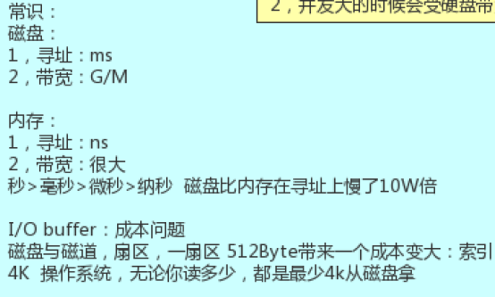

### 为什么要选Redis

都是kv的数据库，为何选redis。用json也可以存储很复杂的数据类型，那么还要数据类型的

* 如果客户端想取回缓存v中的某个元素，memcached会返回value所有的数据到client，server网卡IO瓶颈，client要有你实现的代码去解码
* 而redis存储的value又自己的类型
  并且redis中类型不是很重要，它起到一个标识的作用。redis server中对每种类型都有自己的方法

这就是计算向数据移动的思想（客户端给予k，redis直接解析相应的value并返回少量数据给client）


### redis作为数据库和缓存的区别

* 缓存不是全量数据，它应该是随着访问变化的热数据
  * 那么它怎么才能做到随着业务变化而改变存储的热数据？
  * 因为内存有限，必须更新热数据

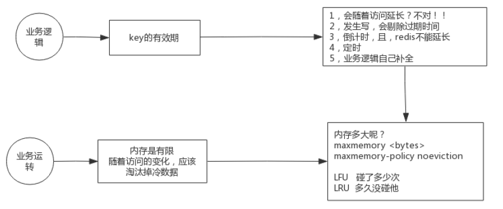

1.通过业务逻辑更新key

2.根据内存限制淘汰

### 安装设置

设置开机启动

* tar xf

  * 减少IO

* make install PREFIX=/opt/dzp/redis5

  * 将执行文件迁出

* vi /etc/profile

* export REDIS_HOME=/opt/dzp/redis5

  export PATH=$PATH:$REDIS_HOME/bin

  * 配置home

* source /etc/profile

  * 通知修改

* cd utils(redis中)

* ./install_server.sh(可以重复安装多个)


* cd etc/init.d


### 多路复用NIO

mmap共享空间


* 尽量让同一个客户端操作一个数据，不然顺序不容易控制


### redis运行原理

单进程、单线程、单实例。在高并发的时候为什么可以这么快

redis存储的key中包含着value和encoding


所有连接先到kernel，操作系统内核通过epol调用的方式来遍历连接

## redis使用

**默认16个库**

```java
//启动
redis-server.exe redis.windows.conf
```

### 库级别

| 命令                         | 功能                              |
| ---------------------------- | --------------------------------- |
| config get *                 | 获得所有配置                      |
| config set protected-mode no |                                   |
| redis-cli -p 6380 -n 8       | 启动6380,并进入8号库              |
| redis-cli --raw              | 显示中文                          |
| exit                         | 退出                              |
| set k v                      | 设置kv                            |
| get k                        | 不同库是隔离的<br />get不到其它库 |
| select 8                     | 进入8号库（默认0号库）            |
| help @gneric/string          | 通用命令帮助                      |
| keys *                       | 查看所有k                         |
| FLUSHDB                      | 清库                              |

### 数据级别

| 命令             | 功能                                |
| ---------------- | ----------------------------------- |
| set k1 first nx  | 当k1中没有first时设置（操作时加锁） |
| set k2 second xx | 只能更新，不能新建                  |
| getset k1 hello  | 更新并显示旧值（减少I/O）           |
| mset k3 a k4 b   | 连续设置                            |
| mget k3  k4      | 多重get                             |
| strlen k1        | 看长度                              |
| type k1          | 看类型                              |

### String/Byte

正向索引0,1,2

反向索引-1,-2,-3

* k中包含着type 和 encoding
  * 比如set k 91 
  * type是string 但
  * encoding 是 int
* 为了二进制安全，type


* 数值计算`incr()`可用于秒杀抢购等，对数据库的事务操作完全用redis内存操作代替

| 命令                 | 功能            |
| -------------------- | --------------- |
| append k v           | 追加字符        |
| getrange k start end | 取指定value区间 |
| getset k v           | 取旧值放新值    |
| setrange k 1 ce      | 从1开始覆盖     |
|                      |                 |
| INCRBY  k  33        | 累加            |
| DECRBY  k  33        | 减少            |
| INCRBYFLOAT  k  0.5  | 累加小数        |
|                      |                 |

#### 秒杀

incr操作可以规避并发下对数据库事务的操作，完全由redis内存操作代替。

### **bitmap**

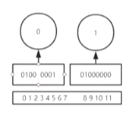

| **bitmap**                   | **二进制位操作**（ASCII）    |
| ---------------------------- | ---------------------------- |
| setbit k 1 v（把）           | 0100 0000                    |
| bitpos key bit [start] [end] | 看第一个bit在二进制的位置    |
| bitcount key [start] [end]   | 看1出现的次数                |
| bitop and andkey k1 k2       | k1和k2按位与，结果存入andkey |
| bitop or key k1 k2           | k1和k2按位或，结果存入orkey  |

#### 登录记录

随机返回指定时间段内登录的天数

* setbit dzp 1 1
  * set bit dzp 364 1
  * 最多占用46B
* bitcount dzp -2 -1
  * 统计最后两周登录次数

#### 统计活跃人数

日期为key, 用户id为位。或者反过来

setbit 20220417 1 1

每个用户对应bitmap的一个位置，那么先调用bittop or key k1 k2按位与，得到的结果再调用bitcount，即可计算出每一天的活跃用户量

40多M就可以存储京东全年1kw用户量。

### List

实现栈：同向push、pop （lpush,lpop）

实现队列：反向push、pop (lpush,rpop)

| 命令                    | 功能                             |
| ----------------------- | -------------------------------- |
| lpush                   | 从左边添加                       |
| lpop                    | 从左边弹出                       |
| lrange k [start] [end]  | 取指定value区间                  |
| lindex key index        | get value                        |
| lset key index value    | 替换                             |
| linsert k after pivot v | 插入                             |
| lrem k -2 a             | 从后向前移除2个a                 |
|                         |                                  |
| blpop k v               | 阻塞弹出，先阻塞先得，后面的等着 |
| ltrim k [start] [end]   | 剪去两端                         |

### hashmap

value中又放一个hashmap

减少调用次数

| 命令                      | 功能        |
| ------------------------- | ----------- |
| hset k filed value        |             |
| hmset                     | 查看所有key |
| hgetall dzp               |             |
| hgetall dzp               | 取出所有    |
| hincrbyfloat dzp age -0.5 | 数字运算    |

### Set

无序唯一

| 命令                      | 功能                           |
| ------------------------- | ------------------------------ |
| sadd k v v                |                                |
| smembers k                | 看所有                         |
| srem key v                | remove                         |
| sinter [key...]           | 交集                           |
| sinterstore dest [key...] | 存入dest(减少io)               |
| sunion                    | 并集                           |
| sdiff k1 k2               | k1去掉k2                       |
|                           |                                |
| srandmember key count     | 随机取，正数不重复，负数带重复 |
| spop k                    | 随机取出                       |
|                           |                                |

### sorted_set

有序去重

| 命令                                    | 功能               |
| --------------------------------------- | ------------------ |
| zadd k score member                     |                    |
| zrange k 0 1                            | 取出0,1            |
| zrevrange k 0 1                         | 倒转命令           |
| zscore k1 apple                         | 根据元素取分值     |
| zrank k1 apple                          | 根据元素取分值排名 |
| zincrby k1 2.5 apple                    |                    |
|                                         |                    |
| zunionstore unkey 2 k1 k2 weights 1 0.5 | k1权重为1,k2为0.5  |
| zunionstore unkey 2 k1 k2 aggregate     | 交集取最大值       |


### 管道

* echo -e "set k2 99\n incr k2 \n get k2" | nc localhost 6379	
  * 将命令放入管道，顺序执行，减少通信次数


## 发布订阅

help @pubsub

| 命令                | 功能             |
| ------------------- | ---------------- |
| publish world hello | 向world推送hello |
| subscribe world     | 监听             |

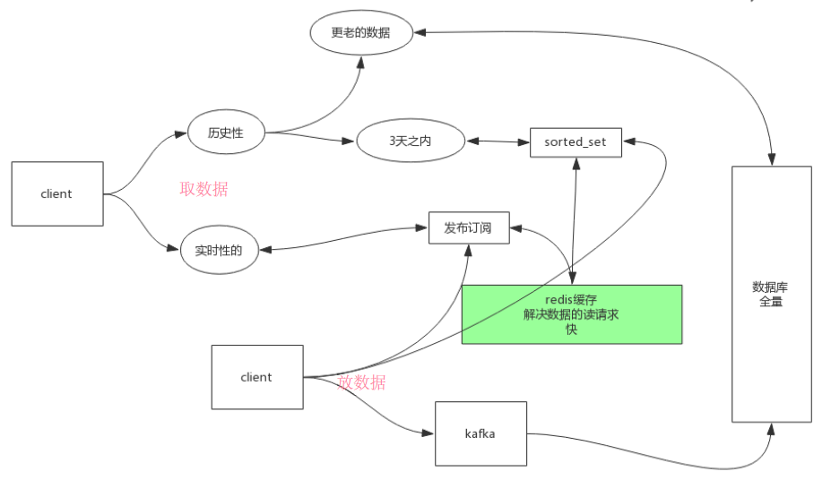


三天之内的数据请求用sorted_set解决，以及实时性的数据请求

放数据和取数据都在sorted_set和发布订阅的进行

持久化的通过kafka慢慢写到数据库中


或者pub、sub用一个redis

另一个service订阅第一个redis并将其写到通过kafka写到数据库

## 事务

help @transactions

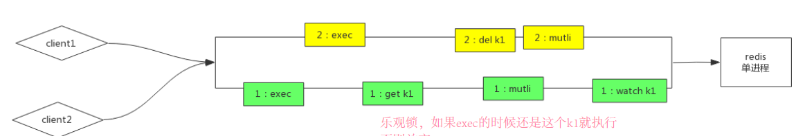

redis事务采用的是乐观锁，先watch住k1，等到exec的时候再看k1是否变化

先exec的先执行


## 布隆过滤器

**布隆过滤器**

module模块可选，扩展redis-server功能
解决缓存穿透的问题

数据库中的元素经过不同的映射函数让bitmap上的不同二进制位变为1.

空间换时间，这个空间成本很低


不能完全抵挡，但可以抵挡一部分，并且成本低


* 新增数据要对bloom添加（双写问题）

* 如果还是穿透了
  * client到redis中增加相应的key,通过value标记，后面的数据就会直接命中这个key，发现不存在

#### 使用

BF.ADD key a1
BF.EXISTS key a2    	会显示0


## 过期时间


| 命令                           | 功能                          |
| ------------------------------ | ----------------------------- |
| set k1 aa ex 20 	20         | 设置过期时间                  |
| expire k1 50                   | 设置过期时间                  |
| expireat k1 [通过系统时间推断] | 定时过期**如何淘汰过期的key** |

* 被动：
  * 当客户端访问到过期的key时清除
* 主动：
  * 测试随机的20个keys进行相关过期检测。
  * 删除所有已经过期的keys。
  * 如果有多于25%的keys过期，重复步奏1.


# Redis管理

## 持久化

### 背景知识

写时复制	内核机制

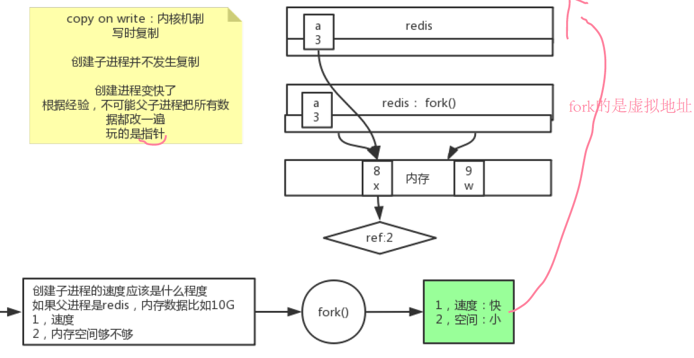

拍摄快照是一个过程，过程中数据可能变化，用到了写时复制的特性

系统调用`fork()`操作复制的是指针，父子进程是隔离的，数据不共享

fork后父进程修改数据实际上是写入其它的物理地址而不是覆盖原先的地址

- 如果你只希望你的数据在服务器运行的时候存在,你也可以不使用任何持久化方式
- 你也可以同时开启两种持久化方式, 在这种情况下, 当redis重启的时候会优先载入AOF文件来恢复原始的数据,因为在通常情况下AOF文件保存的数据集要比RDB文件保存的数据集要完整.

**工作方式**

当 Redis 需要保存 dump.rdb 文件时， 服务器执行以下操作:

- Redis 调用forks. 同时拥有父进程和子进程。
- 子进程将数据集写入到一个临时 RDB 文件中。
- 当子进程完成对新 RDB 文件的写入时，Redis 用新 RDB 文件替换原来的 RDB 文件，并删除旧的 RDB 文件。


### RDB（快照）

RDB持久化方式能够在指定的时间间隔能对你的数据进行快照存储.

#### 

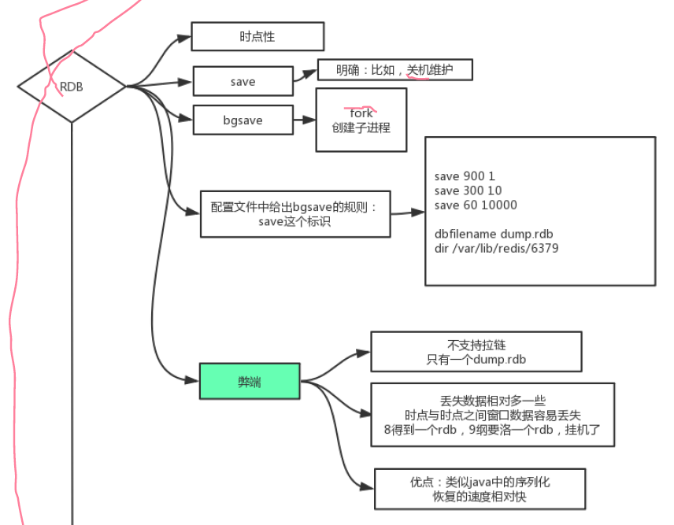

#### **优点**：

* RDB是一个紧凑的单一文件，利于传输
* 父进程只需要fork出一个子进程，不需要再做其他IO操作，提高redis的性能
* 比AOF恢复快

#### 缺点：

* 不支持拉链（只有一个dump.rdb），需要运维定时拷贝
* redis意外停止的时候丢失的数据多
* 数据量大的时候fork非常耗时


### AOF

AOF持久化方式记录每次对服务器写的操作,当服务器重启的时候会重新执行这些命令来恢复原始的数据,AOF命令以redis协议追加保存每次写的操作到文件末尾.Redis还能对AOF文件进行后台重写,使得AOF文件的体积不至于过大.


#### **优点**：

* 可以使用不同的fsync策略，无fsync、每次写、每秒（默认）。(fsync是由后台线程进行处理的,主线程会尽力处理客户端请求)
* AOF文件是一个只进行追加的日志文件,所以不需要写入seek
* AOF文件易读，容易分析

#### 缺点：

* AOF文件大
* 回复慢


#### AOF文件语法

set k1 2
$3 set $2 k1 $1 2

#### 操作

appendfsync always

appendfsync everysec

appendfsync no	(buffer满时系统自动刷，更不安全)

## 集群

### 为什么需要集群

因为redis是单机、单节点、单实例的，所以会出现3个问题

1.单点故障

2.容量有限

3.访问压力

### 概念

Redis 集群是一个提供在**多个Redis节点间共享数据**的程序集。

twitter、predixy、cluster三种实现方式


#### 解决数据一致性问题


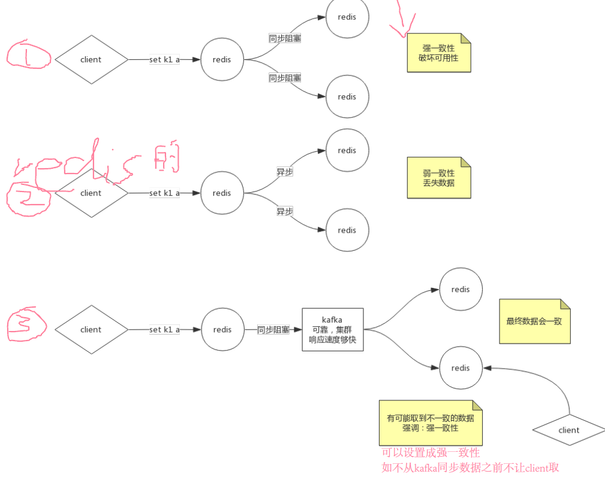

1.同步阻塞，强一致性，但是会破坏可用性

2.弱一致性，但可能数据

3.与kafka同步阻塞,但是kafka响应速度快。


#### 容量问题

这些方案（算法）可以从层迁移到proxy层

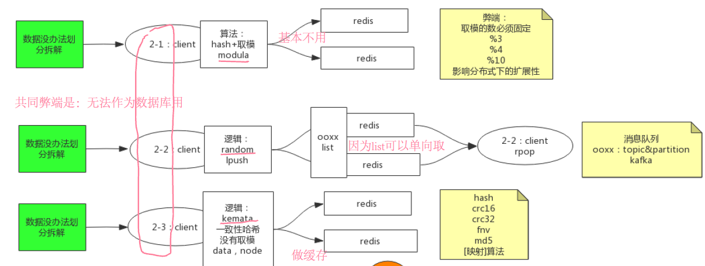

* 1.通过业务逻辑划分，不同redis存储不同业务数据，redis自身是不知道的
* 2.modula（hash取模）基本不用，会影响分布式下的扩展性。因为你一开始用的模数会限制自己

* 3.random算法，做消息队列时用（kafka）
  * 因为redis中的list可以单向取，不用管数据具体存到了哪个区域

* 4.kemate（）

#### redis压力大

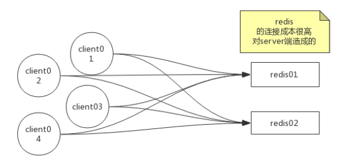

1.通过反向代理做负载均衡

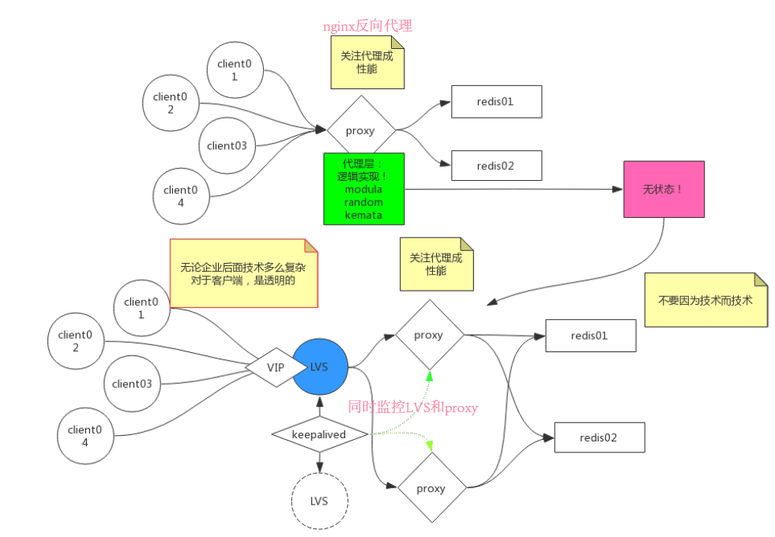

2.再给proxy做集群，通过LVS访问集群

LVS做高可用（通过keepalived做主备）

keepalived可以同时监控lvs和proxy

* 容量问题的解决算法从client迁移到proxy层，称之为无状态（因为只是逻辑，不存数据，所以做集群更为方便）


### 主从复制

redis追求的就是快，所以选用的是异步，面临数据丢失的风险

| 配置                                                | 作用                                 |
| --------------------------------------------------- | ------------------------------------ |
| replica-serve-stale-data yes                        |                                      |
| replica-read-only yes                               | 只读                                 |
| repl-diskless-sync no                               | 不用磁盘IO同步（用网络）             |
| repl-backlog-size 1mb                               | 设置队列大小                         |
| min-replicas-to-write 3<br/>min-replicas-max-lag 10 | 为了保证数据一致性（向强一致性靠拢） |

redis拷贝RDB的时候掉线了几秒，需要通过offset去队列中拿到rdb后面的操作数据

redis通过磁盘IO存储RDB，再通过网络IO传输到从机

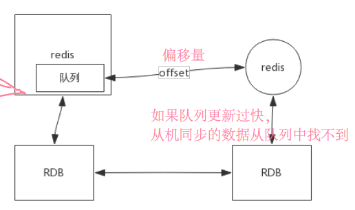


replicaof 127.0.0.1 6379	追随6379


主机知道有几个从机，此时从机不能写

当主机故障时

replicaof  no one	恢复为主，可写

### 从机同步过程

先清除自己的内容

### 其它配置

* replica-serve-stale-data yes
  * 备机接收主机数据时，是否对外暴露原来的数据
* replica-read-only yes
  * 备机是否只支持查询，或是可以写入
* repl-diskless-sync no
  * yes是直接使用网络
* 

### 高可用

不过半的监控判定可能会出现脑裂的问题，但是某些情况是可以容忍的。比如服务注册发现，不需要全部的服务可用，即使注册中心返回的注册表不完全相同也可以容忍


#### ==sentinel

- **监控（Monitoring**）： Sentinel 会不断地检查你的主服务器和从服务器是否运作正常。
- **提醒（Notification）**： 当被监控的某个 Redis 服务器出现问题时， Sentinel 可以通过 API 向管理员或者其他应用程序发送通知。
- **自动故障迁移（Automatic failover）**： 当一个主服务器不能正常工作时， Sentinel 会开始一次自动故障迁移操作， 它会将失效主服务器的其中一个从服务器升级为新的主服务器， 并让失效主服务器的其他从服务器改为复制新的主服务器； 当客户端试图连接失效的主服务器时， 集群也会向客户端返回新主服务器的地址， 使得集群可以使用新主服务器代替失效服务器。

Redis Sentinel 是一个分布式系统， 你可以在一个架构中运行多个 Sentinel 进程（progress）， 这些进程使用流言协议（gossip protocols)来接收关于主服务器是否下线的信息， 并使用**投票协议**（agreement protocols）来决定是否执行自动故障迁移， 以及选择哪个从服务器作为新的主服务器。


* 一般使用使用奇数台

哨兵间通过发布订阅发现其它哨兵


* 


### Redis 集群的数据分片

Redis 集群没有使用一数性hash.而是引入了哈希槽的概念
Redis 集群有16384个哈希槽，每个key通过CRC16校验后对16384取模来决定放置哪个槽。集群的每个节点负责一部分hash偿

通过类似写时复制的原理转移槽内的数据


# 实操

set {oo}k1 abc

set {oo}k1 abc

虽然redis自带的集群不能够跨节点支持事务，但我们可以通过主动设置相同标识的k让它们进入同一节点，这样就能在它们中开启事务。


不同的配置，但是redis工厂只有一个

spring提供了low和high两种使用方式

RedisTemplate提供high-level(更好用)


StringRedisTemplate 方便操作String

拿到工厂提供的redisconnection提供low-level


java客户端设置的key有自己的序列化方式，在redis查看时不是原始的数据


根据需求写不同的template


## 代码

#### TestRedis.java

```java
@Component
public class TestRedis {
    @Autowired
    RedisTemplate redisTemplate;

    @Autowired
    @Qualifier("ooxx")
    StringRedisTemplate stringRedisTemplate;
    @Autowired
    ObjectMapper objectMapper;
    public void testRedis(){


        Person p = new Person();
        p.setName("zhangsan");
        p.setAge(16);

        //jackson2HashMapper用来将Person转化成json格式进行存储，
        Jackson2HashMapper jackson2HashMapper = new Jackson2HashMapper(objectMapper, false);

        //调用toHash方法
        stringRedisTemplate.opsForHash().putAll("lisi",jackson2HashMapper.toHash(p));

        //调用entries方法通过key取出Person的map
        Map<Object, Object> lisi = stringRedisTemplate.opsForHash().entries("lisi");
        //通过objectMapper的convertValue方法转回对象
        Person person = objectMapper.convertValue(lisi, Person.class);


        //聊天室
        stringRedisTemplate.convertAndSend("ooxx","hello");

        RedisConnection conn = stringRedisTemplate.getConnectionFactory().getConnection();

        //订阅
        conn.subscribe(new MessageListener() {
            @Override
            public void onMessage(Message message, byte[] bytes) {
                byte[] body = message.getBody();
                System.out.println(new String(body));
            }
        },"ooxx".getBytes());
        
        //循环发布消息
        while(true){
            stringRedisTemplate.convertAndSend("ooxx","hello  from wo zi ji ");
            try {
                Thread.sleep(3000);
            } catch (InterruptedException e) {
                e.printStackTrace();
            }

        }

    }
}
```

#### 自定义template

```java
@Configuration
public class MyTemplate {

    @Bean
    public StringRedisTemplate ooxx(RedisConnectionFactory fc){

        StringRedisTemplate tp = new StringRedisTemplate(fc);

        tp.setHashValueSerializer(new Jackson2JsonRedisSerializer<Object>(Object.class));
        return  tp ;
    }
}
```


# 发展过程

1.客户端自己实现逻辑，分发到不同redis

2.逻辑抽出放到代理层

