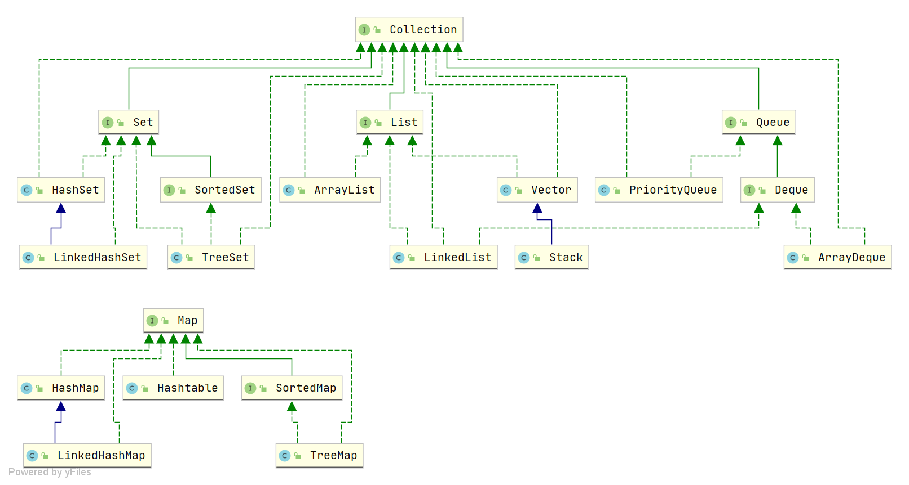
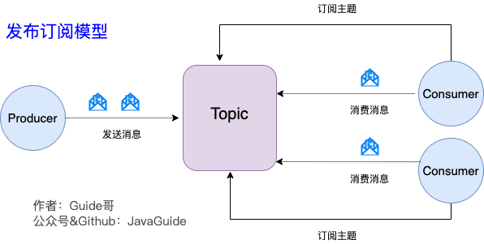

# JAVA核心

## 基础概念

### 说说面向对象

面向对象是一种对现实世界理解和抽象的方法，是一种是软件开发方法。

### **hashCode** **与** equals

hashCode() 的作⽤是获取哈希码，也称为散列码；它实际上是返回⼀个 int 整数。这个哈希码的作⽤是确定该对象在哈希表中的索引位置。


### JDK8有哪些新特性

我列举一下我用到的。

最大的改动就是lamda表达式，然后是新增的时间类**LocalDateTime**

### 为什么要用LocalDateTime

Date如果不格式化，打印出的日期可读性差。如果用SimpleDateFormat对时间进行格式化，但SimpleDateFormat是线程不安全的


### 1.重写和重载区别

方法的重载和重写都是实现多态的方式，区别在于前者实现的是编译时的多态性，而后者实现的是运行时的多态性。重载发生在一个类中，同名的方法如果有不同的参数列表（参数类型不同、参数个数不同或者二者都不同）则视为重载；重写发生在子类与父类之间，重写要求子类被重写方法与父类被重写方法有相同的返回类型，比父类被重写方法更广的访问权限，不能比父类被重写方法声明更多的异常（里氏代换原则）。重载对返回类型没有特殊的要求。


  重写是子类对父类的允许访问的方法的实现过程进行重新编写, 返回值和形参都不能改变。即外壳不变，核心重写！
  重载(overloading) 是在一个类里面，方法名字相同，而参数列表不同（参数类型，参数个数和参数顺序不同）。返回类型可以相同也可以不同。
  方法重载是一个类的多态性表现,而方法重写是子类与父类的一种多态性表现。

### 2.== 和 equals 的区别

**== 解读**

对于基本类型和引用类型 == 的作用效果是不同的，如下所示：

- 基本类型：比较的是值是否相同；
- 引用类型：比较的是引用是否相同；

**equals 解读**

equals 本质上就是 ==，只不过 String 和 Integer 等重写了 equals 方法，把它变成了值比较。

### 3.final在java中的作用，有哪些用法?

1. 被final修饰的类不可以被继承

2. 被final修饰的方法不可以被重写

3. 被final修饰的变量不可以被改变.如果修饰引用,那么表示引用不可变,引用指向的内容可变. 

4. 被final修饰的方法,JVM会尝试将其内联,以提高运行效率

5. 被final修饰的常量,在编译阶段会存入常量池中

### 4.String、StringBuffer和StringBuilder区别

* String是只读字符串，从底层源码来看是一个用final类型的字符数组。所引用的字符串不能跟变，每次对String的操作都会形成新的String对象
  * 每次+操作：隐式得在堆上new了一个跟原字符串相同StringBuilder对象，再调用append方法拼接后面的字符。

* StringBuffer 和 StringBuilder 类的对象能够被多次的修改，并且不产生新的未使用对象。

* 在所有的情况下选择使用 **stringbuiler**，除非你真的遇到了一个需要线程安全的场景.

 stringbuffer 的线程安全，仅仅是保证 jvm 不抛出异常顺利的往下执行而已，它可不保证逻辑正确和调用顺序正确。


String是只读字符串，从底层源码来看是一个用final类型的字符数组，每次对String的操作都会形成新的String对象。因此想要操作的字符串经常改变时，会选择

### 5.讲下java中Math常用方法

Pow()：幂运算

Sqrt()：平方根 

Round()：四舍五入 

Abs()：求绝对值 

Random()：生成一个0-1的随机，左闭右开。

### 6.String类的常用方法有那些？

charAt：返回指定索引处的字符 

indexOf()：返回指定字符的索引 

replace()：字符串替换 

trim()：去除字符串两端空白 

split()：分割字符串，返回一个分割后的字符串数组 

getBytes()：返回字符串的byte类型数组 

length()：返回字符串长度 

toLowerCase()：将字符串转成小写字母 

toUpperCase()：将字符串转成大写字符 

substring()：截取字符串 

format()：格式化字符串 

equals()：字符串比较

### 7.Hashcode的作用

hashCode的存在主要是用于查找的快捷性，如Hashtable，HashMap等，hashCode是用来在散列存储结构中确定对象的存储地址的；

如集合Set中的存储的是无序唯一的数据，插入数据时判断是否重复调用equals方法查询比较慢。hashcode可以提高集合中查找元素的效率，它根据对象的内存地址换算出一个值，当添加新元素时先根据它的哈希值放到指定位置上，再调用equals判断在当前位置是否重复，提高了效率。

### 8.Java创建对象有几种方式？

java中提供了以下四种创建对象的方式：
1.new创建新对象
2.通过反射机制
3.采用clone机制
4.通过序列化机制

### 9.静态内部类

.Java集合类HashMap内部就有一个静态内部类Entry。Entry是HashMap存放元素的抽象，HashMap内部维护Entry数组用了存放元素，但是Entry对使用者是透明的。像这种和外部类关系密切的，且不依赖外部类实例的，都可以使用静态内部类。

### 10.说出一些常用的类，包，接口

常用的类：BufferedReader BufferedWriter FileReader FileWirter String Integer

常用的包：java.lang java.awt java.io java.util java.sql

常用的接口：Remote List Map Document NodeList

### 94.当一个对象被当作参数传递到一个方法后，此方法可改变这个对象的属性，并可返回变化后的结果，那么这里到底是值传递还是引用传递？


### 12.抽象类和接口有什么异同

​	抽象类和接口都不能够实例化，但可以定义抽象类和接口类型的引用。一个类如果继承了某个抽象类或者实现了某个接口都需要对其中的抽象方法全部进行实现，否则该类仍然需要被声明为抽象类。

​	接口比抽象类更加抽象，因为抽象类中可以定义构造器，可以有抽象方法和具体方法，而接口中不能定义构造器而且其中的方法全部都是抽象方法。抽象类中的成员可以是**private**、默认、protected、public的，而接口中的成员全都是public的。

​	抽象类中可以定义成员变量，而接口中定义的成员变量实际上都是常量。有抽象方法的类必须被声明为抽象类，而抽象类未必要有抽象方法。

### 13、抽象的（abstract）方法是否可同时是静态的（static），是否可同时是本地方法（native），是否可同时被 synchronized修饰？

都不能。抽象方法需要子类重写，而静态的方法是无法被重写的，因此二者是矛盾的。本地方法是由本地代码（如C代码）实现的方法，而抽象方法是没有实现的，也是矛盾的。synchronized和方法的**实现细节**有关，抽象方法不涉及实现细节，因此也是相互矛盾的。


### 14、为什么重写equals方法后要重写hashcode

因为如果重写equals意味着你想要以自己的方式去比较数据，如果不重写的话，当数据存放在hashmap中时是按照原来的hashcode去判断的。


### java常用的包

lang
io
sql
util
awt
net
math

### String常用方法

charAt: 返回指定索引处字符

indexOf() 返回指定字符的索引

length

split 分割字符串

trim 去除两端空白

### Java 中的编译期常量是什么？使用它又什么风险？

static final修饰的变量

问题在于，如果使用了一个内部或第三方库中的公有编译时常量，但后面被其他人修改了，而客户端仍然用的老的值。因此需要重新编译程序


### 接口可以继承接口

## 基本数据类型

### 八种基本数据类型

Java 中有 8 种基本数据类型，分别为：

- 6 种数字类型：
  - 4 种整数型：`byte`、`short`、`int`、`long`
  - 2 种浮点型：`float`、`double`
- 1 种字符类型：`char`
- 1 种布尔型：`boolean`。

### 基本类型和包装类型的区别？

- 包装类型不赋值就是 `null` ，而基本类型有默认值且不是 `null`。
- 包装类型可用于泛型，而基本类型不可以。
- 基本数据类型的局部变量存放在 Java 虚拟机栈中的局部变量表中，基本数据类型的成员变量（未被 `static` 修饰 ）存放在 Java 虚拟机的堆中。包装类型属于对象类型，我们知道几乎所有对象实例都存在于堆中。
- 相比于对象类型， 基本数据类型占用的空间非常小。

### 包装类型的缓存机制

`Byte`,`Short`,`Integer`,`Long` 这 4 种包装类默认创建了数值 **[-128，127]** 的相应类型的缓存数据

### 自动拆装箱

从字节码中，我们发现装箱其实就是调用了 包装类的`valueOf()`方法，拆箱其实就是调用了 `xxxValue()`方法。


### 字符串拼接

通过字节码可以看到，字符串+本质就是调用的StringBuilder` 调用 `append()，拼接完成后调用后 `toString()` 。

但在循环中复用**会导致创建过多的 `StringBuilder` 对象**

## 面向对象

###  接口和抽象类有什么共同点和区别？

**共同点** ：

- 都不能被实例化。
- 都可以包含抽象方法。
- 都可以有默认实现的方法（Java 8 可以用 `default` 关键在接口中定义默认方法）。

**区别** ：

- 接口主要用于对类的行为进行约束，你实现了某个接口就具有了对应的行为。抽象类主要用于代码复用，强调的是所属关系（比如说我们抽象了一个发送短信的抽象类，）。
- 一个类只能继承一个类，但是可以实现多个接口。
- 接口中的成员变量只能是 `public static final` 类型的，不能被修改且必须有初始值，而抽象类的成员变量默认 default，可在子类中被重新定义，也可被重新赋值


### 多态

多态，顾名思义，表示一个对象具有多种的状态，具体表现为父类的引用指向子类的实例。

**多态的特点:**

- 对象类型和引用类型之间具有继承（类）/实现（接口）的关系；
- 引用类型变量发出的方法调用的到底是哪个类中的方法，必须在程序运行期间才能确定；
- 多态不能调用“只在子类存在但在父类不存在”的方法；
- 如果子类重写了父类的方法，真正执行的是子类覆盖的方法，如果子类没有覆盖父类的方法，执行的是父类的方


## 异常


### Error与Exception区别？

在 Java 中，所有的异常都有一个共同的祖先 `java.lang` 包中的 `Throwable` 类。`Throwable` 类有两个重要的子类:

- **`Exception`** :程序本身可以处理的异常，可以通过 `catch` 来进行捕获。`Exception` 又可以分为 Checked Exception (受检查异常，必须处理) 和 Unchecked Exception (不受检查异常，可以不处理)。
- **`Error`** ：`Error` 属于程序无法处理的错误 ，我们没办法通过 `catch` 来进行捕获不建议通过`catch`捕获 。例如 Java 虚拟机运行错误（`Virtual MachineError`）、虚拟机内存不够错误(`OutOfMemoryError`)、类定义错误（`NoClassDefFoundError`）等 。这些异常发生时，Java 虚拟机（JVM）一般会选择线程终止


### 异常分为哪两种

　1：编译时被检查的异常，只要是Exception及其子类都是编译时被检测的异常。

　2：运行时异常，其中Exception有一个特殊的子类RuntimeException，以及RuntimeException的子类是运行异常，也就说这个异常是编译时不被检查的异常。

### 异常处理方式

try..catch	
throws

### 常见异常

**运行时：**数组越界、空指针、

classnotfoundexception

arithmeticException

OutOfMemoryError

StackOverflowError


### 6、Thow与thorws区别

**位置不同：**throws 用在函数上，后面跟的是异常类，可以跟多个；而throw 用在函数内，后面跟的是异常对象。功能不同：

**功能不同：**throws用来声明异常，让调用者只知道该功能可能出现的问题。
throw 抛出具体的问题对象


### try-catch-finally 如何使用？

**注意：不要在 finally 语句块中使用 return!** 当 try 语句和 finally 语句中都有 return 语句时，try 语句块中的 return 语句会被忽略。这是因为 try 语句中的 return 返回值会先被暂存在一个本地变量中，当执行到 finally 语句中的 return 之后，这个本地变量的值就变为了 finally 语句中的 return 返回值。


## 泛型

### 项目中哪里用到了泛型？

- 自定义接口通用返回结果 `CommonResult<T>` 通过参数 `T` 可根据具体的返回类型动态指定结果的数据类型
- 定义 `Excel` 处理类 `ExcelUtil<T>` 用于动态指定 `Excel` 导出的数据类型
- 构建集合工具类（参考 `Collections` 中的 `sort`, `binarySearch` 方法）。
- ......


## 反射

### 反射的应用场景

像咱们平时大部分时候都是在写业务代码，很少会接触到直接使用反射机制的场景。

但是，这并不代表反射没有用。相反，正是因为反射，你才能这么轻松地使用各种框架。像 Spring/Spring Boot、MyBatis 等等框架中都大量使用了反射机制。

**这些框架中也大量使用了动态代理，而动态代理的实现也依赖反射。**

比如下面是通过 JDK 实现动态代理的示例代码，其中就使用了反射类 `Method` 来调用指定的方法。

另外，像 Java 中的一大利器 **注解** 的实现也用到了反射。

为什么你使用 Spring 的时候 ，一个`@Component`注解就声明了一个类为 Spring Bean 呢？为什么你通过一个 `@Value`注解就读取到配置文件中的值呢？究竟是怎么起作用的呢？

这些都是因为你可以基于反射分析类，然后获取到类/属性/方法/方法的参数上的注解。你获取到注解之后，就可以做进一步的处理

## 注解

如果说注释是写给人看的，那么注解就是写给程序看的。**它更像一个标签，**贴在一个类、一个方法或者字段上。它的目的是**为当前读取该注解的程序提供判断依据及少量附加信息**

注解需要三要素：定义、使用、读取并执行

### 保留策略

注解的保留策略有三种：SOURCE/ClASS/RUNTIME

既然反射是运行时调用，那就要求注解的信息必须保留到虚拟机将.class文件加载到内存为止。如果你需要反射读取注解，却把保留策略设置为RetentionPolicy.SOURCE、RetentionPolicy.CLASS，那就读取不到了。

@Override，它由编译器读取，此时程序尚未运行。


## 值传递

## 动态代理

### JDK动态代理

就 Java 来说，动态代理的实现方式有很多种，比如 **JDK 动态代理**、**CGLIB 动态代理**等等。

```java
// 创建代理类并同样实现发送短信的接口
public class SmsProxy implements SmsService {

    private final SmsService smsService;

    public SmsProxy(SmsService smsService) {
        this.smsService = smsService;
    }

    @Override
    public String send(String message) {
        // 调用方法之前，我们可以添加自己的操作
        System.out.println("before method send()");
        smsService.send(message);
        // 调用方法之后，我们同样可以添加自己的操作
        System.out.println("after method send()");
        return null;
    }
}
```

### CGLIB动态代理

通过继承的方式代理，所以不能代理声明为final类型的类和方法。

### 动态代理两者对比

1. **JDK 动态代理只能代理实现了接口的类或者直接代理接口，而 CGLIB 可以代理未实现任何接口的类。** 另外， CGLIB 动态代理是通过生成一个被代理类的子类来拦截被代理类的方法调用，因此不能代理声明为 final 类型的类和方法。
2. 就二者的效率来说，大部分情况都是 JDK 动态代理更优秀，随着 JDK 版本的升级，这个优势更加明显

## 静态代理和动态代理的对比

1. **灵活性** ：动态代理更加灵活，不需要必须实现接口，可以直接代理实现类，并且可以不需要针对每个目标类都创建一个代理类。另外，静态代理中，接口一旦新增加方法，目标对象和代理对象都要进行修改，这是非常麻烦的！
2. **JVM 层面** ：静态代理在编译时就将接口、实现类、代理类这些都变成了一个个实际的 class 文件。而动态代理是在运行时动态生成类字节码，并加载到 JVM 中的

# 容器

## 集合概述

### 框架结构



主要是由两大接口派生而来：一个是 `Collection`接口，主要用于存放单一元素；另一个是 `Map` 接口，主要用于存放键值对。对于`Collection` 接口，下面又有三个主要的子接口：`List`、`Set` 和 `Queue`。

### 底层数据结构

#### List

- `Arraylist`： `Object[]` 数组
- `Vector`：`Object[]` 数组
- `LinkedList`： 双向链表(JDK1.6 之前为循环链表，JDK1.7 取消了循环)

#### Set

- `HashSet`(无序，唯一): 基于 `HashMap` 实现的，底层采用 `HashMap` 来保存元素
- `LinkedHashSet`: `LinkedHashSet` 是 `HashSet` 的子类，并且其内部是通过 `LinkedHashMap` 来实现的。有点类似于我们之前说的 `LinkedHashMap` 其内部是基于 `HashMap` 实现一样，不过还是有一点点区别的
- `TreeSet`(有序，唯一): 红黑树(自平衡的排序二叉树)

#### Queue

- `PriorityQueue`: `Object[]` 数组来实现二叉堆
- `ArrayQueue`: `Object[]` 数组 + 双指针


### ArrayList和linkedList区别

ArrayList底层实现是Array,但是它实现了自动扩容（）。
插入和删除效率低，但是查询效率高
而linkedList是一个双向链表，适合数据动态插入和删除，随机访问和遍历速度慢。
一般不会用LinkedList，`LinkedList` 仅仅在头尾插入或者删除元素的时候时间复杂度近似 O(1)，其他情况增删元素的时间复杂度都是 O(n) 。


### HashMap和HashTable的区别

HashMap是线程不安全的，Hashtable是线程安全的，它的每个方法上都有synchronized 关键字，因此可直接用于多线程中。但是HashMap的效率远远高于Hashtabl。当需要多线程操作的时候会使用ConcurrentHashMap，它的效率比Hashtable要高好多倍。因为 ConcurrentHashMap使用了分段锁，并不对整个数据进行锁定。 


### 5、说说List,Set,Map三者的区别

List存储有序不唯一的对象

Set存储唯一无序的对象

Map存储键值对，key是唯一的


### HashSet

哈希表里存放的是哈希值，元素的哈希值是通过hashcode方法获得的，HashSet先判断两个元素的hash值，如果一样再通过equals方法比较，结果为true则视为同一个元素。否则会在同样的哈希值下顺延


### TreeSet(二叉树)

使用二叉树的原理对新加的对象按指定规则排序
integer和string对象都可以默认排序，自定义的对象就必须实现comparable接口，重写compareto方法才能使用，


### 讲讲HashMap

HashMap是根据元素的hashcode值来存储数据的，大多数情况下可以直接定位到元素的值，因此查询速度很快，但是遍历顺序是不确定的。

1.7的时候是数组加链表，

1.8时变成数组+链表+红黑树。因为1.7时链表可能会出现过长的情况，这样需要顺着链表遍历才能找到我们需要的元素，时间复杂度是ON。因此1.8中在链表的元素超过8之后，会将链表转换为红黑树，这样时间复杂度就降低到了OlogN


### 说说ConcurrentHashMap 

ConcurrentHashMap和HashMap思路是差不多的，但是因为它支持并发操作，因此要复杂一些。整个ConcurrentHashMap由一个个Segment 组成，通常会叫它分段锁。

ConcurrentHashMap是一个Segment数组，通常也会叫分段锁。Segment是继承了ReentrantLock来加锁，所以每次需要加锁的时候锁住的是一个Segment，这样的话只要保证每个Segment是线程安全的，那么全局就是线程安全的

默认是16个Segment，可以自己设置，但是初始化之后不可以扩容。


## 源码

### ArrayList扩容机制

多超过原来容量的时候，会在原先容量的基础上加上原容量右移一位的大小，也就是1.5倍大小。


### HashSet如何检查重复

openJDK8中，hashSet的add()方法只是简单的调用HashMap的put方法，并判断是否有重复元素，所以都会直接插入，只是会告诉我们插入前是否有元素


### HashMap扩容

2的幂大小

当链表长度大于阈值（默认为 8）（将链表转换成红黑树前会判断，如果当前数组的长度小于 64，那么会选择先进行数组扩容，而不是转换为红黑树）时，将链表转化为红黑树，以减少搜索时间。Hashtable 没有这样的机制。

所以通常会预定设定好期望的容量，避免hashMap自动扩容，这样会降低效率，因为需要重新进行hash计算去分配位置

### HashMap 的长度为什么是 2 的幂次方

如果我自己设计的话肯定是取余数，**但是当除数是 2 的幂次则等价于与其除数减一的与(&)操作**，与操作效率更高，所以扩容也就采取了这种方式


### HashMap底层

key的hashCode经过扰动函数处理之后得到hash值，然后对数组的长度取模，放置进对应的地方。

1.8对扰动函数有一个优化，扰动次数会少一些


### ConcurrentHashMap 底层

1.7的时候是使用segment分段锁，1.8之后就改成了Node数组+链表/红黑树

首先将数据分为一段一段的存储，然后给每一段数据配一把锁，当一个线程占用锁访问其中一个段数据时，其他段的数据也能被其他线程访问。

Segment 实现了 `ReentrantLock`,所以 `Segment` 是一种可重入锁，扮演锁的角色。`HashEntry` 用于存储键值对数据。


采用 CAS 和 `synchronized` 来保证并发安全。

`synchronized` 只锁定当前链表或红黑二叉树的首节点，这样只要 hash 不冲突，就不会产生并发，效率又提升 N 倍。

# 设计模式

## 单例

~~~java
// 双检锁
public class Singleton {

    private volatile static Singleton uniqueInstance;

    private Singleton() {
    }

    public  static Singleton getUniqueInstance() {
       //先判断对象是否已经实例过，没有实例化过才进入加锁代码
        if (uniqueInstance == null) {
            //类对象加锁
            synchronized (Singleton.class) {
                if (uniqueInstance == null) {
                    uniqueInstance = new Singleton();
                }
            }
        }
        return uniqueInstance;
    }
}
~~~

`uniqueInstance` 采用 `volatile` 关键字修饰也是很有必要的， `uniqueInstance = new Singleton();` 这段代码其实是分为三步执行：

1. 为 `uniqueInstance` 分配内存空间
2. 初始化 `uniqueInstance`
3. 将 `uniqueInstance` 指向分配的内存地址


## 代理模式

静态代理对于目标对象的增强都是手动完成的，一旦新增方法，目标类和代理类都需要变动


### JDK动态代理

**在 Java 动态代理机制中 `InvocationHandler` 接口和 `Proxy` 类是核心。**

实现`InvocationHandler` 来自定义处理逻辑，当我们的动态代理对象调用一个方法时，这个方法的调用就会被转发到实现`InvocationHandler` 接口类的 `invoke` 方法来调用。


### CGLIB动态代理

**在 CGLIB 动态代理机制中 `MethodInterceptor` 接口和 `Enhancer` 类是核心。**

Spring 中的 AOP 模块中：如果目标对象实现了接口，则默认采用 JDK 动态代理，否则采用 CGLIB 动态代理。

CGLIB 动态代理是通过生成一个被代理类的子类来拦截被代理类的方法调用，因此不能代理声明为 final 类型的类和方法。

### JDK 动态代理和 CGLIB 动态代理对比

1. **JDK 动态代理只能代理实现了接口的类或者直接代理接口，而 CGLIB 可以代理未实现任何接口的类。** 另外， CGLIB 动态代理是通过生成一个被代理类的子类来拦截被代理类的方法调用，因此不能代理声明为 final 类型的类和方法。
2. 就二者的效率来说，大部分情况都是 JDK 动态代理更优秀，随着 JDK 版本的升级，这个优势更加明显。

### 静态代理和动态代理的对比

1. **灵活性** ：动态代理更加灵活，不需要必须实现接口，可以直接代理实现类，并且可以不需要针对每个目标类都创建一个代理类。另外，静态代理中，接口一旦新增加方法，目标对象和代理对象都要进行修改，这是非常麻烦的！
2. **JVM 层面** ：静态代理在编译时就将接口、实现类、代理类这些都变成了一个个实际的 class 文件。而动态代理是在运行时动态生成类字节码，并加载到 JVM 中的。


# Spring


### 1.什么是Spring Framework？

Spring 是一个开源应用框架，旨在降低应用程序开发的复杂度。它是轻量级、松散耦合的。它具有分层体系结构，允许用户选择组件，同时还为2EE应用程序开发提供了一个有凝聚力的框架。它可以集成其他框架，如Structs、Hibernate、EJB等，所以又称为框架的框架。

### 2.Spring有哪些不同的功能？

轻量级 - Spring 在代码量和透明度方面都很轻便。

IOC - 控制反转	

AOP - 面向切面编程可以将应用业务逻辑和系统服务分离，以实现高内聚。容器 - Spring 负责创建和管理对象（Bean）的生命周期和配置。

MVC - 对 web 应用提供了高度可配置性，其他框架的集成也十分方便。

事务管理 - 提供了用于事务管理的通用抽象层。Spring 的事务支持也可用于容器较少的环境。JDBC 异常 - Spring的 JDBC 抽象层

提供了一个异常层次结构，简化了错误处理策略。

**Spring 核心容器**-该层基本上是Spring Framework的核心。它包含以下模块：
口Spring Core

口Spring Bean

口SpEL（Spring Expression Language）
口Spring Context

### 3. 为什么要使用 spring？

**1.简介**

- 目的：解决企业应用开发的复杂性
- 功能：使用基本的JavaBean代替EJB，并提供了更多的企业应用功能
- 范围：任何Java应用

简单来说，Spring是一个轻量级的控制反转(IoC)和面向切面(AOP)的容器框架。

**2.轻量**　

从大小与开销两方面而言Spring都是轻量的。完整的Spring框架可以在一个大小只有1MB多的JAR文件里发布。并且Spring所需的处理开销也是微不足道的。此外，Spring是非侵入式的：典型地，Spring应用中的对象不依赖于Spring的特定类。

**3.控制反转**　　

Spring通过一种称作控制反转（IoC）的技术促进了松耦合。当应用了IoC，一个对象依赖的其它对象会通过被动的方式传递进来，而不是这个对象自己创建或者查找依赖对象。你可以认为IoC与JNDI相反——不是对象从容器中查找依赖，而是容器在对象初始化时不等对象请求就主动将依赖传递给它。

**4.面向切面**　　

Spring提供了面向切面编程的丰富支持，允许通过分离应用的业务逻辑与系统级服务（例如审计（auditing）和事务（transaction）管理）进行内聚性的开发。应用对象只实现它们应该做的——完成业务逻辑——仅此而已。它们并不负责（甚至是意识）其它的系统级关注点，例如日志或事务支持。

**5.容器**

Spring包含并管理应用对象的配置和生命周期，在这个意义上它是一种容器，你可以配置你的每个bean如何被创建——基于一个可配置原型（prototype），你的bean可以创建一个单独的实例或者每次需要时都生成一个新的实例——以及它们是如何相互关联的。然而，Spring不应该被混同于传统的重量级的EJB容器，它们经常是庞大与笨重的，难以使用。

**6.框架**

Spring可以将简单的组件配置、组合成为复杂的应用。在Spring中，应用对象被声明式地组合，典型地是在一个XML文件里。Spring也提供了很多基础功能（事务管理、持久化框架集成等等），将应用逻辑的开发留给了你。

所有Spring的这些特征使你能够编写更干净、更可管理、并且更易于测试的代码。它们也为Spring中的各种模块提供了基础支持。


### 4. 解释一下什么是 ioc？

IOC是Inversion of Control的缩写，是一种设计思想，而不是一个具体的技术实现。

原本对象A在初始化或运行到某点的时候需要对象B，此时它主动去创建B，而加入IOC容器之后，当对象A运行到需要B的时候，IOC容器会主动创建B提供给A。

这可以大幅简化我们的开发，帮助我们从复杂的依赖关系中解放出来

IOC就像一个工厂，当我们需要创建一个对象的时候只需要配置好相应的配置文件或注解即可，不用考虑对象是怎么创建出来的


<<<<<<< HEAD


### 5. 解释一下什么是 aop？

AOP(Aspect-Oriented Programming:面向切面编程)能够将那些与业务无关，却为业务模块所共同调用的逻辑或责任（例如事务处理、日志管理、权限控制等）封装起来，便于减少系统的重复代码，降低模块间的耦合度，并有利于未来的可拓展性和可维护性。

Spring AOP 就是基于动态代理的

### AOP和AspectAOP区别

**Spring AOP 属于运行时增强，而 AspectJ 是编译时增强。** Spring AOP 基于代理(Proxying)，而 AspectJ 基于字节码操作(Bytecode Manipulation)。

Spring AOP 已经集成了 AspectJ ，AspectJ 应该算的上是 Java 生态系统中最完整的 AOP 框架了。AspectJ 相比于 Spring AOP 功能更加强大，但是 Spring AOP 相对来说更简单，

如果我们的切面比较少，那么两者性能差异不大。但是，当切面太多的话，最好选择 AspectJ ，它比 Spring AOP 快很多

=======
IoC 容器实际上就是个 Map（key，value），Map 中存放的是各种对象。


>>>>>>> abb318579cf7a7422823f6a7dae5d7fbcd5dea73


### 解释Spring支持的几种bean的作用域

Spring框架支持以下五种bean的作用域：

- **singleton :** bean在每个Spring ioc 容器中只有一个实例。
- **prototype**：一个bean的定义可以有多个实例。
- **request**：每次http请求都会创建一个bean，该作用域仅在基于web的Spring ApplicationContext情形下有效。
- **session**：在一个HTTP Session中，一个bean定义对应一个实例。该作用域仅在基于web的Spring ApplicationContext情形下有效。
- **global-session**：在一个全局的HTTP Session中，一个bean定义对应一个实例。该作用域仅在基于web的Spring ApplicationContext情形下有效。

缺省的Spring bean 的作用域是Singleton.


### 单例 bean 的线程安全问题了解吗？

单例 bean 存在线程问题，主要是因为当多个线程操作同一个对象的时候是存在资源竞争的。

1. 在 bean 中尽量避免定义可变的成员变量。
2. 在类中定义一个 `ThreadLocal` 成员变量，将需要的可变成员变量保存在 `ThreadLocal` 中（推荐的一种方式）。


### SpringMVC 工作原理了解吗?


**流程说明（重要）：**

1. 客户端（浏览器）发送请求，直接请求到 `DispatcherServlet`。
2. `DispatcherServlet` 根据请求信息调用 `HandlerMapping`，解析请求对应的 `Handler`。
3. 解析到对应的 `Handler`（也就是我们平常说的 `Controller` 控制器）后，开始由 `HandlerAdapter` 适配器处理。
4. `HandlerAdapter` 会根据 `Handler`来调用真正的处理器开处理请求，并处理相应的业务逻辑。
5. 处理器处理完业务后，会返回一个 `ModelAndView` 对象，`Model` 是返回的数据对象，`View` 是个逻辑上的 `View`。
6. `ViewResolver` 会根据逻辑 `View` 查找实际的 `View`。
7. `DispaterServlet` 把返回的 `Model` 传给 `View`（视图渲染）。
8. 把 `View` 返回给请求者（浏览器）

### 项目中用到AOP

灰度发布、日志、统计、qps


### 7、Spring Bean 的生命周期？


总结：

**（1）实例化Bean：**

对于BeanFactory容器，当客户向容器请求一个尚未初始化的bean时，或初始化bean的时候需要注入另一个尚未初始化的依赖时，容器就会调用createBean进行实例化。对于ApplicationContext容器，当容器启动结束后，通过获取BeanDefinition对象中的信息，实例化所有的bean。

**（2）设置对象属性（依赖注入）：**

实例化后的对象被封装在BeanWrapper对象中，紧接着，Spring根据BeanDefinition中的信息 以及 通过BeanWrapper提供的设置属性的接口完成依赖注入。

**（3）处理Aware接口：**

接着，Spring会检测该对象是否实现了xxxAware接口，并将相关的xxxAware实例注入给Bean：

①如果这个Bean已经实现了BeanNameAware接口，会调用它实现的setBeanName(String beanId)方法，此处传递的就是Spring配置文件中Bean的id值；

②如果这个Bean已经实现了BeanFactoryAware接口，会调用它实现的setBeanFactory()方法，传递的是Spring工厂自身。

③如果这个Bean已经实现了ApplicationContextAware接口，会调用setApplicationContext(ApplicationContext)方法，传入Spring上下文；

**（4）BeanPostProcessor：**

如果想对Bean进行一些自定义的处理，那么可以让Bean实现了BeanPostProcessor接口，那将会调用postProcessBeforeInitialization(Object obj, String s)方法。

**（5）InitializingBean 与 init-method：**

如果Bean在Spring配置文件中配置了 init-method 属性，则会自动调用其配置的初始化方法。

**（6）如果这个Bean实现了BeanPostProcessor接口**，将会调用postProcessAfterInitialization(Object obj, String s)方法；由于这个方法是在Bean初始化结束时调用的，所以可以被应用于内存或缓存技术；

以上几个步骤完成后，Bean就已经被正确创建了，之后就可以使用这个Bean了。

**（7）DisposableBean：**

当Bean不再需要时，会经过清理阶段，如果Bean实现了DisposableBean这个接口，会调用其实现的destroy()方法；

**（8）destroy-method：**

最后，如果这个Bean的Spring配置中配置了destroy-method属性，会自动调用其配置的销毁方法。

### 8、Spring AOP的实现原理？

​		Spring AOP使用的动态代理，所谓的动态代理就是说AOP框架不会去修改字节码，而是在内存中临时为方法生成一个AOP对象，这个AOP对象包含了目标对象的全部方法，并且在特定的切点做了增强处理，并回调原对象的方法。

​		Spring AOP中的动态代理主要有两种方式，JDK动态代理和CGLIB动态代理。JDK动态代理通过反射来接收被代理的类，并且要求被代理的类必须实现一个接口。JDK动态代理的核心是InvocationHandler接口和Proxy类。

​		如果目标类没有实现接口，那么Spring AOP会选择使用CGLIB来动态代理目标类。CGLIB（Code Generation Library），是一个代码生成的类库，可以在运行时动态的生成某个类的子类，注意，CGLIB是通过继承的方式做的动态代理，因此如果某个类被标记为final，那么它是无法使用CGLIB做动态代理的。


### ==12.AOP两种代理方式

Spring 提供了两种方式来生成代理对象: JDKProxy 和 Cglib，具体使用哪种方式生成由AopProxyFactory 根据 AdvisedSupport 对象的配置来决定。默认的策略是如果目标类是接口，则使用 JDK 动态代理技术，否则使用 Cglib 来生成代理。

**JDK** **动态接口代理**

\1. JDK 动态代理主要涉及到 java.lang.reflect 包中的两个类：Proxy 和 InvocationHandler。

`Proxy` 类中使用频率最高的方法是：`newProxyInstance()` ，这个方法主要用来生成一个代理对象。这个方法一共有 3 个参数：

1. **loader** :类加载器，用于加载代理对象。
2. **interfaces** : 被代理类实现的一些接口；
3. **h** : 实现了 `InvocationHandler` 接口的对象；

这个`InvocationHandler` 就是用来来自定义处理逻辑。 当我们的动态代理对象调用一个方法时，这个方法的调用就会被转发到实现`InvocationHandler` 接口类的 `invoke` 方法来调用。

也就是说：**你通过`Proxy` 类的 `newProxyInstance()` 创建的代理对象在调用方法的时候，实际会调用到实现`InvocationHandler` 接口的类的 `invoke()`方法。** 你可以在 `invoke()` 方法中自定义处理逻辑，比如在方法执行前后做什么事情。


**CGLib** **动态代理**

CGLib 全称为 Code Generation Library，是一个强大的高性能，高质量的代码生成类库，可以在运行期扩展 Java 类与实现 Java 接口，CGLib 封装了 asm，把被代理对象类的class文件加载进来，修改其字节码生成子类。

和 JDK 动态代理相比较：JDK 创建代理有一个限制，就是只能为接口创建代理实例，

而对于没有通过接口定义业务方法的类，则可以通过 CGLib 创建动态代理。 CGLIB动态代理的原理是生成目标类的子类, 这个子类对象就是代理对象, 代理对象是被增强过的.

**在 CGLIB 动态代理机制中 `MethodInterceptor` 接口和 `Enhancer` 类是核心**

你需要自定义 `MethodInterceptor` 并重写 `intercept` 方法，`intercept` 用于拦截增强被代理类的方法。

通过 `Enhancer`类来动态获取被代理类，当代理类调用方法的时候，实际调用的是 `MethodInterceptor` 中的 `intercept` 方法。

### 9. 说一下 spring 的事务隔离？

事务隔离级别指的是一个事务对数据的修改与另一个并行的事务的隔离程度，当多个事务同时访问相同数据时，如果没有采取必要的隔离机制，就可能发生以下问题：

- 脏读：一个事务读到另一个事务未提交的更新数据。
- 幻读：例如第一个事务对一个表中的数据进行了修改，比如这种修改涉及到表中的“全部数据行”。同时，第二个事务也修改这个表中的数据，这种修改是向表中插入“一行新数据”。那么，以后就会发生操作第一个事务的用户发现表中还存在没有修改的数据行，就好象发生了幻觉一样。
- 不可重复读：比方说在同一个事务中先后执行两条一模一样的select语句，期间在此次事务中没有执行过任何DDL语句，但先后得到的结果不一致，这就是不可重复读。


### 11、Spring通知有哪些类型

（1）前置通知（Before advice）：在某连接点（join point）之前执行的通知，但这个通知不能阻止连接点前的执行（除非它抛出一个异常）。

（2）返回后通知（After returning advice）：在某连接点（join point）正常完成后执行的通知：例如，一个方法没有抛出任何异常，正常返回。 

（3）抛出异常后通知（After throwing advice）：在方法抛出异常退出时执行的通知。 

（4）后通知（After (finally) advice）：当某连接点退出的时候执行的通知（不论是正常返回还是异常退出）。 

（5）环绕通知（Around Advice）：包围一个连接点（join point）的通知，如方法调用。这是最强大的一种通知类型。 环绕通知可以在方法调用前后完成自定义的行为。它也会选择是否继续执行连接点或直接返回它们自己的返回值或抛出异常来结束执行。 环绕通知是最常用的一种通知类型。


### 13.Spring中有哪些不同的通知类型

通知(advice)是你在你的程序中想要应用在其他模块中的横切关注点的实现。Advice主要有以下5种类型：

1. **前置通知(Before Advice)**: 在连接点之前执行的Advice，不过除非它抛出异常，否则没有能力中断执行流。使用 `@Before` 注解使用这个Advice。
2. **返回之后通知(After Retuning Advice)**: 在连接点正常结束之后执行的Advice。例如，如果一个方法没有抛出异常正常返回。通过 `@AfterReturning` 关注使用它。
3. **抛出（异常）后执行通知(After Throwing Advice)**: 如果一个方法通过抛出异常来退出的话，这个Advice就会被执行。通用 `@AfterThrowing` 注解来使用。
4. **后置通知(After Advice)**: 无论连接点是通过什么方式退出的(正常返回或者抛出异常)都会执行在结束后执行这些Advice。通过 `@After` 注解使用。
5. **围绕通知(Around Advice)**: 围绕连接点执行的Advice，就你一个方法调用。这是最强大的Advice。通过 `@Around` 注解使用

### 12、自动装配的注解@AutoWired，@Resource

​		在使用自动装配的时候，出了可以使用@AutoWired注解之外，还可以使用@Resource注解，大家需要知道这两个注解的区别。

​		1、@AutoWired:是spring中提供的注解，@Resource:是jdk中定义的注解，依靠的是java的标准

​		2、@AutoWired默认是按照类型进行装配，找不到则通过名字查找，默认情况下要求依赖的对象必须存在，@Resource默认是按照名字进行匹配的，同时可以指定name属性。

​		3、@AutoWired只适合spring框架，而@Resource扩展性更好

### SpringBean生命周期

**实例化**
1.实例化一个Bean，也就是我们常说的new。
**IOC依赖注入**
2.按照Spring上下文对实例化的Bean进行配置，也就是IOC注入。
**setBeanName 实现**
3.如果这个Bean 已经实现了BeanNameAware接口，会调用它实现的setBeanName（String）方法，此处传递的就是Spring配置文件中Bean的id值
**BeanFactoryAware 实现**
4.如果这个Bean 已经实现了BeanFactoryAware接口，会调用它实现的 setBeanFactory，setBeanFactory（BeanFactory）传递的是Spring 工厂自身（可以用这个方式来获取其它Bean，只需在Spring配置文件中配置一个普通的Bean就可以）。

**ApplicationContextAware 实现**
5.如果这个Bean已经实现了ApplicationContextAware接口，会调用setApplicationContext（ApplicationContext）方法，传入Spring上下文（同样这个方式也可以实现步骤4的内容，但比4更好，因为ApplicationContext是BeanFactory的子接口，有更多的实现方法）

**postProcessBeforelnitialization 接口实现初始化处理**
6.如果这个Bean关联了BeanPostProcessor接口，将会调用
postProcessBeforelnitialization（Object obj，String s）方法，BeanPostProcessor 经常被用作是Bean内容的更改，并且由于这个是在Bean初始化结束时调用那个的方法，也可以被应用于内存或缓存技术。
**init-method**
7.如果Bean在Spring配置文件中配置了init-method属性会自动调用其配置的初始化方法。
**postProcessAfterlnitialization**
8.如果这个Bean关联了BeanPostProcessor接口，将会调用
postProcessAfterlnitialization（Object obj，Strings）方法。
注：以上工作完成以后就可以应用这个Bean了，那这个Bean是一个Singleton的，所以一般情况下我们调用同一个id的Bean会是在内容地址相同的实例，当然在Spring配置文件中也可以配置非Singleton。
**Destroy 过期自动清理阶段**
9.当Bean不再需要时，会经过清理阶段，如果Bean实现了DisposableBean这个接口，会调用那个其实现的 destroy0方法；

**destroy-method 自配置清理**
10.最后，如果这个Bean的Spring配置中配置了destroy-method 属性，会自动调用其配置的销毁方法。


### spring常用注解

@Controller
@RestController
@Service
@ResponseBody
@RequestMapping
@Autowire
@PathVariable


### 源码


### 有哪些不同类型的IOC（依赖注入）方式？

- **构造器依赖注入：**构造器依赖注入通过容器触发一个类的构造器来实现的，该类有一系列参数，每个参数代表一个对其他类的依赖。
- **Setter方法注入：**Setter方法注入是容器通过调用无参构造器或无参static工厂 方法实例化bean之后，调用该bean的setter方法，即实现了基于setter的依赖注入。


### 用到哪些设计模式

IOC就是典型的工厂模式，通过sessionfactory去注入实例。
AOP就是典型的代理模式的体现。
代理模式是常用的java设计模式，他的特征是代理类与委托类有同样的接口，代理类主要负责为委托类
预处理消息、过滤消息、把消息转发给委托类，以及事后处理消息等。代理类与委托类之间通常会存在关联关系，一个代理类的对象与一个委托类的对象关联，代理类的对象本身并不真正实现服务，而是通过调用委托类的对象的相关方法，来提供特定的服务


## AOP

- **连接点（Joinpoint)** 程序执行的某个特定位置，如某个方法调用前，调用后，方法抛出异常后，这些代码中的特定点称为连接点。简单来说，就是在哪加入你的逻辑增强
  连接点表示具体要拦截的方法，上面切点是定义一个范围，而连接点是具体到某个方法
- **切点（PointCut）** 每个程序的连接点有多个，如何定位到某个感兴趣的连接点，就需要通过切点来定位。比如，连接点--数据库的记录，切点--查询条件
  切点用于来限定Spring-AOP启动的范围，通常我们采用表达式的方式来设置，所以关键词是范围
- **增强（Advice）** 增强是织入到目标类连接点上的一段程序代码。在Spring中，像BeforeAdvice等还带有方位信息
  通知是直译过来的结果，我个人感觉叫做**“业务增强”**更合适 对照代码就是拦截器定义的相关方法，通知分为如下几种：
  **前置通知(before)**:在执行业务代码前做些操作，比如获取连接对象
  **后置通知(after)**:在执行业务代码后做些操作，无论是否发生异常，它都会执行，比如关闭连接对象
  **异常通知（afterThrowing）**:在执行业务代码后出现异常，需要做的操作，比如回滚事务
  **返回通知(afterReturning)**,在执行业务代码后无异常，会执行的操作
  **环绕通知(around)**，这个目前跟我们谈论的事务没有对应的操作，所以暂时不谈
- **目标对象（Target）** 需要被加强的业务对象
- **织入（Weaving）** 织入就是将增强添加到对目标类具体连接点上的过程。
  织入是一个形象的说法，具体来说，就是生成代理对象并将切面内容融入到业务流程的过程。
- **代理类（Proxy）** 一个类被AOP织入增强后，就产生了一个代理类。
- **切面（Aspect）** 切面由切点和增强组成，它既包括了横切逻辑的定义，也包括了连接点的定义，SpringAOP就是将切面所定义的横切逻辑织入到切面所制定的连接点中。
  比如上文讨论的数据库事务，这个数据库事务代码贯穿了我们的整个代码，我们就可以这个叫做切面。 SpringAOP将切面定义的内容织入到我们的代码中，从而实现前后的控制逻辑。 比如我们常写的拦截器Interceptor，这就是一个切面类


## 事务

### Spring 的不同事务传播行为有哪些，干什么用的？


| 传播属性     | 描述                                                         |
| ------------ | ------------------------------------------------------------ |
| REQUIRED     | 在外围方法未开启事务的情况下`Propagation.REQUIRED`修饰的内部方法会新开启自己的事务，且开启的事务相互独立，互不干扰。<br /><br />外围方法开启事务的情况下`Propagation.REQUIRED`修饰的内部方法会加入到外围方法的事务中，所有`Propagation.REQUIRED`修饰的内部方法和外围方法均属于同一事务，只要一个方法回滚，整个事务均回滚。 |
| REQUIRED_NEW | 在外围方法未开启事务的情况下`Propagation.REQUIRES_NEW`修饰的内部方法会新开启自己的事务，且开启的事务相互独立，互不干扰。<br /><br />在外围方法开启事务的情况下`Propagation.REQUIRES_NEW`修饰的内部方法依然会单独开启独立事务，且与外部方法事务也独立，内部方法之间、内部方法和外部方法事务均相互独立，互不干扰。 |


### Transactional常用参数

**`@Transactional` 的常用配置参数总结（只列出了 5 个我平时比较常用的）：**

| 属性名      | 说明                                                         |
| :---------- | :----------------------------------------------------------- |
| propagation | 事务的传播行为，默认值为 REQUIRED，可选的值在上面介绍过      |
| isolation   | 事务的隔离级别，默认值采用 DEFAULT，可选的值在上面介绍过     |
| timeout     | 事务的超时时间，默认值为-1（不会超时）。如果超过该时间限制但事务还没有完成，则自动回滚事务。 |
| readOnly    | 指定事务是否为只读事务，默认值为 false。                     |
| rollbackFor | 用于指定能够触发事务回滚的异常类型，并且可以指定多个异常类型。 |

### 事务AOP

如果一个类或者一个类中的 public 方法上被标注`@Transactional` 注解的话，Spring 容器就会在启动的时候为其创建一个代理类，在调用被`@Transactional` 注解的 public 方法的时候，实际调用的是，`TransactionInterceptor` 类中的 `invoke()`方法。这个方法的作用就是在目标方法之前开启事务，方法执行过程中如果遇到异常的时候回滚事务，方法调用完成之后提交事务。

> `TransactionInterceptor` 类中的 `invoke()`方法内部实际调用的是 `TransactionAspectSupport` 类的 `invokeWithinTransaction()`方法。由于新版本的 Spring 对这部分重写很大，而且用到了很多响应式编程的知识，这里就不列源码了

### AOP事务自调用

若**同一类中**没有 `@Transactional` 注解的方法内调用了有 `@Transactional` 注解的方法，事务会失效。

这是由于`Spring AOP`代理的原因造成的，因为只有当 `@Transactional` 注解的方法在类以外被调用的时候，Spring 事务管理才生效。

`MyService` 类中的`method1()`调用`method2()`就会导致`method2()`的事务失效。

解决办法就是避免同一类中自调用或者使用 AspectJ 取代 Spring AOP 代理


## 常用注解

###  `@SpringBootApplication`

 可以看作是`@Configuration`、`@EnableAutoConfiguration`、`@ComponentScan` 注解的集合。

### `@scope`

声明 Spring Bean 的作用域，使用方法:

```java
@Bean
@Scope("singleton")
public Person personSingleton() {
    return new Person();
}
```


### `@value`

```java
@Value("${wuhan2020}")
String wuhan2020;
```

### `@ConfigurationProperties`(常用)

```java
@Component
//yaml配置文件中的属性名，自动注入进来
@ConfigurationProperties(prefix = "library")
class LibraryProperties {
    @NotEmpty
    private String location;
    private List<Book> books;

    @Setter
    @Getter
    @ToString
    static class Book {
        String name;
        String description;
    }
  省略getter/setter
  ......
}
```

### 参数校验

- `@NotEmpty` 被注释的字符串的不能为 null 也不能为空
- `@NotBlank` 被注释的字符串非 null，并且必须包含一个非空白字符
- `@Null` 被注释的元素必须为 null
- `@NotNull` 被注释的元素必须不为 null
- `@AssertTrue` 被注释的元素必须为 true
- `@AssertFalse` 被注释的元素必须为 false
- `@Pattern(regex=,flag=)`被注释的元素必须符合指定的正则表达式
- `@Email` 被注释的元素必须是 Email 格式。
- `@Min(value)`被注释的元素必须是一个数字，其值必须大于等于指定的最小值
- `@Max(value)`被注释的元素必须是一个数字，其值必须小于等于指定的最大值
- `@DecimalMin(value)`被注释的元素必须是一个数字，其值必须大于等于指定的最小值
- `@DecimalMax(value)` 被注释的元素必须是一个数字，其值必须小于等于指定的最大值
- `@Size(max=, min=)`被注释的元素的大小必须在指定的范围内
- `@Digits(integer, fraction)`被注释的元素必须是一个数字，其值必须在可接受的范围内
- `@Past`被注释的元素必须是一个过去的日期
- `@Future` 被注释的元素必须是一个将来的日期


### JPA

`@Column` 声明字段。

**示例：**

设置属性 userName 对应的数据库字段名为 user_name，长度为 32，非空

```java
@Column(name = "user_name", nullable = false, length=32)
private String userName;
```

设置字段类型并且加默认值，这个还是挺常用的。

```java
@Column(columnDefinition = "tinyint(1) default 1")
private Boolean enabled;
```

`@Transient` ：声明不需要与数据库映射的字段，在保存的时候不需要保存进数据库 


## springboot自动装配

允许自动装配之后，会自动装配META-INF/spring.factories 目录下的配置类

包括各种starter都是有这个目录的，因此如果自己想写一个starter，这一步是必不可少的。

并不是会装配所有的配置，是通过condition来决定具体要装配哪些配置信息


# MVC


### 1、什么是MVC？

​		MVC是模型(Model)、视图(View)、控制器(Controller)的简写，是一种软件设计规范。就是将业务逻辑、数据、显示分离的方法来组织代码。MVC主要作用是**降低了视图与业务逻辑间的双向偶合**。MVC不是一种设计模式，**MVC是一种架构模式**。当然不同的MVC存在差异。

​		**Model（模型）：**数据模型，提供要展示的数据，因此包含数据和行为，可以认为是领域模型或JavaBean组件（包含数据和行为），不过现在一般都分离开来：Value Object（数据Dao） 和 服务层（行为Service）。也就是模型提供了模型数据查询和模型数据的状态更新等功能，包括数据和业务。

​		**View（视图）：**负责进行模型的展示，一般就是我们见到的用户界面，客户想看到的东西。

​		**Controller（控制器）：**接收用户请求，委托给模型进行处理（状态改变），处理完毕后把返回的模型数据返回给视图，由视图负责展示。 也就是说控制器做了个调度员的工作。


### 7.2. 描述一下 DispatcherServlet 的工作流程

DispatcherServlet 的工作流程可以用一幅图来说明：

1. 向服务器发送 HTTP 请求，请求被前端控制器 `DispatcherServlet` 捕获。

2. `DispatcherServlet` 根据 **-servlet.xml** 中的配置对请求的 URL 进行解析，得到请求资源标识符（URI）。然后根据该 URI，调用 `HandlerMapping` 获得该 Handler 配置的所有相关的对象（包括 Handler 对象以及 Handler 对象对应的拦截器），最后以`HandlerExecutionChain` 对象的形式返回。

3. `DispatcherServlet` 根据获得的`Handler`，选择一个合适的 `HandlerAdapter`。（附注：如果成功获得`HandlerAdapter`后，此时将开始执行拦截器的 preHandler(...)方法）。

4. 提取Request中的模型数据，填充Handler入参，开始执行Handler（Controller)。 在填充Handler

   的入参过程中，根据你的配置，Spring 将帮你做一些额外的工作：

   - HttpMessageConveter： 将请求消息（如 Json、xml 等数据）转换成一个对象，将对象转换为指定的响应信息。
   - 数据转换：对请求消息进行数据转换。如`String`转换成`Integer`、`Double`等。
   - 数据根式化：对请求消息进行数据格式化。 如将字符串转换成格式化数字或格式化日期等。
   - 数据验证： 验证数据的有效性（长度、格式等），验证结果存储到`BindingResult`或`Error`中。

5. Handler(Controller)执行完成后，向 `DispatcherServlet` 返回一个 `ModelAndView` 对象；

6. 根据返回的`ModelAndView`，选择一个适合的 `ViewResolver`（必须是已经注册到 Spring 容器中的`ViewResolver`)返回给`DispatcherServlet`。

7. `ViewResolver` 结合`Model`和`View`，来渲染视图。

8. 视图负责将渲染结果返回给客户端。

### 2.执行流程

```
1、DispatcherServlet表示前置控制器，是整个SpringMVC的控制中心。用户发出请求，DispatcherServlet接收请求并拦截请求。
2、HandlerMapping为处理器映射。DispatcherServlet调用HandlerMapping,HandlerMapping根据请求url查找Handler。
3、处理器映射器返回处理器执行链，根据url查找控制器，并且将解析后的信息传递给DispatcherServlet
4、HandlerAdapter表示处理器适配器，其按照特定的规则去执行Handler。
5、执行handler找到具体的处理器
6、Controller将具体的执行信息返回给HandlerAdapter,如ModelAndView。
7、HandlerAdapter将视图逻辑名或模型传递给DispatcherServlet。
8、DispatcherServlet调用视图解析器(ViewResolver)来解析HandlerAdapter传递的逻辑视图名。
9、视图解析器将解析的逻辑视图名传给DispatcherServlet。
10、DispatcherServlet根据视图解析器解析的视图结果，调用具体的视图，进行试图渲染
11、将响应数据返回给客户端
```

### 3.Spring MVC常用的注解有哪些？

**@RequestBody**

用于获取请求体内容。直接使用得到是key=value&key=value..结构的数据。

**@RequestMapping**

一个用来处理请求地址映射的注解，可用于类或方法上。用于类上，表示类中的所有响g应请求的方法都是以该地址作为父路径

**@ResponseBody**

该注解用于将Controller的方法返回的对象，通过适当的HttpMessageConverter转换为指定格式后，写入到Response对象的body数据区。返回的数据不是htm标签的页面，而是其他某种格式的数据时（如json、xm等）使用

**@RequestParam**

主要用于在SpringMVC后台控制层获取参数。

**@ModelAttribute**

在方法定义上使用 @ModelAttribute 注解：Spring MVC 在调用目标处理方法前，会先逐个调用在方法级上标注了@ModelAttribute 的方法

在方法的入参前使用 @ModelAttribute 注解：可以从隐含对象中获取隐含的模型数据中获取对象，再将请求参数 –绑定到对象中，再传入入参将方法入参对象添加到模型中

**@SessionAttribute** 

用于多次执行控制器方法间的参数共享。


# springBoot

### 为什么要用boot

spring和mvc需要配置大量的参数
而springboot可自动默认配置

通过starter来加载


### 自动装配

没有 Spring Boot 的情况下，如果我们需要引入第三方依赖，需要手动配置，非常麻烦。但是，Spring Boot 中，我们直接引入一个 starter 即可。比如你想要在项目中使用 redis 的话，直接在项目中引入对应的 starter 即可。

### SpringBoot 是如何实现自动装配的？

我们先看一下 SpringBoot 的核心注解 `SpringBootApplication` 。

大概可以把 `@SpringBootApplication`看作是 `@Configuration`、`@EnableAutoConfiguration`、`@ComponentScan` 注解的集合。根据 SpringBoot 官网，这三个注解的作用分别是：

- `@EnableAutoConfiguration`：启用 SpringBoot 的自动配置机制
- `@Configuration`：允许在上下文中注册额外的 bean 或导入其他配置类
- `@ComponentScan`： 扫描被`@Component` (`@Service`,`@Controller`)注解的 bean，注解默认会扫描启动类所在的包下所有的类 ，可以自定义不扫描某些 bean。如下图所示，容器中将排除`TypeExcludeFilter`和`AutoConfigurationExcludeFilter`。


### 需要独立容器运行吗

自带了Tomcat/Jetty等容器


### @SpringBootApplication 注解中的属性相当于哪几个注解？ 

等价于下面三个注解，完成自动装配

* @Configuration，	spring中标注为配置类

* @ComponentScan。spring中将指定包下需要装配的组件注册到容器中
* @EnableAutoConfiguration 

其实就是springboot通过配置文件自动装配所属依赖的类，再用动态代理的方式注入到spring容器中


### 6、如何理解 Spring Boot 中的 Starters？

Starters是什么：
Starters可以理解为启动器，它包含了一系列可以集成到应用里面的依赖包，你可以一站式集成Spring及其他技术，而不需要到处找示例代码和依赖包。


Starters命名：
Spring Boot官方的启动器都是以spring-boot-starter-命名的，代表了一个特定的应用类型。第三方的
启动器不能以spring-boot开头命名，它们都被Spring Boot官方保留。一般一个第三方的应该这样命
名，像mybatis的mybatis-spring-boot-starter。
Starters分类：

1. Spring Boot应用类启动器


# mysql

### 架构


#### 分析器

1. 词法分析
   提取出关键字
2. 语法分析

#### 优化器

多个索引时如何使用，多表查询的关联顺序


### 1.锁机制

**锁是计算机协调多个进程或线程并发访问某一资源的机制。**

不同的**存储引擎**支持不同的锁机制，MyISAM和MEMORY存储引擎采用的是表级锁（table-level locking）；InnoDB存储引擎既支持行级锁（row-level locking），也支持表级锁，但默认情况下是采用行级锁。

​	**表级锁：**开销小，加锁快；不会出现死锁；锁定粒度大，发生锁冲突的概率最高，并发度最低。 
​	**行级锁：**开销大，加锁慢；会出现死锁；锁定粒度最小，发生锁冲突的概率最低，并发度也最高。  

表级锁更适合于以查询为主，有少量按索引条件更新数据的应用，如Web应用；而行级锁则更适合于有大量按索引条件并发更新少量不同数据，同时又有 并发查询的应用

#### MyISAM表锁

MySQL的表级锁有两种模式：**表共享读锁（Table Read Lock）**和**表独占写锁（Table Write Lock）**。  

### 2.InnoDB与MyISAM的区别


InnoDB支持事务、行级锁和外键，这几个MyISAM是不支持的。
然后InnoDB是聚簇索引，而myisam是非聚簇索引

myisam的表格会有3种文件

.frm存储的是表定义

.MYD存储的是数据文件

.MYI存储的是索引文件

---


1.InnoDB支持事务，MyISAM不支持，对于InnoDB每一条SQL语言都默认封装成事务，自动提交，这样会影响速度，所以最好把多条SQL语言放在begin和commit之间，组成一个事务；
2.InnoDB支持外键，而MyISAM不支持。对一个包含外键的InnoDB表转为MYISAM会失败；

==外键的好处：可以使得两张表关联，保证数据的一致性和实现一些级联操作；==
主键受到外键的约束，如果外键表不删，无法清除主键。因为外键依附于主键


3.InnoDB是聚集索引，数据文件是和索引绑在一起的，必须要有主键，通过主键索引效率很高。但是辅助索引需要两次查询，先查询到主键，然后再通过主键查询到数据。因此，主键不应该过大，因为主键太大，其他索引也都会很大。而MyISAM是非聚集索引，数据文件是分离的，索引保存的是数据文件的指针。主键索引和辅助索引是独立的。

5.Innodb5.6之后支持全文索引，而MyISAM支持全文索引，查询效率上MyISAM要高

6.Innodb支持行级锁


4.InnoDB不保存表的具体行数，执行select count（*）from table时需要全表扫描。而MyISAM用一个变量保存了整个表的行数，执行上述语句时只需要读出该变量即可，速度很快；


### LIKE声明中的%和是什么意思？

%对应于0个或更多字符，_代表一个字符


### 71、如何通俗地理解三个范式？ 

**第一范式：**确保每一列的原子性

**第二范式：**非主键字段必须依赖于主键字段

**第三范式：**任何非主键属性不依赖于其它非主键属性


**范式优点**: 可以尽量得减少数据冗余，使得更新快，体积小 
**范式缺点:**对于查询需要多个表进行关联，减少写得效率增加读得效率，更难进行索引优化 

**反范式优点:**可以减少表得关联，可以更好得进行索引优化 
**反范式缺点:**数据冗余以及数据异常，数据得修改需要更多的成本 

刚开始设计的时候遵守第三范式，再根据业务需求来进行反三范式的设计。


### 存储过程

可以看成是一些 SQL 语句的集合，中间加了点逻辑控制语句

程在互联网公司应用不多，因为存储过程难以调试和扩展，而且没有移植性，还会消耗数据库资源。

### 3.索引

索引为了帮助我们高效获取数据的一种数据结构


帮助Mysql高效获取数据的排好序的**数据结构**

索引是放在磁盘里的，使用时才读取到内存里。读取速度需要考虑，磁盘预读长度一般为页（page）的整数倍

索引文件的存储形式与存储引擎有关

加速对表的查询，通过快速路径访问方法快速定位数据，减少了磁盘的IO

但降低数据插入、修改和删除的性能


### 读写分离与主从复制

主从复制为了解决并发访问数据库压力大的问题


读写分离经由代理

主写 副读


​		MySQL读写分离能提高系统性能的原因在于：

​		1、物理服务器增加，机器处理能力提升。拿硬件换性能。

​		2、主从只负责各自的读和写，极大程度缓解X锁和S锁争用。

​		3、slave可以配置myiasm引擎，提升查询性能以及节约系统开销。

​		4、master直接写是并发的，slave通过主库发送来的binlog恢复数据是异步。

​		5、slave可以单独设置一些参数来提升其读的性能。

​		6、增加冗余，提高可用性。


### 事务ACID属性

1、原子性：即不可分割性，事务要么全部被执行，要么就全部不被执行。

2、一致性或可串性。事务的执行使得数据库从一种正确状态转换成另一种正确状态 

3、隔离性。在事务正确提交之前，不允许把该事务对数据的任何改变提供给任何其他事物

 4、持久性。事务正确提交后，其结果将永久保存在数据库中，即使在事务提交后有了其他故障，事务 的处理结果也会得到保存

### =事务隔离级别

读未提交，会出现脏读，即会读到未提交的数据

读已提交，会出现不可重复读，即在同一个事务中多次读取数据出现不一致的情况

可重复读，会出现幻读，a执行事务时，b新插入了一条数据，a虽然读不到数据，但不允许重复插入，也就是幻读

序列化，没有问题。


### 17、什么是内联接、左外联接、右外联接？

内联接（Inner Join）：匹配2张表中相关联的记录。
左外联接（Left Outer Join）：除了匹配2张表中相关联的记录外，还会匹配左表中剩余的记录，右表中未匹配到的字段用NULL表示。
右外联接（Right Outer Join）：除了匹配2张表中相关联的记录外，还会匹配右表中剩余的记录，左表中未匹配到的字段用NULL表示。在判定左表和右表时，要根据表名出现在Outer Join的左右位置关系


### 52、MySQL 数据库作发布系统的存储，一天五万条以上的增量，预计运维三年，怎么优化？

1、设计良好的数据库结构，允许部分数据冗余，尽量避免join 查询，提高效率。。
2、选择合适的表字段数据类型和存储引擎，适当的添加索引。
3、MySQL 库主从读写分离。
4、找规律分表，减少单表中的数据量提高查询速度。
5、添加缓存机制，比如memcached，apc等。
6、不经常改动的页面，生成静态页面。
7、书写高效率的SQL。比如SELECT*FROM TABEL 改为SELECT field_1，field_2，field_3 FROM TABLE.

### 大表如何优化

**查询是尽可能的限定范围**

**读写分离**

**垂直分区**
	将数据表的列拆分为多张表
	简化表结构，易于维护
	但主键会出现冗余，并且会引起join操作，让事物更加复杂

**水平分区**

​	sharding


### 分库分表后，id主键如何处理

twitter的snowflake算法

美团的leaf分布式ID生成系统


### char与varchar区别

char长度固定，最大长度255，会自动删除末尾的空格，

varchar可变程度

按照查询速度：char>varchar>text

**优化**：

1. 使用最小符合要求的长度
2. 基本使用varchar
3. char存储波动不大的数据

### 日期类型

不要用字符串存日期

**datetime:**

* 占用8字节
* 与时区无关
* 保存到毫秒

**timestamp**：

* 占用4字节
* 时间范围1970—2038
* 精度到秒
* 采用整形存储

**date:**

* 占用3字节
* 可以利用日期时间函数计算


### 存储过程

存储过程是一个预编译的 SQL 语句，优点是允许模块化的设计，就是说只需创建一次，以后就可以调用多次。如果某次操作需要执行多次 SQL，使用存储过程比单纯 SQL 语句执行要快。 可以用一个命令对象来调用存储过程。 

## 索引

### 索引的数据类型

要说为什么选择B+树作为索引，先说说其它的数据结构为什么不行

首先是哈希表，它更适合做等值查询，因为一个数据索引对应着唯一的hash值，hash表中的数据为无序数据，范围查找的时候非常浪费时间，而企业中更多使用范围查询，并且查询时必须将全部数据加载到内存，因此pass

然后是二叉树，使用二叉树的话容易出现树身过长的情况，影响查询效率。

AVL树的话，插入元素时会进行N次的旋转，严重影响插入的性能。

红黑树的话，虽然通过牺牲部分查询性能，提高了插入性能，但是树深仍无法控制

然后到B树，b树的磁盘块中包含了指针、键值和数据，如果数据的体积比较大，就会导致树身增大，从而间接增加了IO的次数，影响查询性能

因此最后是选择的B+tree，

### 索引类型

索引是帮助mysql高效获取数据的数据结构。

主要有4中索引

主键索引（PRIMARY）
唯一索引（UNIQUE）
普通索引（INDEX）
全文索引（FULLTEXT）

索引并不是越多越好，因为创建索引也会耗费资源，并且需要花费较多的时间维护。


### 创建索引的注意事项

**应该**

* 不为null的字段，难以优化
* 频繁查询的字段
* 被作为where条件查询的字段
* 频繁作为排序的字段

**不应该**

* 频繁更新的字段
* 避免冗余索引（考虑联合索引）
* 字符串类型考虑前缀索引


### 索引难点

**回表**

比如用创建索引的是其它字段（比如name）时，叶子节点中放的是主键，再根据主键索引找数据

因此经过两次遍历 

> 这么设定的原因在于，如果普通索引也放置数据，那么就需要解决数据一致性的问题

**覆盖索引**

如果查询的值为索引内容，则成为覆盖索引

* 使用**覆盖索引**优化回表问题
* select id from emp where name ="";
* select id 而不是*，name的B+树中就有id，直接找到，不会发生回表
* 或者查询的数据本身就是索引，比如创建了name ,age索引，然后查name，就是覆盖索引，因为name本身就在索引中，如果查的不是name字段，就需要回表了。

**最左前缀**


**最左匹配**

组合索引 只有在搜最左的数据时才生效

**索引下推**

select * from table where name="zhangsan" and age=10

普通情况下先通过张三找到对应的主键，再通过主键找到age返回信息

索引下推时，匹配name的同时匹配age=10的情况，只将"zhangsan" and age=10的数据主键返回

### 索引优化

给经常查询的字段做索引
限制索引的条数
尽量用数据量少的索引
尽量扩展索引，不要新建索引


## 日志

### -innodb日志引擎

**Redo LOG**：保证了数据库持久性

发生数据修改时，innodb引擎会先将记录写到redo log中，并更新内存。然后innodb引擎会在合适的时间将记录同步到磁盘中

Redolog是固定大小的，是循环写的过程

**Undo log**：保证了事务原子性

在操作任何数据之前，都会通过UndoLog将数据备份。
如果出现错误，或者执行了rollback系统可以利用Undo Log中的备份将数据恢复到事务开始之前的状态。

undo log是逻辑日志，逆sql

**Bin log**：同步数据，保证数据一致性

`binlog`会记录所有涉及更新数据的逻辑操作，并且是顺序写。


# mysql优化

### 数据类型优化

1. 越小越好
   在不影响存储的情况下选择最小的数据类型
2. 使用简单的数据类型
   整型比字符操作代价更低、使用自建类型而不是字符串来存日期时间
   用整型存IP地址
3. 避免出现可能为null的列，
4. 有时可以使用枚举类代替常用的字符串类型，mysql存储枚举类型会非常紧凑

#### 字符型

1、char长度固定，即每条数据占用等长字节空间；最大长度是255个字符，适合用在身份证号、手机号等定长字符串
2、varchar可变程度，可以设置最大长度；最大空间是65535个字节，适合用在长度可变的属性
3、text不设置长度，当不知道属性的最大长度时，适合用text
按照查询速度：char>varchar>text

#### 范式与反范式的选择

数据较好的范式化的时候，很少有重复的数据，总数据量较小
但查询时通常需要关联

反范式会导致数据冗余较多，
但可以设计有效的索引，较少的关联查询


即空间换时间

#### 主键选择

代理主键和自然主键

推荐使用代理主键
因为他们不与业务耦合，更容易维护，并且可以减少

#### 字符集选择

1.纯拉丁字符能表示的内容，没必要选择 latin1 之外的其他字符编码，因为这会节省大量的存储空间。

2.如果我们可以确定不需要存放多种语言，就没必要非得使用UTF8或者其他UNICODE字符类型，这回造成大量的存储空间浪费。

#### 适当拆分

当我们的表中存在类似于 TEXT 或者是很大的 VARCHAR类型的大字段的时候，如果我们大部分访问这张表的时候都不需要这个字段，我们就该义无反顾的将其拆分到另外的独立表中，以减少常用数据所占用的存储空间。这样做的一个明显好处就是每个数据块中可以存储的数据条数可以大大增加，既减少物理 IO 次数，也能大大提高内存中的缓存命中率。

### 执行计划

explain+SQL


### 1.sql语句优化

尽量细化查询范围

避免再where子句中对字段进行控制判断，否则会触发全表扫描

避免再索引列上计算

尽量先让where子句去过滤条件++


2.表结构优化


# Mybatis

### mybatis的优点

1. 基于sql语句编程，较为灵活。sql是写在XML中的，与程序代码解耦，便于管理


### 6、#{}和{}的区别是什么？ 

#{}是预编译处理，​ ${}是字符串替换。 

Mybatis 在处理#{}时，会将 sql 中的#{}替换为?号，调用 PreparedStatement 的set 方法来赋值； 

Mybatis 在处理${}时，就是将其替换成变量的值。 使用#{}可以有效的防止 SQL 注入，提高系统安全性 

# 网络

### 1.tcp和udp的区别

网络五层协议体系结构：**物理层、数据链路层、网络层、传输层、应用层**

在传输层中有TCP协议与UDP协议。

TCP（Transmission Control Protocol，传输控制协议）是基于连接的协议，也就是说，在正式收发数据前，必须和对方建立可靠的连接。一个TCP连接必须要经过三次“对话”才能建立起来，简单概况就是：

\1. 主机A向主机B发出连接请求数据包

\2. 主机B向主机A发送同意连接和要求同步的数据包

\3. 主机A再发出一个数据包确认主机B的要求同步

而UDP（User Data Protocol，用户数据报协议）是与TCP相对应的协议。它是面向非连接的协议，它不与对方建立连接，而是直接就把数据包发送过去！

### 2：tcp连接建立的时候3次握手，断开连接的4次挥手的具体过程

建立连接采用的3次握手协议，具体是指：
    第一次握手是客户端connect连接到server；server accept client的请求之后，向client端发送一个消息，相当于说我都准备好了，你连接上我了，这是第二次握手；第3次握手就是client向server发送的，就是对第二次握手消息的确认。之后client和server就开始通讯了。
断开连接的4次握手,具体如下：
    断开连接的一端发送close请求是第一次握手（一般是客户端）；另外一端接收到断开连接的请求之后需要对close进行确认，发送一个消息，这是第二次握手，发送了确认消息之后还要向对端发送close消息，要关闭对对端的连接，这是第3次握手，而在最初发送断开连接的一端接收到消息之后，进入到一个很重要的状态time_wait状态，这个状态也是面试官经常问道的问题，最后一次握手是最初发送断开连接的一端接收到消息之后。对消息的确认。


# IO

### 如何提高IO的性能

1. 增加缓存，减少磁盘访问次数
2. 优化磁盘的管理系统，设计最优的磁盘访问策略，以及磁盘的寻址策略，这里是在底层操作系统层面考虑的。
3. 设计合理的磁盘存储数据块，以及访问这些数据块的策略，这里是在应用层面考虑的。如我们可以给存放的数据设计索引，通过寻址索引来加快和减少磁盘的访问，还有可以采用异步和非阻塞的方式加快磁盘的访问效率。
4. 应用合理的 RAID 策略提升磁盘 IO，每种 RAID 的区别我们可以用下表所示：


# 多线程

## 基本

### **说一下你对多线程的理解**

并发编程有三大特性

1. **可见性**
   每个线程运行的时候都是从主存拷贝一份数据到线程本地缓存，后续操作则是读取的本地的数据，而不是再到主存中读取，所以线程内的改动不会影响到其它线程

   但只要在变量上加上volatile就可以保证可见性，当然某些操作也是可以触发线程可见机制，比如print打印的操作。

2. **有序性**
   线程的运行顺序是不可预知的，两个相邻的语句有一定概率会交换顺序执行，因为到底层是汇编指令，第二条语句的指令全部排到前面的概率非常低

   乱序的存在有个前提，就是 as-if-serial，实际意思就是不影响单线程的最终一致性。比如第一条语句是a=1, b=a++。这两条语句显然就不能颠倒。但涉及到多线程的时候，不同线程之间的数据交换就需要注意这一点。

3. **原子性**
   多线程访问共享数据时会产生竞争如多线程 i++, 最后的值并不会是理想的值。
   原因在于 i++ 这个操作，需要从内存读到寄存器再写回去，那在还没来得及写回去时被别的线程读到，就会乱。那么如果我能保证我这个操作不被其它线程所打断，也就是保证它的原子性，就可以得到理想的值。

   > 理想情况当然是每个人都懂得细节原理，但人总是有可能犯错的，不是每个人都能时时刻刻保持，所以还是用统一的工具保证正确性

值得说明的是对volatile变量的单次读/写操作可以保证原子性的，如long和double类型变量，但是并不能保证i++这种操作的原子性，因为本质上i++是读、写两次操作。在某些场景下可以代替Synchronized。但是，volatile的不能完全取代Synchronized的位置，只有在一些特殊的场景下，才能适用volatile。


### 哪些操作是原子性的

无论什么语言最终都是转化为汇编语言，并且汇编语言的每一条指令也是可能被其他语言所打断的。我记得有8大原子操作。
lock,unlock肯定是原子性的，还有读取内存什么的操作


### 线程有几种实现方式，并且哪种好

* 继承*Tread*类,重写run方法
* 实现*Runable*接口
  * new Thread(new Runable()).start
  * new Thread(()->{sout("hello，thread");}).start
* 实现callable接口（有返回值）
* 线程池

runnable优势

1）：适合多个相同程序代码的线程去处理同一个资源

2）：可以避免java中的单继承的限制

3）：线程池只能放入实现Runable或callable类线程，不能直接放入继承Thread的类

）：----增加程序的健壮性，代码可以被多个线程共享，代码和数据独立

### =1.notify()notifyAll()有什么区别？

notify可能会导致死锁，而notifyAll则不会

任何时候只有一个线程可以获得锁，也就是说只有一个线程可以运行synchronized 中的代码

使用notifyall,可以唤醒所有处于wait状态的线程，使其重新进入锁的争夺队列中，而notify只能唤醒一个。

wait() 应配合while循环使用，不应使用if，务必在wait()调用前后都检查条件，如果不满足，必须调用

notify()唤醒另外的线程来处理，自己继续wait()直至条件满足再往下执行。

notify() 是对notifyAll()的一个优化，但它有很精确的应用场景，并且要求正确使用。不然可能导致死

锁。正确的场景应该是 WaitSet中等待的是相同的条件，唤醒任一个都能正确处理接下来的事项，如果

唤醒的线程无法正确处理，务必确保继续notify()下一个线程，并且自身需要重新回到WaitSet中. 

### 2.sleep（）和wait（）有什么区别？

1.对于sleep（）方法，我们首先要知道该方法是属于Thread类中的。而wait（）方法，则是属于Object类中的。
2.sleep）方法导致了程序暂停执行指定的时间，让出cpu该其他线程，但是他的监控状态依然保持者，当指定的时间到了又会自动恢复运行状态
3.在调用sleep）方法的过程中，线程不会释放对象锁。
4.而当调用wait）方法的时候，线程会放弃对象锁，进入等待此对象的等待锁定池，只有针对此对象调用notify（）方法后本线程才进入对象锁定池准备获取对象锁进入运行状态。

### 3.为什么wait，notify 和notifyAll这些方法不在thread类里面？

原因是JAVA提供的锁是对象级的而不是线程级的，每个对象都有锁，通过线程获得。如果线程需要等待某些锁那么调用对象中的wait()方法就有意义了。如果wait()方法定义在Thread类中，线程正在等待的是哪个锁就不明显了。简单的说，由于wait，notify和notifyAll都是锁级别的操作，所以把他们

定义在Object类中因为锁属于对象 。


### 8.什么是Callable和Future？

Callable 接口类似于Runnable，从名字就可以看出来了，但是Runnable 不会返回结果，并且无法

抛出返回结果的异常，而Callable功能更强大一些，被线程执行后，可以返回值，这个返回值可以被Future拿到，也就是说，Future可以拿到异步执行任务的返回值。可以认为是带有回调的Runnable。
Future 接口表示异步任务，是还没有完成的任务给出的未来结果。所以说Callable用于产生结果，Future用于获取结果。

### 9.api方法

**join** : 让当前线程在指定线程运行结束后运行，比如主线程需要子线程的计算结果，但是子线程运行较为耗时，此时就需要用到join，让主线程等待子线程运行结束再继续运行

**yield：**暂停当前正在执行的线程对象，并执行其他线程。会先检测当前是否有相同优先级的其它线程，有就交给它，否则继续运行。也有可能继续抢到cpu

**stop:**废弃，过于粗暴。


### 线程的生命周期

**新生状态：**指创建好线程，还没有调用start方法

**就绪状态：**线程调用了start方法，变为可运行状态，等待获取cpu的使用权

**运行状态：**指当前线程抢占到了cpu资源，执行程序代码

**阻塞状态：**指运行过程中出现了异常导致无法继续运行，将进入阻塞状态，阻塞的原因消除后会再次进入就绪状态。

阻塞的原因有：
等待阻塞：线程调用了wait方法，jvm会把该线程放入等待池中（wait会释放持有的锁）
同步阻塞：运行的线程在获取对象的同步锁时，锁被占用，jvm会把该线程放入锁池中
其他阻塞：比如执行了sleep、join方法，或者是发出了IO请求。

**死亡状态：**运行结束、人为中断、程序抛出未捕获的异常

### 线程调度

**1、调整线程优先级**

Java线程的优先级用整数表示，取值范围是1~10，Thread类有以下三个静态常量：

```cpp
static int MAX_PRIORITY
          线程可以具有的最高优先级，取值为10。
static int MIN_PRIORITY
          线程可以具有的最低优先级，取值为1。
static int NORM_PRIORITY
          分配给线程的默认优先级，取值为5。
```

setPriority()和getPriority()方法分别用来设置和获取线程的优先级。

**2、线程睡眠**

Thread.sleep(long millis)方法，使线程转到阻塞状态。millis参数设定睡眠的时间，以毫秒为单位。当睡眠结束后，就转为就绪（Runnable）状态。
 sleep()是Thread类的Static(静态)的方法；**因此他不能改变对象的锁**，所以当在一个Synchronized块中调用Sleep()方法是，线程虽然休眠了，但是对象的机锁并木有被释放，其他线程无法访问这个对象

**3、线程等待：**

Object类中的wait()方法，
Obj.wait()，与Obj.notify()必须要与synchronized(Obj)一起使用,是针对已经获取了Obj锁进行操作
导致当前的线程等待，直到其他线程调用此对象的 notify() 方法或 notifyAll() 唤醒方法。

**4、线程让步**：Thread.yield() 方法，暂停当前正在执行的线程对象，把执行机会让给相同或者更高优先级的线程。

**5、线程加入**：join()方法，等待其他线程终止。在当前线程中调用另一个线程的join()方法，则当前线程转入阻塞状态，直到另一个进程运行结束，当前线程再由阻塞转为就绪状态。

 **6、线程唤醒**：

sleep和wait

### 谈谈volatile作用

**1.保证线程可见性**

一个线程修改了某个变量的值，这个新值对于其他线程是立即可见的。

堆内存共享，各线程有自己的工作内存，使用堆内存变量时先取回自己的工作内存，更改后写回堆内存的时间不好控制。导致线程之间不可见。

因此两个线程使用的数据不能够及时共享。加上volatile后，不同线程就能及时感知到数据的变化。实际底层根据了cpu的 MESI 缓存一致性协议，毕竟如果读取过程中又被改了，还是需要硬件层面来保证。

**2.禁止指令重排序**

单例模式双重检查的写法

因为对象的初始化过程是先给成员变量赋予默认值，然后再赋予初始值，那么在赋予默认值之后，这个对象就已经不为空了，那么此时另外一个线程过来判断INSTANCE不为空，直接用了默认值，就出问题了。


### 不同并发方案时间比较

总得来说还是要通过压测才能判断，并且升级后的Synchronized效率并不一定就比其它的方法低。


### =java的四种引用

强引用：

软引用：

弱引用：

虚引用：

### =谈谈ThreadLocal

ThreadLocal是线程独有的。

ThreadLocal中是用到弱引用的，线程中tl是强引用指向keyThreadLocal对象，ThreadLocal对象是作为ThreadLocalMap中的key,并且这个key是弱引用指向ThreadLocal。如果强引用的话会出现内存泄漏的情况。

* 在声明式事务中
  * 第一个拿到connection后，放入ThreadLocal中，后续的从local拿，这样不会使得拿到不同的connection。

4. 


### 9、sleep（）和wait（）有什么区别？

sleep方法是属于Thread类中的，而wait方法是    属于object类中的。

锁的状态是根据被锁的对象二进制的前两位来判断的。

所以sleep作为Thread类中的静态方法，不能改变对象的锁状态，因而也不会释放锁，

wait作为object中的方法就可以做到释放锁的操作

### Thread 类中的start() 和 run() 方法有什么区别？

start()方法被用来启动新创建的线程，且start()内部调用了run()方法。
当你调用run()方法的时候，只会是在原来的线程中调用，没有新的线程启动。

### 为什么wait, notify 和 notifyAll这些方法不在thread类里面？

这个明显就说明java提供的锁是对象级别的，而不是线程级别的，每个对象都有锁。
如果wait方法定义在Thread类中，那么线程正在等待的是哪个锁就不明显了。


### =20、Java线程池中submit（）和execute（）方法有什么区别？

两个方法都可以向线程池提交任务，execute()方法的返回类型是void，它定义在Executor接口中, 而 submit()方法可以返回持有计算结果的Future对象，它定义在ExecutorService接口中，它扩展了 Executor接口。


### 86、线程与进程的区别？

进程是操作系统分配资源的最小单元，线程是操作系统调度的最小单元。

**进程**：每个进程都有独立的代码和数据空间（进程上下文），进程间的切换会有较大的开销，一个进程包含1--n个线程。（**进程是资源分配的最小单位**）

**线程**：同一类线程共享代码和数据空间，每个线程有独立的运行栈和程序计数器(PC)，线程切换开销小。（**线程是cpu调度的最小单位**）

在java中，每次程序运行至少启动2个线程。一个是main线程，一个是垃圾收集线程。因为每当使用java命令执行一个类的时候，实际上都会启动一个JVM，每一个jvm实际就是在操作系统中启动了一个进程。

指一个程序运行的实例，一个进程可以有多个线程，这些线程共享同一地址空间。

 一个程序至少有一个进程,一个进程至少有一个线程。


### 死锁

死锁是指两个或以上的线程在执行过程中因争夺资源而互相等待的现象。

### =89、Java 中用到的线程调度算法是什么？

采用时间片轮转的方式。可以设置线程的优先级，会映射到下层的系统上面的优先级上，如非特别需要，尽量不要用，防止线程饥饿，毕竟如果一个线程始终得不到时间片去运行是有问题的。


### 92、在 Java 中 Executor 和 Executors 的区别？ 

Executors 工具类的不同方法按照我们的需求创建了不同的线程池，来满足业务的需求。 Executor 接口对象能执行我们的线程任务。 ExecutorService 接口继承了 Executor 接口并进行了扩展，提供了更多的方法我们能获得任务执行的状 态并且可以获取任务的返回值。 使用 ThreadPoolExecutor 可以创建自定义线程池。 Future 表示异步计算的结果，他提供了检查计算是否完成的方法，以等待计算的 完成，并可以使用 get()方法获取计算的结果。


### ForkJoinPool

大任务分散后汇总任务

采用了work stealing算法

每个线程维护自己的队列，执行完就去其它队列尾部拿。
而ThreadPoolExecutor是多个线程用同一个队列

## 锁

### 对象锁

Java中，每一个对象都会有一个对应的Monitor锁，Monitor维护着EntrySet和WaitSet。

线程阻塞时，会被放入EntrySet，对应的状态是BLOCKED状态，

线程调用wait方法后，会被加进WaitSet中，对应的状态是WAITING、TIMED_WAITING。
线程“**被唤醒**”和“**获得锁**”是两个过程，被唤醒的线程需要重新参与锁竞争。

### 6.Synchronized 同步锁

synchronized 它可以把任意一个非NULL的对象当作锁。他属于独占式的悲观锁，同时属于可重入锁。Synchronized**作用范围**
1.作用于方法时，锁住的是对象的实例（this）；
2.当作用于静态方法时，锁住的是Class实例，又因为Class的相关数据存储在永久带PermGen（jdk1.8则是metaspace），永久带是全局共享的，因此静态方法锁相当于类的一个==全局锁==，会锁所有调用该方法的线程；
3.synchronized作用于一个对象实例时，锁住的是所有以该对象为锁的代码块。它有多个队列，当多个线程一起访问某个对象监视器的时候，对象监视器会将这些线程存储在不同的容器中。


### =说一说自己对于synchronized 关键字的了解

synchronized关键字解决的是多个线程之间访问资源的==同步性==，synchronized关键字可以保证被它修饰的方法或者代码块在任意时刻只能有一个线程执行。

另外，在Java早期版本中，synchronized属于重量级锁，需要找操作系统内核申请锁，涉及用户态和内核态的转换，效率低下。因为监视器锁（monitor）是依赖于底层的操作系统的 `Mutex Lock` 来实现的，Java 的线程是映射到操作系统的原生线程之上的。如果要挂起或者唤醒一个线程，都需要操作系统帮忙完成，而操作系统实现线程之间的切换时需要从用户态转换到内核态，这个状态之间的转换需要相对比较长的时间，时间成本相对较高。

jkd6之后，官方对从 JVM 层面对 `synchronized` 较大优化，首先是首先是**偏向锁**，markword 记录这个线程ID，提高单个线程执行同步块时的性能（二进制的头两位,00代表无锁，01代表偏向锁，10轻量级锁，11重量级锁）
如果线程争用，升级为**自旋锁**（循环判断是否能拿到锁，占用cpu，但是不访问操作系统，只在用户态解决）
默认是自旋10次后升级为**重量级锁-OS**，进入等待状态，不占用cpu(状态不可退回，但虚拟机也可以实现)


### 说说自己是怎么使用 synchronized 关键字

**1.修饰实例方法:** 作用于当前对象实例加锁，进入同步代码前要获得 **当前对象实例的锁**

**2.修饰静态方法:** 也就是给当前类加锁，会作用于类的所有对象实例。锁住的是Class实例，又因为Class的相关数据存储在永久带PermGen（jdk1.8则是metaspace），永久带是全局共享的，因此静态方法锁相当于类的一个==全局锁==，会锁所有调用该方法的线程；

**3.修饰代码块** ：指定加锁对象，对给定对象/类加锁。`synchronized(this|object)` 表示进入同步代码库前要获得**给定对象的锁**。`synchronized(类.class)` 表示进入同步代码前要获得 **当前 class 的锁**


### Synchronized小问题

Synchronized 方法可以和普通方法同时运行
如写操作上锁而读操作不上锁，可能会出现脏读问题，读也加锁可解决

Synchronized对象属性可以改变，但对象引用不能改变，因此需要加fina


### synchronized 关键字的底层原理

通过 JDK 自带的 `javap` 命令查看类的相关字节码信息，从上面我们可以看出：**`synchronized` 同步语句块的实现使用的是 `monitorenter` 和 `monitorexit` 指令，其中 `monitorenter` 指令指向同步代码块的开始位置，`monitorexit` 指令则指明同步代码块的结束位置。**

当执行 `monitorenter` 指令时，线程试图获取锁也就是获取 **对象监视器 `monitor`** 的持有权。

> 在 Java 虚拟机(HotSpot)中，Monitor 是基于 C++实现的，由[ObjectMonitoropen in new window](https://github.com/openjdk-mirror/jdk7u-hotspot/blob/50bdefc3afe944ca74c3093e7448d6b889cd20d1/src/share/vm/runtime/objectMonitor.cpp)实现的。每个对象中都内置了一个 `ObjectMonitor`对象。
>
> 另外，`wait/notify`等方法也依赖于`monitor`对象，这就是为什么只有在同步的块或者方法中才能调用`wait/notify`等方法，否则会抛出`java.lang.IllegalMonitorStateException`的异常的原因。

在执行`monitorenter`时，会尝试获取对象的锁，如果锁的计数器为 0 则表示锁可以被获取，获取后将锁计数器设为 1 也就是加 1。

对象锁的的拥有者线程才可以执行 `monitorexit` 指令来释放锁。在执行 `monitorexit` 指令后，将锁计数器设为 0，表明锁被释放，其他线程可以尝试获取锁。

如果获取对象锁失败，那当前线程就要阻塞等待，直到锁被另外一个线程释放为止。

**总结：**
`synchronized` 同步语句块的实现使用的是 `monitorenter` 和 `monitorexit` 指令，其中 `monitorenter` 指令指向同步代码块的开始位置，`monitorexit` 指令则指明同步代码块的结束位置。

`synchronized` 修饰的方法并没有 `monitorenter` 指令和 `monitorexit` 指令，取得代之的确实是 `ACC_SYNCHRONIZED` 标识，该标识指明了该方法是一个同步方法。

### =15、Java中synchronized 和 ReentrantLock 有什么不同？

**两者都是可重入锁**

**“可重入锁”** 指的是自己可以再次获取自己的内部锁。比如一个线程获得了某个对象的锁，此时这个对象锁还没有释放，当其再次想要获取这个对象的锁的时候还是可以获取的，如果是不可重入锁的话，就会造成死锁。同一个线程每次获取锁，锁的计数器都自增 1，所以要等到锁的计数器下降为 0 时才能释放锁

**synchronized 依赖于 JVM 而 ReentrantLock 依赖于 API**

`synchronized` 是依赖于 JVM 实现的，前面我们也讲到了 虚拟机团队在 JDK1.6 为 `synchronized` 关键字进行了很多优化，但是这些优化都是在虚拟机层面实现的，并没有直接暴露给我们。`ReentrantLock` 是 JDK 层面实现的（也就是 API 层面，需要 lock() 和 unlock() 方法配合 try/finally 语句块来完成），所以我们可以通过查看它的源代码，来看它是如何实现的

**ReentrantLock 比 synchronized 增加了一些高级功能**

- **等待可中断** : `ReentrantLock`提供了一种能够中断等待锁的线程的机制，通过 `lock.lockInterruptibly()` 来实现这个机制。也就是说正在等待的线程可以选择放弃等待，改为处理其他事情。
- **可实现公平锁** : `ReentrantLock`可以指定是公平锁还是非公平锁。而`synchronized`只能是非公平锁。所谓的公平锁就是先等待的线程先获得锁。`ReentrantLock`默认情况是非公平的，可以通过 `ReentrantLock`类的`ReentrantLock(boolean fair)`构造方法来制定是否是公平的。
- **可实现选择性通知（锁可以绑定多个条件）**: `synchronized`关键字与`wait()`和`notify()`/`notifyAll()`方法相结合可以实现等待/通知机制。`ReentrantLock`类当然也可以实现，但是需要借助于`Condition`接口与`newCondition()`方法。

就是这把锁可以绑定多个condition(对象监视器)，线程对象就可以注册在指定的condition中，从而可以实现有选择性的通知。synchronized就相当于只有一个condition，所有线程实例都注册到它的上面。执行notifyAll()方法的话会通知所有处于等待中的线程，造成效率问题。而condition实例的signalAll()方法只会唤醒注册在condition实例中的所有等待线程。


## CAS

cas又叫乐观锁、自旋锁、无锁优化，其实可以当做是一个方法。是Compare And Set
判断当前值是否和期望值相同，如果相同就将其设置为新值。

这个会出现ABA问题，如果是基础类型的话没有影响，但是引用类型会有影响。引用没变，但是内容变了。增加版本号可以解决这个问题

内部利用了Unsafe类实现cas操作，
有印象，具体记不清了。

### CAS如何实现原子性

为了保障cas的有效，那么CAS操作本身必须是原子性的，因为如果在compare之后set过程被打断

内部调用了Unsafe类的一个方法，到最后是一个native的方法，然后去看c++的代码，里面会判断是否为多核处理器MP，如果是是那么会执行一个 lock cmpchg的指令，cpu底层是有这么一条语句的 ,但这条指令不是原子的，实际是通过Lock实现的。

lock指令在执行时视情况而定采用缓存锁或总线锁，底层仍然是一个悲观锁。

### 悲观锁如何实现

和锁关联的会有一个队列，队列里等待的线程是不会消耗CPU资源的

而乐观锁是会消耗cpu资源的，因为它需要循环判断。


### 临界区是什么

加锁的代码块称为临界区，如果临界区的执行时间比较长，语句多，就叫做 锁的粒度比较粗

平时我们说锁定了某段代码，但严格来说这样是不准确的，实际是锁定了某个对象，获得锁的线程才可以执行这段代码


### 各种JUC同步锁

**synchronize**

**ReentrantLock**

比Synchronized更灵活，特点是必须手动解锁，因此一般放在finally中执行。它也是可重入锁。并且它可以设置公平锁。默认是非公平锁，新来的线程和前面来的线程有同等的竞争力

可设置为公平锁

* ```java
  private static ReentrantLock lock=new ReentrantLock(true); //参数为true表示为公平锁，请对比输出结果
  ```

* 新线程会先检查队列中有没有线程，如果有，就进队列等待其他线程先执行

* 公平锁下不会出现大规模线程1在执行，

* 大概是线程1,2交替执行，线程1也会连续执行2次，因为在1执行完时，其他线程还没有进队列，线程1又一次进入，所以会连续执行，但不会大规模连续执行，因为线程2不会拖延太长时间挤不进去。

**CountDownLatch**

需要设置门栓数量，调用await方法后，必须通过countDown()方法将门栓数量减为0才能够继续执行

**CyclicBarrier**

需要先设置一个数量，必须调用await()达到这个数量，才能执行runnable中的代码

场景：一个复杂操作需要其它各个操作完成再执行。那么在并发场景下，其它操作调用await


**读写锁**

​	读锁共享，写锁排他


**Semaphore**

先设置你想要限制的同时运行的线程数量

 `acquire()`阻塞获取锁，成功就-1，最后再`release()`,再+1.
这样就可以控制同时运行的线程数量。

默认是非公平锁


**Exchage**

交换两个线程中的值


**LockSupport**

无需synchronize锁住某个目标（或调用wait），就可以实现对线程的阻塞等控制

LockSupport.park

LockSupport.unpark (t)		

它的特点是unpark可以先于park调用,不像notify，必须wait以后调用

### 锁优化

* 采用细粒度的锁，尽量不要将无需锁的代码放入其中
* 当锁在一片区域比较密集的时候，可以粗化锁
* 锁分离。常见的就是读写锁

执行时间长，线程数量多用重量级（OS）锁
时间短，线程数量少用自旋锁（比如1个在执行，999个在自旋等待）最终还是以压测为准

实际用起来synchronize也不慢

* 锁定某对象o，如果o的属性发生改变，不影响锁的使用。但是如果o变为另一个对象，锁将失效（另一个对象的前两位不相同）

  因此应该	final Object o = new Object();


### =谈谈AQS

所有锁的底层实现
使用了模板方法、回调函数

锁的底层是AQS。我主要看的是ReentrantLock的实现，其他锁本质也是AQS。其中主要重要的是state，它是volatle的int类型，用于判断是否加锁，并且设置state的方法除了有setState,还有compareAndSetState。
所以有人称AQS底层就是volatile+CAS

state内部维护一个队列，是AQS的内部类，它是一个双向链表，它的节点node中装着Thread，没抢到锁的通过addwaiter方法进入队列 (addWaiter方法是一个死循环，cas试图加在链表后面，因为不是锁整个链表，所以效率还行)

## ThreadLocal

通常情况下，我们创建的变量是可以被任何一个线程访问并修改的。**如果想实现每一个线程都有自己的专属本地变量该如何解决呢？** JDK 中提供的`ThreadLocal`类正是为了解决这样的问题。 **`ThreadLocal`类主要解决的就是让每个线程绑定自己的值，可以将`ThreadLocal`类形象的比喻成存放数据的盒子，盒子中可以存储每个线程的私有数据。**

**如果你创建了一个`ThreadLocal`变量，那么访问这个变量的每个线程都会有这个变量的本地副本，这也是`ThreadLocal`变量名的由来。他们可以使用 `get（）` 和 `set（）` 方法来获取默认值或将其值更改为当前线程所存的副本的值，从而避免了线程安全问题。**


### ThreadLocal 原理

~~~java
public class Thread implements Runnable {
    //......
    //与此线程有关的ThreadLocal值。由ThreadLocal类维护
    ThreadLocal.ThreadLocalMap threadLocals = null;

    //与此线程有关的InheritableThreadLocal值。由InheritableThreadLocal类维护
    ThreadLocal.ThreadLocalMap inheritableThreadLocals = null;
    //......
}
~~~

`Thread` 类中有一个 `threadLocals` 和 一个 `inheritableThreadLocals` 变量，它们都是 `ThreadLocalMap` 类型的变量，可以理解为`ThreadLocal` 类实现的定制化的 `HashMap`

只有当前线程调用 `ThreadLocal` 类的 `set`或`get`方法时才创建它们，实际上调用这两个方法的时候，我们调用的是`ThreadLocalMap`类对应的 `get()`、`set()`方法。从源码中可以看到

**每个`Thread`中都具备一个`ThreadLocalMap`，而`ThreadLocalMap`可以存储以`ThreadLocal`为 key ，Object 对象为 value 的键值对。**


### ThreadLocal 内存泄露问题

`ThreadLocalMap` 中使用的 key 为 `ThreadLocal` 的弱引用,而 value 是强引用。所以，如果 `ThreadLocal` 没有被外部强引用的情况下，在垃圾回收的时候，key 会被清理掉，而 value 不会被清理掉。这样一来，`ThreadLocalMap` 中就会出现 key 为 null 的 Entry。假如我们不做任何措施的话，value 永远无法被 GC 回收，这个时候就可能会产生内存泄露。ThreadLocalMap 实现中已经考虑了这种情况，在调用 `set()`、`get()`、`remove()` 方法的时候，会清理掉 key 为 null 的记录。使用完 `ThreadLocal`方法后 最好手动调用`remove()`方法


## 线程池

### 简述一下你对线程池的理解

- **降低资源消耗**。通过重复利用已创建的线程降低线程创建和销毁造成的消耗。
- **提高响应速度**。当任务到达时，任务可以不需要等到线程创建就能立即执行。
- **提高线程的可管理性**。线程是稀缺资源，如果无限制的创建，不仅会消耗系统资源，还会降低系统的稳定性，使用线程池可以进行统一的分配，调优和监控。

callable和runnable内的run方法和call方法都是待执行的任务task，那就需要有一个任务队列。

需要线程容器，以及创建线程的工厂

### 执行 execute()方法和 submit()方法的区别是什么呢？

1. **`execute()`方法用于提交不需要返回值的任务，所以无法判断任务是否被线程池执行成功与否；**
2. **`submit()`方法用于提交需要返回值的任务。线程池会返回一个 `Future` 类型的对象，通过这个 `Future` 对象可以判断任务是否执行成功**，并且可以通过 `Future` 的 `get()`方法来获取返回值，`get()`方法会阻塞当前线程直到任务完成，而使用 `get(long timeout，TimeUnit unit)`方法则会阻塞当前线程一段时间后立即返回，这时候有可能任务没有执行完。

以 **`AbstractExecutorService` 接口** 中的一个 `submit` 方法为例子来看看源代码：

~~~java
public Future<?> submit(Runnable task) {
    if (task == null) throw new NullPointerException();
    RunnableFuture<Void> ftask = newTaskFor(task, null);
    execute(ftask);
    return ftask;
}
~~~

上面方法调用的 `newTaskFor` 方法返回了一个 `FutureTask` 对象

### 如何创建线程池

《阿里巴巴 Java 开发手册》中强制线程池不允许使用 Executors 去创建，而是通过 ThreadPoolExecutor 的方式


### 7.=Java线程池工作过程

1.线程池刚创建时，里面没有一个线程。任务队列是作为参数传进来的。不过，就算队列里面有任务，线程池也不会马上执行它们。
2.当调用execute）方法添加一个任务时，线程池会做如下判断：
a）如果正在运行的线程数量小于corePoolSize，那么马上创建线程运行这个任务；b）如果正在运行的线程数量大于或等于corePoolSize，那么将这个任务放入队列；c）如果这时候队列满了，而且正在运行的线程数量小于maximumPoolSize，那么还是要创建非核心线程立刻运行这个任务；d）如果队列满了，而且正在运行的线程数量大于或等于maximumPoolSize，那么线程池会抛出异常RejectExecutionException。
3.当一个线程完成任务时，它会从队列中取下一个任务来执行。
4.当一个线程没有任务，超过一定的时间（keepAliveTime）时，线程池会判断，如果当前运行的线程数大于corePoolSize，那么这个线程就被停掉。所以线程池的所有任务完成后，它最终会收缩到corePoolSize的大小。

### Executors

是线程的工厂，线程池的顶级接口。严格意义说的话它并不是一个线程池，而只是一个执行线程的工具。

### 线程池的参数有哪些

 **corePoolSize**：就是线程池中的核心线程数量 

**maximumPoolSize**：就是线程池中可以容纳的最大线程的数量

**keepAliveTime**：线程池中除了核心线程之外的其他的最长可以保留的时间

**TimeUnit.SECONDS**：时间单位

**workQueue（BlockingQueue）**：任务队列，任务可以储存在任务队列中等待被执行

**threadFactory**：就是创建线程的线程工厂（可自定义创建线程方式，默认的创建线程方式）

**handler**(RejectStrategy)：拒绝策略，jdk默认提供了4种，可自定义


### 线程池状态

首先获取当前线程池状态 （用一个32位的整型的前三位来表示线程的状态，可表示8种），实际状态有5种，最低用3位表示 ，剩下的位数用来保存容量

> 其中只有运行状态用负数表示，为什么这么设计，因为这样在编码的过程中只需要判断 **if(ctl < 0)** 即可知道其为运行状态

#### 

**1.RUNNING**

状态说明：线程池处在RUNNING状态时，能够接收新任务，以及对已添加的任务进行处理。
状态切换：线程池的初始化状态是RUNNING。换句话说，线程池被一旦被创建，就处于RUNNING状态，并且线程池中的任务数为0！
private final AtomicInteger ctl = new AtomicInteger(ctlOf(RUNNING, 0));

**2.SHUTDOWN**

状态说明：线程池处在SHUTDOWN状态时，不接收新任务，但能处理已添加的任务。
状态切换：调用线程池的shutdown()接口时，线程池由RUNNING -> SHUTDOWN。

**3.STOP**

状态说明：线程池处在STOP状态时，不接收新任务，不处理已添加的任务，并且会中断正在处理的任务。
状态切换：调用线程池的shutdownNow()接口时，线程池由(RUNNING or SHUTDOWN ) -> STOP。

**4.TIDYING**

状态说明：当所有的任务已终止，ctl记录的”任务数量”为0，线程池会变为TIDYING状态。当线程池变为TIDYING状态时，会执行钩子函数terminated()。terminated()在ThreadPoolExecutor类中是空的，若用户想在线程池变为TIDYING时，进行相应的处理；可以通过重载terminated()函数来实现。
状态切换：当线程池在SHUTDOWN状态下，阻塞队列为空并且线程池中执行的任务也为空时，就会由 SHUTDOWN -> TIDYING。
当线程池在STOP状态下，线程池中执行的任务为空时，就会由STOP -> TIDYING。

**5.TERMINATED**

状态说明：线程池彻底终止，就变成TERMINATED状态。
状态切换：线程池处在TIDYING状态时，执行完terminated()之后，就会由 TIDYING -> TERMINATED。


### 自义线程池数量

需要看业务是计算密集型还是IO密集型。

实际还是需要压测来验证

### 功能线程池

大概有印象，但一般不用，都用自定义的。因为实际上提供的这些线程池实际上就是帮你定义了一些参数。

**FixedThreadPool**

- **特点**：只有核心线程，线程数量固定，执行完立即回收，任务队列为链表结构的有界队列。
- **应用场景**：控制线程最大并发数。

**CachedThreadPool:**	可缓存的线程池

- **特点**：无核心线程，非核心线程数量无限，执行完闲置60s后回收，任务队列为不存储元素的阻塞队列。SynchronousQueue
- **应用场景**：执行大量、耗时少的任务。

**SecudleThreadPool:**

- **特点**：核心线程数量固定，非核心线程数量无限，执行完闲置10ms后回收，任务队列为延时阻塞队列。
- **应用场景**：执行定时或周期性的任务。

**SingleThreadPool:**	

- **特点**：只有1个核心线程，无非核心线程，执行完立即回收，任务队列为链表结构的有界队列。
- **应用场景**：不适合并发但可能引起IO阻塞性及影响UI线程响应的操作，如数据库操作、文件操作等


### 拒绝策略

1. AbortPolicy ： 直接抛出异常，阻止系统正常运行。

2. CallerRunsPolicy ： 只要线程池未关闭，该策略直接在调用者线程中，运行当前被丢弃的 任务。显然这样做不会真的丢弃任务，但是，任务提交线程的性能极有可能会急剧下降。
3. DiscardOldestPolicy ： 丢弃最老的一个请求，也就是即将被执行的一个任务，并尝试再 次提交当前任务。 
4. DiscardPolicy ： 该策略默默地丢弃无法处理的任务，不予任何处理。如果允许任务丢 失，这是最好的一种方案。 以上内置拒绝策略均实现了 RejectedExecutionHandler 接口，若以上策略仍无法满足实际 需要，完全可以自己扩展 RejectedExecutionHandler 接口

### =容器发展历史

* vector、hashtable 自带锁 （有缺陷，现在不用）
* hashmap 去除锁，增加效率
* synchronizeHashMap	增加加锁版本（性能也不比hashtable高多少）
* concurrentHashMap	多线程专用
  * 读效率很高，但写效率跟上面几个差不多
  * 但是没有concurrentTreeMap,因为树实现cas太复杂了
  * 但又需要一个排好序的容器，因此产生了 如下
* concurrentSkipListMap 跳表
  因为concurrentTreeMap不好实现，又需要一个排好序的便于查找
  先从顶层查找，依次向下

### 阻塞队列

queue提供了这些对多线程友好的操作

**ArrayBlockingQueue ：**由数组结构组成的有界阻塞队列。

**LinkedBlockingQueue：**基于链表的阻塞队列

`take()`自带阻塞，线程数最大值是INTEGER最大值

 **PriorityBlockingQueue ：**支持优先级排序的无界阻塞队列。

**SynchronizeQueue：**不存储元素的阻塞队列。

这个队列是空的，不能在里面放东西，只能1先take()在那阻塞，等着2去take()。相当于两个线程手把手交换。

**TransferQueue：**strs.transfer("aaa"),必须有结果才会离开

MQ底层就是用这种逻辑，比如，确认用户的订单得到了处理
当你自己去实现mq的效果时就需要用这个了

### 源码讲解

**Executor**

最顶层是Executor接口，其中只有一个execute方法，为的是将线程的定义和线程执行分开

**ExecutorService**

Executor+service 
定义了执行的服务，如检查线程状态，

其中submit方法返回了一个 RunnableFuture对象(接口)，封装为FutrueTask对象

**invokeall**

其中带超时机制的invokeall在第一个任务就超时的情况下会取消所有任务。


**invokeAny**

都执行，只要一个执行完成就返回

引入了一个
通过poll方法拿到一个任务的Future，如果为空，会再将它放入队列
这个poll方法调用的是BlockQueue的方法。


**ThreadPoolExecutor**

最基础的一个实现类就是ThreadPoolExecutor，它就是实现了一些基础的线程池操作，比如和新线程这些。后面的一些ScheduleThreadPoolExecutor则是将强了一些排队的功能，即时调度的功能。


### execute方法流程

其中有个ctl的AtomicInteger原子类，存储线程状态和线程数等信息。
用一个32位的整型的前三位来表示线程的状态，可表示8种，后面表示线程数（并且负数表示的是运行状态，这样它后面代码中需要判断运行状态的时候只判断这个值是小于0则代表运行状态）

若工作线程数小于核心线程数，通过addWorker() 新建一个线程。
否则去调用 isRuuning()方法判断线程池状态，这个状态设计的比较有意思，它把running的状态设置为负值，这样直接判断小于0即可。

再判断队列状态，


否则扔进队列。队列再满就开启非核心线程执行，再不行就reject.

还有一些小细节，比如在线程池被关闭的时候也会拒绝


### addWorker() 增加工作线程

* 首先检测状态，如果正常，就把线程数状态+1

  * 如果线程池是SHUTDOWN状态 且 !(状态为SHUTDOWN && 新task为空 && workQueue不为空）

    > 括号内全成立就可以去添加worker，否则就走reject

    最后给线程数的标识+1（后面再真正的去添加worker，添加失败再把数值-1就好）

* 真正添加worker

  * new Worker (保存在HashSet中)

    > 状态设为-1代表还没工作，赋值firstTask, 赋值thread(通过threadFactory给)

    使用ReentrantLock加锁,增加worker
    然后start

* 执行任务 runWorker

  * 解锁，如果task为空，调用getTask()拿任务（执行完的task置为空）

内部增加线程都是使用的CAS操作

并且需要判断线程池的状态，如SHUTDOWN状态等

## Atomic

### AtomicInteger

AtomicInteger 类主要利用 CAS (compare and swap) + volatile 和 native 方法来保证原子操作，从而避免 synchronized 的高开销，执行效率大为提升。

CAS的原理是拿期望的值和原本的一个值作比较，如果相同则更新成新的值。UnSafe 类的 objectFieldOffset() 方法是一个本地方法，这个方法是用来拿到“原来的值”的内存地址，返回值是 valueOffset。另外 value 是一个volatile变量，在内存中可见，因此 JVM 可以保证任何时刻任何线程总能拿到该变量的最新值。


## AQS

 `ReentrantLock`，`Semaphore`，其他的诸如 `ReentrantReadWriteLock`，`SynchronousQueue`，`FutureTask` 等等皆是基于 AQS 的。当然，我们自己也能利用 AQS 非常轻松容易地构造出符合我们自己需求的同步器。


# JVM

## 内存区域

### JMM

内存读写速度赶不上cpu，因此cpu厂商在每颗cpu上加上高速缓存
这样虽然解决了处理器和内存速度不匹配的问题，但是带来一个新的问题，就是缓存一致性的问题，cpu读取缓存是以cacheline（64byte）为基本单位的，这样cpu对于同一个变量的缓存值可能是不一样的。

老的cpu的话使用的是总线锁，就是说一个cpu访问数据的时候，不允许其它cpu访问，当然这个效率就非常低了。

因此就出现一些如MSI，MESI的协议去保证缓存一致性
这个协议就是说，它给每一个缓存的内容做了标记，如果更改过就标记为modified，独享的话就标记为exclusive，如果读取的时候别的cpu也在读，就标记为shared，如果读的时候被别的cpu改过，就标记为invalid。
所以就比如我读取一个数据，观察到它是invalid，那么我要对这个数计算的时候，就重新去内存里读取，就有效了。

关于缓存行这里，并发的有一个disruptor，据说是单机效率最高的队列，它就是利用了这个缓存行，因为它在并发的时候会用到一个指针，这个指针使用的非常频繁。所以disruptor在这个指针的前后填充了7个long的数据，这样就可以使这个指针永远不会跟其他的数据混在一个cacheline中。


因为这个一致性问题是由于

多核cpu有L1,L2,L3高速缓存，但是主存只有一个


### Java运行时数据区


pc计数器、堆、栈、本地方法栈、方法区、常量池、直接内存
jdk1.4后增加了一个直接内存，是增加IO效率的，可以让用户空间直接去访问内核空间的一些内存

pc计数器、JVM Stack、本地方法栈是线程私有的。


#### 堆

Java 虚拟机所管理的内存中最大的一块，Java 堆是所有线程共享的一块内存区域，在虚拟机启动时创建。**此内存区域的唯一目的就是存放对象实例，几乎所有的对象实例以及数组都在这里分配内存。**

Java 堆是垃圾收集器管理的主要区域，因此也被称作 **GC 堆**

。从垃圾回收的角度，由于现在收集器基本都采用分代垃圾收集算法，所以 Java 堆还可以细分为：新生代和老年代；再细致一点有：Eden、Survivor、Old 等空间。进一步划分的目的是更好地回收内存，或者更快地分配内存。

#### PC程序计数器

存放指令的位置（虚拟机的运行，类似于不停的取PC中的位置信息，找到对应位置的指令）

PC记录的是下一个指令在哪里。

每个线程都有自己的PC、VMS（虚拟机栈，里面放的栈帧）


#### Java虚拟机栈

JVM Stack  和 本地方法栈（这里是涉及C和C++的，暂且不表）

JVM Stack的栈是归属于线程的，是线程独有的。每个线程都有，不然cpu切换线程执行的时候，不知道每个线程执行到哪一步了。

VMS里面是栈帧，栈帧随着方法调用而创建，随着方法结束而销毁。无论方法正常完成还是异常完成都算作方法结束。
每个栈帧都由**局部变量表，操作数栈，动态链接组成的**


#### 本地方法栈

和虚拟机栈所发挥的作用非常相似，区别是： **虚拟机栈为虚拟机执行 Java 方法 （也就是字节码）服务，而本地方法栈则为虚拟机使用到的 Native 方法服务。**


#### Method Area 方法区

> 1.8前指的就是永久区，1.8后meta space


方法区是可提供各个线程共享的运行时内存区域，它存储了每一个类的**元数据**

1. Perm Space (<1.8)
   字符串常量位于PermSpace
   FGC不会清理
   大小启动的时候指定，不能变
2. Meta Space (>=1.8)
   字符串常量位于堆
   会触发FGC清理
   不设定的话，最大就是物理内存

#### 运行时常量池

Class 文件中除了有类的版本、字段、方法、接口等描述信息外，还有用于存放编译期生成的各种字面量（Literal）和符号引用（Symbolic Reference）的 **常量池表(Constant Pool Table)** 。

**字面量**是源代码中的固定值的表示法，即通过字面我们就能知道其值的含义。字面量包括整数、浮点数和字符串字面量，符号引用包括类符号引用、字段符号引用、方法符号引用和接口方法符号引用。

#### 字符串常量池

**字符串常量池** 是 JVM 为了提升性能和减少内存消耗针对字符串（String 类）专门开辟的一块区域，主要目的是为了避免字符串的重复创建。

HotSpot 虚拟机中字符串常量池的实现本质上就是一个`HashSet<String>` ，**保存的是字符串对象的引用，字符串对象的引用指向堆中的字符串对象。**

#### JDK 1.7 为什么要将字符串常量池移动到堆中？

主要是因为永久代（方法区实现）的 GC 回收效率太低，只有在整堆收集 (Full GC)的时候才会被执行 GC。Java 程序中通常会有大量的被创建的字符串等待回收，将字符串常量池放到堆中，能够更高效及时地回收字符串内存。


#### 为什么要将永久代替换为元空间


1、整个永久代有一个 JVM 本身设置的固定大小上限，无法进行调整，而元空间使用的是直接内存，受本机可用内存的限制，虽然元空间仍旧可能溢出，但是比原来出现的几率会更小。

2、元空间里面存放的是类的元数据，这样加载多少类的元数据就不由 `MaxPermSize` 控制了, 而由系统的实际可用空间来控制，这样能加载的类就更多


> **运行时常量池、方法区、字符串常量池这些都是不随虚拟机实现而改变的逻辑概念，是公共且抽象的，Metaspace、Heap 是与具体某种虚拟机实现相关的物理概念，是私有且具体的**


### 你线上怎么调优的


### 如何理解JVM

jvm是一种规范，它定义了java虚拟机能够执行什么，应该具备哪些模块，遇到不同指令应该做什么

任何语言只要能编译成class，符合class规范，就可以在java虚拟机上运行


### jvm编译执行流程

通过javac编译成class文件，此时jvm才可读。
调用java命令的时候class文件被装载到内存classloader，此时java类库也需要load到内存。
然后通过字节码解释器或即时编译器来解释或者编译，再由执行引擎执行，再下面就是OS硬件了。


### 对象在内存中布局

**普通对象：**对象头8、classpoint指针4/8、实例数据4/8、Padding

**数组对象：**数组长度4

### 对象头中是什么


### 对象创建过程

#### Step1:类加载检查

虚拟机遇到一条 new 指令时，首先将去检查这个指令的参数是否能在常量池中定位到这个类的符号引用，并且检查这个符号引用代表的类是否已被加载过、解析和初始化过。如果没有，那必须先执行相应的类加载过程。

#### Step2:分配内存

在**类加载检查**通过后，接下来虚拟机将为新生对象**分配内存**。对象所需的内存大小在类加载完成后便可确定，为对象分配空间的任务等同于把一块确定大小的内存从 Java 堆中划分出来。**分配方式**有 **“指针碰撞”** 和 **“空闲列表”** 两种，**选择哪种分配方式由 Java 堆是否规整决定，而 Java 堆是否规整又由所采用的垃圾收集器是否带有压缩整理功能决定**。

**内存分配的两种方式** （补充内容，需要掌握）：

#### Step3:初始化零值

内存分配完成后，虚拟机需要将分配到的内存空间都初始化为零值（不包括对象头），这一步操作保证了对象的实例字段在 Java 代码中可以不赋初始值就直接使用，程序能访问到这些字段的数据类型所对应的零值。

#### Step4:设置对象头

初始化零值完成之后，**虚拟机要对对象进行必要的设置**，例如这个对象是哪个类的实例、如何才能找到类的元数据信息、对象的哈希码、对象的 GC 分代年龄等信息。 **这些信息存放在对象头中。** 另外，根据虚拟机当前运行状态的不同，如是否启用偏向锁等，对象头会有不同的设置方式。

####  Step5:执行 init 方法

在上面工作都完成之后，从虚拟机的视角来看，一个新的对象已经产生了，**但从 Java 程序的视角来看，对象创建才刚开始**，`<init>` 方法还没有执行，所有的字段都还为零。所以一般来说，执行 new 指令之后会接着执行 `<init>` 方法，把对象按照程序员的意愿进行初始化，这样一个真正可用的对象才算完全产生出来


### 你jstack怎么用的

\

### 你是怎么定位OOM问题的？


### G1有什么变化

CMS时代的年轻代和老年代是两块物理上连续的内存，这就导致当内存变大的时候，无论你采用什么算法都难以高效地清理垃圾，因此到G1时代采用分而治之的思想，不再分为连续的区域


### JRE、JDK、JVM

JRE指java运行时环境，是java运行必须的

jdk是java开发工具


JIT代表即时编译，当代码执行的次数超过一定阈值的时候，会将java的字节码转换为本地代码，可以提升执行的效率。


## 垃圾回收

当需要排查各种内存溢出问题、当垃圾收集成为系统达到更高并发的瓶颈时，我们就需要对这些“自动化”的技术实施必要的监控和调节。

> 为了解决实际的问题


### 垃圾定位算法（标识对象死亡）

* 1.引用计数（ReferenceCount）
  * 每个对象都有一个引用计数器，当对象被引用一次，计数器就加1，当对象引用失效一次就减1，当计数器为0，意味着对象是垃圾，可以被GC回收。
  * **这个方法实现简单，效率高，但是目前主流的虚拟机中并没有选择这个算法来管理内存，其最主要的原因是它很难解决对象之间相互循环引用的问题。** 
    无法解决循环引用，引起内存泄露

* 2.根可达算法(RootSearching)
  * 目前主流虚拟机都是采用该算法，核心是以GC Roots对象作为起始点，利用数学中图论的知识，图中root可达的对象便是存活对象，不可达的对象则是需要被回收的垃圾内存。
  * GC Roots
    * 虚拟机栈(栈帧中的本地变量表)中引用的对象
    * 本地方法栈(Native 方法)中引用的对象
    * 方法区中类静态属性引用的对象
    * 方法区中常量引用的对象
    * 所有被同步锁持有的对象

### 常见的垃圾回收算法

1. 标记清除(mark sweep) - 找到垃圾，标记。

   * 最基础的算法，分为两个阶段，标记阶段和清除阶段
   * 存活对象多的情况下效率比较高

   * 但会产生内存碎片。这会导致在后续过程中需要为大对象分配空间的时候，无法找到足够的空间，从而提前触发GC。
2. 拷贝算法 (copying) - 没有碎片，浪费空间

   * 将可用内存按容量划分为相等的两块，每次只使用一块，回收的时候将存活对象复制到另外一块，再将当前的这一块一次清理掉。这样就解决了内存碎片的问题。
   * 这样对内存空间的要求非常高，并且如果存活对象比较多，拷贝算法的效率也会大大降低
3. 标记压缩(mark compact) - 没有碎片，效率偏低（两遍扫描，指针需要调整）

   * 标记阶段和标记清除算法一样，但在标记完成后，不是直接清理可回收对象，而是将存活对象向一端移动，然后清理边界以外的内存。
4. 分代收集算法
   * 就是对象存活周期的不同将内存分为几块。

### 垃圾回收算法对应的分代

新生代存活对象少，用拷贝算法
老年代存活对象多，用标记压缩或标记清除算法。

### JVM内存分代模型（用于分代垃圾回收算法）


新生代分为8:1:1是因为根据经验，9成对象会被回收

1. 部分垃圾回收器使用的模型

   > 除Epsilon ZGC Shenandoah之外的GC都是使用逻辑分代模型
   >
   > G1是逻辑分代，物理不分代
   >
   > 除此之外不仅逻辑分代，而且物理分代

2. 新生代 + 老年代 + 永久代（1.7）Perm Generation/ 
   元数据区(1.8) Metaspace

   1. 永久代 元数据 - Class

   2. 永久代必须指定大小限制 ，元数据可以设置，也可以不设置，无上限（受限于物理内存）
   3. 字符串常量 1.7 - 永久代，1.8 - 堆
   4. MethodArea逻辑概念 - 永久代、元数据

3. 新生代 = Eden + 2个suvivor区 

   1. YGC回收之后，大多数的对象会被回收，活着的拷贝进s0

      > 比如一个for循环会new很多对象，然后被GC掉

   2. 再次YGC，活着的对象eden + s0 -> s1

   3. 再次YGC，eden + s1 -> s0

   4. 年龄足够 -> 老年代 （大部分15岁， CMS 6岁）

   5. s区==装不下== -> 老年代

4. 老年代

   1. 顽固分子
   2. 老年代满了FGC（Full GC）

5. GC Tuning (Generation) ==调优目标==

   1. 尽量减少FGC

      > 非常耗时，会出现STW（stop world），系统停顿现象

   2. MinorGC = YGC

   3. MajorGC = FGC

6. 对象分配过程图


### 常见的垃圾回收器

jdk诞生后就伴随Serial，单线程回收垃圾，需要忍受STW，现在基本不用。然后是PS+PO，多线回收垃圾。jdk1.4之后诞生了CMS，还有PN+CMS，PN是PS的变种，为了配合CMS的。CMS它是一个里程碑式的GC，它开启了并发回收的过程，但是自身的毛病较多，默认不会使用它。

G1是三色标记算法

1.8默认的是PS+PO

### 引用类型作用

加快垃圾回收效率

**软引用：**通常做缓存用，内存不足的时候才会被GC

**弱引用：**一般用于容器中，和强引用指向同一对象，强引用消失的时候，弱引用就会被回收。

**虚引用：**管理堆外内存，给写JVM的人用的，对使用api的人没有意义。


### 如何判断一个类是无用的类

方法区主要回收的是无用的类，那么如何判断一个类是无用的类的呢？

判定一个常量是否是“废弃常量”比较简单，而要判定一个类是否是“无用的类”的条件则相对苛刻许多。类需要同时满足下面 3 个条件才能算是 **“无用的类”** ：

- 该类所有的实例都已经被回收，也就是 Java 堆中不存在该类的任何实例。
- 加载该类的 `ClassLoader` 已经被回收。
- 该类对应的 `java.lang.Class` 对象没有在任何地方被引用，无法在任何地方通过反射访问该类的方法。

虚拟机可以对满足上述 3 个条件的无用类进行回收，这里说的仅仅是“可以”，而并不是和对象一样不使用了就会必然被回收

## 类加载过程


### JVM加载class文件原理机制

> 所有的类都由类加载器加载，加载的作用就是将 `.class`文件加载到内存

类加载分为三个步骤：loading、linking、initializing

首先是loading，jvm所有的class都是类加载器加载到内存的，也就是通过classloader。
然后采用混合模式去解析

第二步linking，

1. Verification
   1. 确保加载的类符合 JVM 规范和安全，保证被校验类的方法在运行时不会做出危害虚拟机的事件，其实就是一个安全检查
2. Preparation
   1. 为static变量在方法区中分配内存空间，设置变量的初始值，例如 static int a = 3 （注意：准备阶段只设置类中的静态变量（方法区中）
3. Resolution
   1. 虚拟机将常量池内的符号引用替换为直接引用的过程（符号引用比如我现在import java.util.ArrayList这就算符号引用，直接引用就是指针或者对象地址，注意引用对象一定是在内存进行）

第三步Initializing，申请对象内存，成员变量赋予默认值，调用类初始化代码，给成员变量赋予初始值，执行构造方法语句


---

class被load到内存后创建了两块内容，第一块是把String.class二进制扔到内存中，第二块是生成一个class类的对象，这个对象指向第一块内容。


## 类加载器详解

### 类加载器的类别

**BootstrapClassLoader（启动类加载器）**

`c++`编写，加载`java`核心库 `java.*`,构造`ExtClassLoader`和`AppClassLoader`。由于引导类加载器涉及到虚拟机本地实现细节，开发者无法直接获取到启动类加载器的引用，所以不允许直接通过引用进行操作

**ExtClassLoader （标准扩展类加载器）**

`java`编写，加载扩展库，如`classpath`中的`jre` ，`javax.*`或者
 `java.ext.dir` 指定位置中的类，开发者可以直接使用标准扩展类加载器。

**AppClassLoader（系统类加载器）**

```
java`编写，加载程序所在的目录，如`user.dir`所在的位置的`class
```

**CustomClassLoader（用户自定义类加载器）**

`java`编写,用户自定义的类加载器,可加载指定路径的`class`文件

### 描述双亲委派机制

它主要是想达到两个目的。
1。防止重复加载同一个class
2。为了安全，保证核心class不被篡改

从上往下是BootstrapClassLoader、ExtClassLoader 、AppClassLoader、
CustomClassLoader。
它的执行流程可以从classloader的源码中看到，首先最下层的classloader会调用findInCache查看自己的自定义缓存中是否存在，没有的话再调用parent的loadClass方法，这样一层一层向上直到顶层的bootstrapClassloader。
如果它也没有在自己的自定义缓存中找到，就会调用findClass()来加载这个类。
如果没有找到再到下一级执行同样的流程，直到findClass()找到这个类。


### 》如何打破双亲委派

继承classLoader，重写loadClass方法，而不是重写findClass方法
因为它是先调用的findInCache，没有的话是直接调用parent的loadClass，这个parent不是说classLoader是继承的关系，是逻辑上的关系。所以你要想打破双亲委派的话，就是说不让它去调用parent的loadClass方法，所以需要重写自己的这个loadClass方法。


### 自定义classloader的应用

tomcat、spring、JRebel热部署，都要classloader给手动load到内存中。

**如何实现？**
1.继承classloader
2.重写findClass方法
3.将自己的内容load进内存，用defindclass方法将二进制流转换为class类对象（这一步可以加密）

## JVM调优

### 你线上怎么调优的

运维团队收到报警信息，后台用 top 命令观察问题，jps定位到具体的java进程，会重点关注：WAITING BLOCKED，jstack 查看线程信息，如果发现是GC的线程，那就去看GC日志。这个时候有意义的线程名称会方便排查。 jconsole/jvisualVM用于测试的时候看

线上一般会配这个·`-XX:+HeapDumpOnOutOfMemoryError`

用jmap -histo 1736 | head -20  命令打印出instances占用的空间信息

PS：你在线上系统执行这个命令，服务不踏马宕机了？

我们线上有多台服务器备分，做了高可用，停掉这台服务器不影响其他服务器

有时是数据库连接没有关闭占用资源，其他线程无法调用，等待超时，通过数据库日志定位


### 常用调优参数

设置堆最大最小空间，一般设置成一样的，防止它弹性压缩，浪费系统资源。


吞吐量优先的一般：（PS + PO）

响应时间优先：网站 GUI API （1.8 G1）

# Restful

基于Http短连接请求的方式为什么流行

主要是spring有一套庞大的生态来提供各种解决方案

短连接可以解决网络的不可靠，dubbo属于长连接，传输效率较高，可序列化为二进制。而http需要序列化为json再进行解析

### 为什么慢还要用http请求

可插拔，比如我们通过eureka注册中心，那我们客户端调用的时候，可以每次请求到不同的服务器，

# SpringCloud

springCloud是实现微服务架构的一系列框架的有机集合

自己用的springboot 2.1.7
Greenwich.SR2 (稳定版)

远端的配置优先级高


## 微服务

### 微服务是什么

微服务架构是一种架构模式，或者说是一种架构风格，将单一应用程序划分成一组组小的服务，每个服务独立运行，服务间相互协调配合。

服务间采用轻量级的通信机制互相沟通(通常是基于HTTP的RESTful API).

### 微服务优缺点

优点：独立开发、部署、运行，不与其它业务耦合。

缺点：需要处理分布式系统的复杂性。数据一致性，服务间通信成本。

## Eureka

注册中心，其它注册中心有 Nacos, Consuk, Zookeeper

### 什么是Eureka

Eureka：是Netflix的一个子模块，是一个RESTful风格的服务，用于服务发现和注册的基础组件，包括两个部分：服务器端、客户端

传统应用中，组件间的调用通过有规范约束的接口实现，但拆成微服务之后，每个微服务实例的网络地址可能动态变化，数量也会变化，此时需要一个中心化组件来进行服务的登记和管理。


**Server**是一个公共服务，为Client提供服务注册和发现的功能，维护注册到自身的Client的相关信息，同时提供接口给Client获取注册表中其他服务的信息

**Client**将自己的服务信息登记到Server上，这样其它服务可以发现自己，同时可以通过server获得其它服务的信息，同时内置了负载均衡器。

### 架构图


**同步复制：**Eureka Server集群间注册表信息会同步复制使Eureka集群间的注册表信息保持一致

**注册:**client端向server端注册

**续约：**clent端发送心跳到server以维持和更新注册表中服务元数据有效性。一定时间内没有续约则会从实例中剔除

**下线：**Client在关闭时会主动注销

###  自己如何实现注册中心

定义注册表
Map<name,Map<id,InstanceInfo>>
因为实际注册过来的服务也是一个集群，所以需要双层map


### 服务注册与发现详情

**server功能**

1. 注册：将微服务信息注册到注册中心。
   发现：查询可用微服务列表及其网络地址。

2. 服务注册表：记录各个微服务信息，例如服务名称，ip，端口等。

   注册表提供 查询API（查询可用的微服务实例）和管理API（用于服务的注册和注销）。

3. 服务检查：定时检测已注册的服务，如发现某实例长时间无法访问，就从注册表中移除。

配置中要取消将自己注册到server

**client功能**

1. 注册：每个微服务启动时，将自己的网络地址等信息注册到注册中心，注册中心会存储（内存中）这些信息。
2. 获取服务注册表：服务消费者从注册中心，查询服务提供者的网络地址，并使用该地址调用服务提供者，为了避免每次都查注册表信息，所以client会定时去server拉取注册表信息到缓存到client本地，这样即使eureka挂了，也能直接通过缓存中注册表的信息访问其它服务的端口。
3. 心跳：各个微服务与注册中心通过某种机制（心跳）通信，若注册中心长时间和服务间没有通信，就会注销该实例。
4. 调用：实际的服务调用，通过注册表，解析服务名和具体地址的对应关系，找到具体服务的地址，进行实际调用。

### eureka如何保证高可用

运行多个Eureka server实例并相互注册的方式实现。（3个eureka）
配置文件中client:server-url: defaultZone:写上其它所有eureka地址（也可以写自己，不建议循环注册）。

Server节点之间会彼此增量地同步信息，从而确保节点中数据一致。(也可以手动调用注册接口来自行注册)

* 1.Eureka 间互相独立
  * 优点：只要有一个活着，就可以运行
  * 缺点：请求会变多
* 2.Eureka 间需要通信数据，降低数据一致性，但提高可用性。

### eureka启动流程

springCloud定义了一套标准，其它注册中心可以来实现这些接口

1. 拉取peer的注册表
2. 把自己注册到peer上
3. peer收到注册信息后会把信息同步到自己的peer上


### 高级应用

Actuator监控，需要配置开启所有节点

可以通过api控制服务

### 续租原理

心跳是由client向server发起，可以节省sever的资源
默认是每30秒发送一次心跳来续租
如果服务器在**90秒**内没有看到更新，它将从其注册表中删除实例

### 客户端获取注册表详情

Eureka客户端从服务器获取注册表信息并将其缓存在本地。之后，客户端使用这些信息来查找其他服务。

之后会定期更新这个信息

节点信息在服务器中保存的时间更长(大约3分钟)

### 元数据

Eureka的元数据有两种：标准元数据和自定义元数据

自定义元数据可以自定义用来区分不同的服务

### 自我保护机制

默认情况下server如果在90s内没有收到服务端的心跳，就会将其注销。但是当出现网络波动的时候，大量服务无法正常通信，这个时候注销大量服务就十分危险。因此这个自我保护机制在每分钟续约数量小于总数的85%的时候会触发。

### 健康检查机制

client配置之后会将自己真正的健康状态传播到server

心跳没问题不代表服务没问题，在server的列表中status是UP的。服务中catch到问题通过actuator上报到server，关停服务

### eureka调优

* 快速下线：减少服务上下线的延时

* 三级缓存：
  * 注册信息有三级缓存 register，readWriteCacheMap，readOnlyCacheMap，后两者的数据是30s同步一次的。
  * 减少同步时间也能加快发现服务的速度
  * 因为我们并发压力不高，设置直接从readWriteCacheMap拿数据

* 服务更新： 先停止，再发送下线请求，因为先下线可能会续约

**client优化：**

* 实际工作中，要把后面的url随机打乱
  * 因为默认是访问第一个，如果都配置一样的，会使得第一个压力过大
  * eureka会相互注册，所以会共享
    因此新来服务只注册第一个，就会被全部共享

### 如何测算服务数量

20个服务每个服务部署5个，eureka client：100个。
1分钟200。
心跳，向server发送我们活着，一天几十万次（对server来说）

集群并没有扩大承受能力，是为了高可用


### 生产eureka优化


## Ribbon

### 简介

Spring Cloud Ribbon是一个基于HTTP和TCP的客户端负载均衡工具

### 负载均衡策略

目的就是将请求分发到其它功能相同的服务

软件负载均衡分为：服务端（集中式），客户端。
最大的区别在于 ***服务端地址列表的存储位置，以及负载算法在哪里***。

在服务端负载均衡中，客户端节点只知道==单一服务代理==的地址，服务代理则知道所有服务端的地址。（nginx）

而在客户端负载均衡中，==所有的客户端节点都有一份自己要访问的服务端地址列表==，这些列表都是从服务注册中心获取的；(ribbon)

### 手写负载均衡

1. 知道自己请求的目的地（虚拟主机名，默认为spring.application.name）
2. 获取到所有服务端地址表（也就是注册表，和euraka配置可自动获取）
3. 选出一个地址，拿出对应的Ip,port
4. 发起实际请求

### ribbon使用及原理

在自动注入的RestTemplate上加@LoadBalanced注解

实际上就是一个拦截器，

1. 拦截RestTemplate请求
2. 获取url
3. 通过url中的serviceName获取List<ServiceInstance>
4. 通过算法选取一个ServiceInstance
5. 替换请求，将原来url中的serviceName换成ip+port

### 源码


### 处理无用的服务

1. 更新机制，更新最新的服务
2. ping机制，通过定时任务，间隔去ping

### 负载算法

IRule

默认是区域内轮询。

可以通过实现IRule接口实现自己的负载均衡策略

* 响应时间加权策略

## Feign

feign本身不支持Spring MVC注解，它有一套自己的注解

OpenFeign是SpringCloud在Feign的基础上

本质是对restTemlate的封装，以服务的形式调用


只是内部调用是最方便的，直接抽象一个api接口，两边都引入，这样调用的时候能直接点出来


## Hystrix熔断

### 简述hystrix

 hystrix是spring cloud的一个容错组件。

Hystrix实现了 超时机制和断路器模式。

添加@HystrixCommand，标记fallbackMethod

### 为什么要做熔断

在分布式系统下，微服务之间相互调用，但每个系统都无法百分之百保证自身运行不出问题。在服务调用中，很可能面临依赖服务失效的问题（网络延时，服务异常，负载过大无法及时响应）。因此需要一个组件，提供强大的容错能力，为服务间调用提供保护和控制。

### 什么是雪崩

简单来说就是由基础服务故障导致级联故障的现象。服务提供者不可用导致消费者不可用，并逐渐放大，不可用的服务越来越多。

​	每个服务 发出一个HTTP请求都会 在 服务中 开启一个新线程。如果下游的服务不可用，线程会阻塞住。并发量高的情况下，大量的阻塞线程占用大量的资源，将服务器的资源耗尽。

### hystrix的容错机制

1.为网络请求设置超时。

2.使用断路器模式。

### 断路器原理

服务调用失败率达到阈值（默认50%）会打开断路器，停止对该服务的调用。一段时间后变为半开模式，允许一个服务发送请求。成功则关闭断路器，失败则打开断路器

### 如何实现降级

用fallback方法代替主方法执行并返回结果，对失败的服务进行降级。

断路器打开后会直接执行fallback

比如网约车中的计价服务，做了熔断，如果服务出现问题就返回默认10块

### 自己如何实现降级

通过try catch,对异常次数计数，当到达阈值之后就直接抛异常走catch的方法。

hystrix是通过AOP做的


### 信号量隔离和线程隔离


## zuul网关

### 简介

Zuul是Netflix开源的微服务网关，核心是一系列过滤器。这些过滤器可以完成以下功能。

身份验证、限流、负载均衡、动态路由

zuul默认集成了：ribbon和hystrix。

网关也可以做两层，流量网关和业务网关

拒绝策略最好前置，不然做很多无用功

### 4种过滤器

**PRE：**在请求被路由之前调用，可利用这种过滤器鉴权。选择微服务，记录日志，限流。
**ROUTE：**在将请求==路由==到微服务调用，用于构建发送给微服务的请求，并用http clinet（或者ribbon）请求微服务。
**POST：**在调用微服务执行后。可用于添加header，记录日志，将响应发给客户端。
**ERROR：**在其他阶段发生错误是，走此过滤器。


> 内部方法

**filterType：**pre，routing,post,error
**filterOrder:**执行顺序，越小优先级越高
**shouldFilter：**此过滤器是否执行，返回true就生效，可以写过滤器是否执行的判断条件。
**run：**具体执行逻辑。

### 网关如何限流

使用**RateLimiter**令牌桶工具

### 如何做高可用

一般前面加上nginx。

## 隔离怎么实现

用一个concurrentHashMap，以URI为key,记录线程数。相同的URI限制总的线程数，可以避免一个URI出现故障却无限制的创建新的线程。

if线程数满了，直接抛异常


## 信号量隔离


## 熔断实现

失败时计数，达到阈值之后直接进入exception的情况


# Redis

## 基本知识


### 和数据库中的一致性怎么保证


### 为什么选择redis

大部分都是选择redis作为缓存，那么就要说为什么要用缓存。现阶段最大的限制就是IO瓶颈，全用内存又十分昂贵，因此缓存作为一个折中的选择。

redis运行在内存中，但是可以持久化到磁盘上


redis和memcache都是k-v型，用于缓存，为什么选择redis?
因为redis的value有类型的概念，memcache是把value的所有数据返回到client，这样就需要client端再去解码，而redis可以调用类型指定的方法去取回数据，这是**计算向数据移动**的思想。

### redis为什么快

1. 纯内存操作
2. 单线程操作，避免了频繁的上下文切换
3. 采用了非阻塞IO多路复用机制


**运行过程：**多个client请求socket打到linux的kernel，redis进程和内核间使用的是epoll通信（多路复用）

虽然redis是单进程，单线程，单实例。
但是通过调用epoll，顺序处理数据，十分高效

### =IO发展历程

**BIO：**最开始是socket是阻塞的，==进程==读取文件描述符是阻塞式的，占用系统资源。

**同步非阻塞NIO：**单进程轮询read fd，轮询发生在用户空间，就不会出现多线程read而部分阻塞的问题。但如果需要轮询调用kernel的用户进程过多，涉及大量的用户态到内核态的转换，成本过高

**多路复用：**用户进程的请求一次发到kernel的select，由内核自己询问，可以访问的再返回给用户空间，用户空间再read。

**多路复用NIO：**调用epoll，多出了个共享空间，先存入红黑树，内核处理后放入链表，用户进程通过链表顺序读取

### 共享空间

用户空间和内核空间要传输数据，是为了安全考虑。为了增加效率，规定一块两者的共享空间mmap，内部是红黑树+链表

### 零拷贝

以往用户空间read内核，再write回内核，都需要拷贝。
而如果调用sendfile(out,in)。就会内核直接完成读写操作，这样就没有了来回拷贝的过程。


### redis数据类型及使用场景

1. String/Byte、
   * 常规使用
   * incr 实现抢购、秒杀、点赞、评论
2. List：调用不同命令可以实现栈和队列
   * 根据命令实现堆、栈
3. hash map
   * 做点赞收藏
4. Set
   * 实现去重
   * 做抽奖
5. sorted_set
   * sorted set多了一个权重参数score,集合中的元素能够按score进行排列。可以做排行榜应用，取TOP N 操作 

redis存储的key中包含着value和encoding

### 发布订阅怎么用的

pub sub

实时性的消息用发布订阅，并启用另一个client监听，通过kafka写入数据库
3天之内的消息通过sorted_set读取，更早的消息放数据库

### redis事务特点

mutli开启事务

因为redis是单进程的，两个client开启事务，先exec的先执行。

还可以用watch，实现乐观锁的作用
比如1想操作k1，那么先watch住k1，等到真正执行的是还看还是不是原来的k1，不是就取消操作


## 持久化机制

### redis作为缓存和数据库的区别

缓存的数据相对来说是不那么重要的数据，它不是全量的数据，并且应该是根据访问变化的热数据。


### redis作为缓存，数据如何随业务更新

1.业务逻辑：自行设置过期时间 

2.内存限制
内存是有限的，在装满时要清理。

**主动：**redis每10秒随机检测key,并删除过期的key,直到过期key百分比低于25%
**被动：**访问时判断是否过期

牺牲内存，性能为王


### RDB工作方式

RDB持久化方式会在指定的时间间隔能对数据进行快照存储.

* save
  * 阻塞式快照
  * 基本只有关机维护的时候用
* bgsave
  * RDB文件不是一瞬间生成的，我们希望在生成的时候还能够提供服务，那么在写入RDB文件的过程中数据可能发生变化，因为会调用系统的fork机制
  
  * 通过系统调用fork()利用内核写时复制的机制，创建子进程将数据写入临时的RDB，再用这个临时文件替换上次的快照文件。
    主进程在fork操作之后修改数据实际上是写入其它的物理地址，而不是覆盖原来的地址。
    
    > fork操作复制的是指针
* 配置文件设置bgsave的规则
  * save 900 1
    save 300 10
    save 60 10000
    从下往上，如果60s操作数达到10000，触发RDB

优点是 数据的恢复速度相对快，类似java序列化

### RDB优缺点

**优点**

* RDB是一个紧凑的单一文件，利于传输
* 父进程只需要fork出一个子进程，不需要再做其他IO操作，性能比较高
* 比AOF恢复快

**缺点**

* 不支持==拉链==（只有一个dump.rdb），需要运维定时拷贝
* 丢失数据相对多，因为只记录时点的数据，时点间的数据可能会丢

### 介绍AOF

AOF会将redis的写操作会记录到文件中。先在配置中改为yes开启AOF（默认是关闭的）

如果同时开启了RDB和AOF，只会通过AOF恢复。4.0后AOF包含RDB的全量，恢复流程是先恢复RDB再恢复AOF的追加写操作

* 优点在于它记录的数据较完整
* 弊端就在于，体量会无限增大，恢复数据会越来越慢。
  因此需要设计一些方案尽可能减少AOF文件的大小
  （要看redis的版本）
  可以通过AOF文件的名字来判断版本，内容以REDIS开头的AOF文件就是包含RDB的
  * 4.0以前通过重写的机制
    删除抵消的命令
    合并重复的命令
  * 4.0以后
    将老的数据RDB写入到AOF文件中，增量以指令的方式追加到AOF中
    重写后，AOF变为混合体，既利用了RDB的快，又有日志全量的优点
* 同时，写操作会触发IO，因此需要选择IO设置
  看你对数据的敏感性，选择。默认也行
  * everysec	默认是每秒
  * always    每一笔都flush   
  * no    由内核自己处理，buffer满了自动flush，可能会丢失一个buffer的数据
* 默认设置是AOF文件达到64M触发重写,多余64触发下一轮64M

**AOF文件语法**

set k1 2
$3 set $2 k1 $1 2

## 过期策略

### Redis 是如何判断数据是否过期的呢？


### 14、redis的过期策略以及

redis采用的是定期删除+惰性删除策略。

**为什么不用定时删除策略?** 

定时删除,用一个定时器来负责监视key,过期则自动将其删除。虽然内存得到及时释放，但是十分消耗==CPU资源==。 如果在高并发请求下，CPU要将时间应用在处理请求，而不是删除key，redis是追求高性能的，因此没有采用这一策略. 

牺牲一点内存换取性能为王

**定期删除+惰性删除是如何工作的呢?** 

定期删除，redis默认每个100ms随机检查20个key是否过期，有过期key则删除。如果有多余1/4的key过期，则继续清除，这意味着过期key的数量大概会保持在1/4以下

但是如果只采用这个策略，会导致一部分过期key没有被删除。因此需要搭配上惰性删除。也就是说在你获取某个key的时候，redis会检查一下，这个key如果设置了过期时间那么是否过期 了？如果过期了此时就会删除。 

**采用定期删除+惰性删除就没其他问题了么?** 

### 内存淘汰机制 

不是的，如果定期删除没删除key。然后你也没即时去请求key，也就是说惰性删除也没生效。这样， redis的内存会越来越高。那么就应该采用内存淘汰机制。在redis.conf中有一行配置 该配置就是配内存淘汰策略的(什么，你没配过？好好反省一下自己) 通常是挑一个**lru**，如果你主动设置过期时间的key比较多，**就用volatiole-lru**

**volatile-lru：**从已设置过期时间的数据集（server.db[i].expires）中挑选最近最少使用的数据淘汰 

**allkeys-lru：**从数据集（server.db[i].dict）中挑选最近最少使用的数据淘汰 

**volatile-ttl：**从已设置过期时间的数据集（server.db[i].expires）中挑选将要过期的数据淘汰 

**volatile-random：**从已设置过期时间的数据集（server.db[i].expires）中任意选择数据淘汰

**allkeys-random：**从数据集（server.db[i].dict）中任意选择数据淘汰 

**no-enviction**（驱逐）：禁止驱逐数据，新写入操作会报错 

ps：如果没有设置 expire 的key, 不满足先决条件(prerequisites); 那么 volatile-lru, volatile-random 和 volatile-ttl 策略的行为, 和 noeviction(不删除) 基本上一致 


## Redis集群

### redis单机有什么问题，如何解决

一开始是单点的redis，有时会出现服务器宕机的情况，服务就不可用了，大家都不是很关心，每次出现问题就重启一下就完事。后来我就建议做个集群。

redis单机会出现3个问题，可通过**AKF**思路解决

* 1.单点故障
  * 通过主从复制解决
    主机负责写，从机负责读
    但每个都存着全量数据，仍然需要解决容量问题
* 2.容量有限
  * 按照功能业务划分不同的redis实例（不同服务连不同redis）
    如果划分业务容量又不足，可以按照业务优先级逻辑再拆分，比如1-1000的用户放一套主从，1000-2000的放一套主从redis,
  * module—哈希取模（twitter的实现）
  * random
  * kemata—一致性哈希
* 3.访问压力
  * nginx反向代理

### redis的主从复制会带来数据一致性问题，如何解决

其实这不是单单是redis需要解决的问题，是所有主从复制都需要面临的数据一致性问题
大体上有三种解决方案

* 第一种是主机更新数据后，阻塞等待数据复制到从机。实现了强一致性，但是极大的破坏了可用性。
* 第二种是在redis主从之间加上kafka，因为响应速度快，可以阻塞写入kafka，再由kafka同步到其他redsi，保证最终一致性
* 第三种是异步同步到其它redis，弱一致性，可能会丢失数据。因为redis追求的是速度，实际上它是容忍了丢失数据的风险。（redis就是这种）


### Redis 集群的主从复制模型是怎样操作的？

5.0之后是replicaof 命令来追随主机，以前是slaveof，可能是觉得奴隶不大好听给换了

Redis 可以使用主从同步，从从同步。第一次同步时，主节点做一次 bgsave，并同时将后续修改操作记录到内存 buffer，待完成后将 rdb 文件全量同步到复制节点，复制节点接受完成后flush本地数据，将 rdb 镜像加载到内存，完成后，再通知主节点将期间修改的操作记录同步到复制节点进行重放就完成了同步过程。 

### 主从集群中，从机重新启动后数据如何同步

从机挂掉重启后，是重新复制全量数据，还是复制增量数据？

主从同步是增量复制的

如果开启了AOF，会将主机的RDB重写为AOF。

### 主从复制有哪些配置项

replica-serve-stale-data yes	是否支持复制期间查询旧数据
replica-read-only yes				是否只读模式
repl-diskless-sync no				默认RDB是通过磁盘再同步，配置后直接通过网络发送RDB
repl-backlog-size 1mb			  配置内部维护的队列大小（存储着RDB外的增量数据），根据业务场景来设置大小，比如你从机redis挂掉了几秒，那么只要这段时间新增变量数据没有超过这个队列大小，就可以直接根据偏移量读取到，否则会重新触发全量复制。
#增量复制
min-replicas-to-write 3
min-replicas-max-lag 10

### 无论是主从还是主备，都存在主机，主机如何做==高可用==

sentinel集群 监控

高可用，也就是在主机故障的时候，自动转移到备机。但是这回带来一个新的问题，就是如何判断主机是不可用了。因为监控的程序它也是一个单点也会单点故障，所以监控程序也需要是一个集群。同时为了避免脑裂的情况，使用了半数以上的确认机制，并且是使用奇数台监控。（因为奇数和偶数承担的风险是一样的，但偶数多了一台的成本）

### Sentinal集群

sentinel monitor mymaster 127.0.0.1 6379 2

使用Sentinal可以使主机自动完成故障转换

没有sentinel的时候， 主机挂掉需要自己重新去设置主从集群（把一个从机设为主，让其它从跟随）

配置sentinel后只需要监控主机，就可以感知到从机（联系到监控之间结合成势力，判定主机是否健在）

同时各哨兵通过redis的发布订阅可以发现其它哨兵
PSUBSCRIBE * 可以看到哨兵在里面发hello

### 单节点解决容量问题有哪些方法

* 数据可以按照业务拆分，在客户端做分离，数据库本身是无感知的。（还是不够，业务也无法拆分了，继续通过算法拆分）
* module （sharding分片）
  * hash取模划分数据。但是一开始需要确定模数（DB数量），影响分布式下的扩展性
* random
  * lpush顺序存，lpop顺序取
  * 一般用于做消息队列，key类似于topic
* kemata
  * 一致性哈希。
  * 将节点放在一个treemap中，
  * 优点：加节点可以分摊其他节点压力，并且已存的数据不用重新洗牌
  * 缺点：新增节点会造成一小部分数据不能命中，出现击穿
    * 解决办法：尝试取最近的两个节点（增加复杂度）
  * 通过增加虚拟节点解决数据倾斜问题
    * hash计算后再加个数字
* 哈希槽


### redis如如何解决容量问题

使用cluster集群，引入了哈希槽的概念。

要说哈希槽，首先要说一下预分区的概念。（proxy直接hash取模一个较大的值，再均匀分配给不同的redis，迁移时只需要迁移指定的模数）

哈希槽在此之上更进一步，算法是在redis实例上的，取模后看是否在自己的mapping里，同时每个redis都知道其它redis的mapping，因此客户端随便连接到哪一台redis都可以知道需要的数据在哪

但是带来的问题是，对于数据的聚合操作很难实现。比如事务
因此需要客户端主动给key做标识 {ooxx}，使得hash后能到同一个redis


### 客户端实例较多时连接压力大如何解决

1.通过Nginx反向代理做负载均衡

那些算法在proxy层实现，就会减少客户端的逻辑。

实际去是

2.再给proxy做集群，通过LVS访问集群

LVS做高可用（通过keepalived做主备）

keepalived可以同时监控lvs和proxy

* 容量问题的解决算法从client迁移到proxy层，称之为无状态（因为只是逻辑，不存数据，所以做集群更为方便）

不要为了技术而技术，有时就是最简单的方案最实用，实际的办法也会提高系统复杂度，看公司的实际要求。

### redis还有哪些集群

predixy代理，

推特


## 解决问题

### 击穿、穿透、雪崩

* **击穿：**指缓存中没有但数据库中有的数据，被并发访问，压到数据库上

  * 由于redis是单进程单实例，必然有第一个访问的，在客户端写逻辑，如果redis没有拿到值，直接setnx加锁，拿到锁的去访问数据库，没拿到锁的sleep后再get。
  * 但会出现死锁问题，就是拿到锁的进程可能会挂掉。这个可以用锁过期时间解决（如果过期时间短了，再起个线程监控，加时）

* **穿透：**客户端查询的是整个系统中不存在的数据。

  * 布隆过滤器
    	将数据库中的数据通过相应的算法给映射到一个bitmap上，用户查询时先到bitmap上匹配，这样可以过滤掉大部分的无效请求。
  * 算法和bitmap可以分开放置，一般是都放在redis

* **雪崩：**大量的key同时失效，间接造成大量的访问到达DB，压垮数据库，形成连锁反应。

  > 分为两种情况。时点性的，时点性无关。

  * 时点性无关的可以用随机过期时间解决。但是时点性的这样解决就不合适，比如一批数据就是要求在零点后过期，还用随机过期时间就不合适。ddq
  * 时点相关可以做类似于击穿的解决方案，仍然是第一个进程加锁访问数据库。或者业务层做延时，随机睡个几十毫秒，总之就是尽量不要让访问在同一时刻到达

### 布隆过滤器解决缓存穿透

 用户搜索缓存中没有的数据，请求就会压到数据库上。
如果有人故意攻击，大量请求穿过缓存压到数据库上，就可能击垮数据库。

布隆将数据库中存在的元素通过n个不同的映射函数，映射到一个bitmap上。（不同元素是可能出现映射重叠的情况）。如果用户搜索的元素在数据库中存在，那么通过映射函数就一定能在bitmap上找到。

能大概率减少穿透，并且成本低。
布隆的算法和map可以自己选择放在哪里，redis集成更加合适，client轻量符合微服务架构

如果穿透过了布隆且数据不存在，client增加redis中的key，value标记不存在。下次请求就直接打到key.

### redis做分布式锁

setnx
过期时间
多线程（守护线程，延长过期）


实际用zookeeper做分布式锁（既然使用分布式锁了，说明对速度要求不高，更看重一致性）


## 其它应用

### 分布式锁

### 限流


# 消息队列

**异步：**有些操作是不需要在一次请求中完成的，在重要的操作完成之后，将消息发送给消息队列，然后再去订阅相应的消息去完成后续操作。

**解耦：**比如我们一系列的操作都依赖于一个关键操作，比如购买成功之后加积分，发短信，提醒商家等等。我们可以在中间加上一个消息队列，这样当新业务接入的时候只需要去订阅相应的topic即可。

**削峰：**当并发量比较高的情况下，主业务系统性能比较高的可以扛下来，但是其它系统不一定可以，那么他们可以根据自己的能力去按照自己的节奏来消费处理消息。

当然好处是这些，你引入一个新的组件必然会带来新的问题


早期的消息队列就是用队列来实现的，所以现在都喜欢叫消息队列，实际上现在常用的RocketMQ和kafka都不是仅仅通过队列来实现消息存储的。

发布订阅可以认为是一个标准，每个消息中间件的设计不同。


## Activemq

### 角色

#### broker

消息服务器，作为server提供消息核心服务

#### consumer

用于接收发送到目的地的消息。消息的消费可以采用以下两种方法之一：

- 同步消费。通过调用消费者的receive方法从目的地中显式提取消息。receive方法可以一直阻塞到消息到达。
- 异步消费。客户可以为消费者注册一个消息监听器，以定义在消息到达时所采取的动作。

### 消费模式

Queue/Topic
都是Destination 的子接口

### JMS的消息格式

- 消息头。

  每个消息头字段都有相应的getter和setter方法。

- 消息属性。

  如果需要除消息头字段以外的值，那么可以使用消息属性。

- 消息体。

  JMS定义的消息类型有TextMessage、MapMessage、BytesMessage、StreamMessage和ObjectMessage。

### 优先级

可以使用消息优先级来指示JMS Provider首先提交紧急的消息。优先级分10个级别，从0（最低）到9（最高）。如果不指定优先级，默认级别是4。

### 消息过滤

创建消息后设置分组

也可以通过JMS selector来取，规则


### 存储方式

默认是KahaDB

**JDBC存储**:
默认会创建3个表，


## Kafka

### 和其他消息队列相比,Kafka的优势在哪里？

我们现在经常提到 Kafka 的时候就已经默认它是一个非常优秀的消息队列了，我们也会经常拿它跟 RocketMQ、RabbitMQ 对比。我觉得 Kafka 相比其他消息队列主要的优势如下：

1. **极致的性能** ：基于 Scala 和 Java 语言开发，设计中大量使用了批量处理和异步的思想，最高可以每秒处理千万级别的消息。
2. **生态系统兼容性无可匹敌** ：Kafka 与周边生态系统的兼容性是最好的没有之一，尤其在大数据和流计算领域。

### 队列模型了解吗？Kafka 的消息模型知道吗？

#### 发布-订阅模型:Kafka 消息模型




### Kafka 的多副本机制了解吗？带来了什么好处？

1. Kafka 通过给特定 Topic 指定多个 Partition, 而各个 Partition 可以分布在不同的 Broker 上, 这样便能提供比较好的并发能力（负载均衡）。
2. Partition 可以指定对应的 Replica 数, 这也极大地提高了消息存储的安全性, 提高了容灾能力，不过也相应的增加了所需要的存储空间。

###  Zookeeper 在 Kafka 中的作用知道吗？

ZooKeeper 主要为 Kafka 提供元数据的管理的功能

**Broker 注册** ：在 Zookeeper 上会有一个专门**用来进行 Broker 服务器列表记录**的节点。

**Topic 注册** ： 在 Kafka 中，同一个**Topic 的消息会被分成多个分区**并将其分布在多个 Broker 上，**这些分区信息及与 Broker 的对应关系**

**负载均衡** ：上面也说过了 Kafka 通过给特定 Topic 指定多个 Partition, 而各个 Partition 可以分布在不同的 Broker 上, 这样便能提供比较好的并发能力。


### Kafka 如何保证消息的消费顺序？

Kafka 中 Partition(分区)是真正保存消息的地方，我们发送的消息都被放在了这里。而我们的 Partition(分区) 又存在于 Topic(主题) 这个概念中，并且我们可以给特定 Topic 指定多个 Partition。

添加消息的时候会采用尾加法，kafka只能保证在partition内的消息有序性。

Kafka 中发送 1 条消息的时候，可以指定 topic, partition, key,data（数据） 4 个参数。如果你发送消息的时候指定了 Partition 的话，所有消息都会被发送到指定的 Partition。

### Kafka 如何保证消息不丢失

#### 生产者丢失

生产者(Producer) 调用`send`方法发送消息之后，消息可能因为网络问题并没有发送过去。

 Kafka 生产者(Producer) 使用 `send` 方法发送消息实际上是异步的操作，我们可以通过 `get()`方法获取调用结果，但是这样也让它变为了同步操作

可以采用为其添加回调函数的形式，示例代码如下：

```java
        ListenableFuture<SendResult<String, Object>> future = kafkaTemplate.send(topic, o);
        future.addCallback(result -> logger.info("生产者成功发送消息到topic:{} partition:{}的消息", result.getRecordMetadata().topic(), result.getRecordMetadata().partition()),
                ex -> logger.error("生产者发送消失败，原因：{}", ex.getMessage()));
```


**为 Producer 的`retries `（重试次数）设置一个比较合理的值，一般是 3** 

**建议还要设置重试间隔，因为间隔太小的话重试的效果就不明显了，网络波动一次你3次一下子就重试完了**


####  Kafka 弄丢了消息

**假如 leader 副本所在的 broker 突然挂掉，那么就要从 follower 副本重新选出一个 leader ，但是 leader 的数据还有一些没有被 follower 副本的同步的话，就会造成消息丢失。**


**设置 replication.factor >= 3**
保证每个分区至少有3个副本，虽然造成了数据冗余，但提高了数据安全性，还是值得的

**设置 min.insync.replicas > 1**
一般情况下我们还需要设置 **min.insync.replicas> 1** ，这样配置代表消息至少要被写入到 2 个副本才算是被成功发送。**min.insync.replicas** 的默认值为 1 ，在实际生产中应尽量避免默认值 1。

但是，为了保证整个 Kafka 服务的高可用性，你需要确保 **replication.factor > min.insync.replicas** 为什么呢？设想一下假如两者相等的话，只要是有一个副本挂掉，整个分区就无法正常工作了。这明显违反高可用性！一般推荐设置成 **replication.factor = min.insync.replicas + 1**。

**设置 unclean.leader.election.enable = false**


## Rocketmq

rocketmq是经过阿里双11的检验的，它本身也是在kafka的基础上优化，使得更满足互联网公司的特点。

因为分布式应用必然涉及到各个系统之间的通信问题，这是消息队列产生的基础。
使用消息队列可以起到 异步、应用解耦、流量削峰、异构系统

**异步**：

**解耦：**比如一个订单生成后，可能要发消息，发送邮件，添加积分等等后续操作都要等待订单生效这个结果。这样就可以加上消息队列在中间解耦，可以用到广播消息。

如果没有消息队列，每有一个新的业务接入，都要在主系统调用新的接口，或者说取消某些业务，也需要在主系统删除。但加入了消息之后，只需要关心主系统是否将消息送到了队列，至于后续的处理那是下游的事情。

**削峰：**像发送验证码这种服务，即时性要求没有那么高，请求先放到消息队列中，让消息服务根据自身能力去处理。

### 作用

的异步、应用解耦、流量削峰、异构系统


### 原理

**每个消费组在每个队列上维护一个消费位置** ，为什么呢？

如果此时有多个消费者组，那么消息被一个消费者组消费完之后是不会删除的(因为其它消费者组也需要呀)，它仅仅是为每个消费者组维护一个 **消费位移(offset)** ，每次消费者组消费完会返回一个成功的响应，然后队列再把维护的消费位移加一，这样就不会出现刚刚消费过的消息再一次被消费了。

每个topic是分布在不同的broker上面的，

### 各个角色作用

#### nameserver

起到服务注册发现的作用，主要提供两个功能：Broker 管理和路由信息管理。
broker注册到nameserver，producer和consumer从nameServer中获取路由表，然后根据其中的信息到对应的Broker通信，由它返回broker的地址，因此broker可以做成集群。

集群间互不通信，没有主备的概念。为了提高性能不用zookeeper


#### broker

- Broker面向producer和consumer接受和发送消息
- 向nameserver提交自己的信息
- 是消息中间件的消息存储、转发服务器。
- 每个Broker节点，在启动时，都会遍历NameServer列表，与每个NameServer建立长连接，注册自己的信息，之后定时上报。

#### producer

- 通过nameserver集群中的其中一个节点（随机选择）建立长连接，获得Topic的路由信息，包括Topic下面有哪些Queue，这些Queue分布在哪些Broker上等
- 接下来向提供Topic服务的Master建立长连接，且定时向Master发送心跳

#### consumer

消息的消费者，通过NameServer集群获得Topic的路由信息，连接到对应的Broker上消费消息。

支持分布式集群方式部署。支持以 push 推，pull 拉两种模式对消息进行消费。同时也支持集群方式和广播方式的消费，它提供实时消息订阅机制。说白了就是消费者。


#### topic

Topic是一个**逻辑**上的概念，实际上Message是在每个Broker上以Queue的形式记录。


### 集群问题

①Broker 做了集群并且还进行了主从部署，由于消息分布在各个 Broker 上，一旦某个 Broker 宕机，则该 Broker 上的消息读写都会受到影响。所以 RocketMQ 提供了 master/slave 的结构，salve 定时从 master 同步数据（同步刷盘或者异步刷盘），如果 master 宕机，则 slave 提供消费服务，但是不能写入消息。

②为了保证 HA，我们的 NameServer 也做了集群部署，但是集群间互不通信，没有主备的概念。broker和所有的NameServer 都保持了长连接，并且每30秒向所有NameServer发送心跳

③provider生产消息的时候，通过NameServer 获取broker的路由信息，然后通过轮询的方式向每个队列生产消息，以起到负载均衡的目的。

### 如何解决重复消费

关键词是 "**幂等**"

1. 写入redis，以业务唯一标识为key,首先去getKey,为空的情况下再去走业务

2. 通过主键约束


### 消息消费模式

#### 集群消息

1.一条消息只会被同Group中的一个Consumer消费

2.多个Group同时消费一个Topic时，每个Group都会有一个Consumer消费到数据

每个group消费完一个消息的时候，只是更新自身group维护的一个消费偏移量offset。

#### 广播消费

 Group 下的各个 Consumer 实例都消费一遍。


### 发送方式

**同步、异步、单向**
三种方式

### 批量消息发送

可以多条消息打包一起发送，减少网络传输次数提高效率。

- 批量消息要求必要具有同一topic、相同消息配置
- 不支持延时消息
- 建议一个批量消息最好不要超过1MB大小
- 如果不确定是否超过限制，可以手动计算大小分批发送

### TAG、sql过滤消息

方便开发的api


### =顺序消费

只要顺序的发送，再保证一个线程只去消费一个队列上的消息，那么他就是有序的。

这就需要在producer的send()方法中添加MessageQueueSelector接口的实现类，并重写select选择使用的队列，因为顺序消息局部顺序，需要将所有消息指定发送到同一队列中。

### 事务消息


相当于一个两阶段的提交

1. 服务A发送half消息

2. MQ服务端响应消息

3. 服务A执行事务

4. MQ根据事务执行的情况，commit或rollback

   > 到这一步看似没有问题，但是如果本地事务执行后，网络波动，mq没有接受到本地事务的消息，它无法确定自己的行为

5. 因此MQ会开启一个定时任务，去回查事务的状态，来确认自己执行commit或rollback

如果消息是 half 消息，将备份原消息的主题与消息消费队列，然后改变主题为 RMQ_SYS_TRANS_HALF_TOPIC。由于消费组未订阅该主题，故消费端无法消费 half 类型的消息，然后 RocketMQ 会开启一个定时任务，从 Topic 为 RMQ_SYS_TRANS_HALF_TOPIC 中拉取消息进行消费，根据生产者组获取一个服务提供者发送回查事务状态请求，根据事务状态来决定是提交或回滚消息。


provider先发送一个半消息，成功之后再通过executeLocalTransaction方法执行本地业务（Lisenter接口中实现）。同时broker会开启一个定时任务，向provider确认事务执行状态。


### 消息堆积问题

产生消息堆积的根源其实就只有两个——生产者生产太快或者消费者消费太慢。

对于生产者可以使用一些限流降级的方法

对于消费者，检查是否是消费者出现了大量的消费错误，或者打印一下日志查看是否是哪一个线程卡死，出现了锁资源不释放等等的问题。也可以增加多个消费者实例去水平扩展增加消费能力来匹配生产的激增。


### 刷盘机制（持久化）


在同步刷盘中provider需要等待broker一个刷盘成功的 ACK，同步刷盘对 MQ 消息可靠性来说是一种不错的保障，但是性能上会有较大影响，一般地适用于金融等特定业务场景。

而异步刷盘往往是开启一个线程去异步地执行刷盘操作。消息刷盘采用后台异步线程提交的方式进行，降低了读写延迟，提高了 MQ 的性能和吞吐量，一般适用于如发验证码等对于消息保证要求不太高的业务场景。

一般地，异步刷盘只有在 Broker 意外宕机的时候会丢失部分数据，你可以设置 Broker 的参数 FlushDiskType 来调整你的刷盘策略（ASYNC_FLUSH 或者 SYNC_FLUSH）。

### 同步复制和异步复制

同步刷盘和异步刷盘是在单个结点层面的，而同步复制和异步复制主要是指的 Borker 主从模式下，主节点返回消息给客户端的时候是否需要同步从节点。

很多事情是没有完美的方案的，就比如我们进行消息写入的节点越多就更能保证消息的可靠性，但是随之的性能也会下降，所以需要程序员根据特定业务场景去选择适应的主从复制方案。

异步复制它不像异步刷盘那样影响的是消息的可靠性，而是消息的可用性。
因为RocketMQ 是不支持主从切换的，所以当主节点挂掉的时候，生产者就不能给这个主节点生产消息了。这种情况下采用异步复制的时候，在主节点尚未发送完需要同步的消息时挂了，从节点就少了这部分信息。

因此多个broker可以解决主故障的问题，但同时也带来了无法严格顺序消费的问题
RocketMQ 中采用了 Dledger 解决这个问题，他要求在写入消息的时候，要求至少消息复制到半数以上的节点之后，才给客⼾端返回写⼊成功，并且它是⽀持通过选举来动态切换主节点的，再详细暂时不清楚了。


### RocketMQ中的Topic和JMS的queue有什么区别？

queue就是来源于数据结构的FIFO队列。而Topic是个抽象的概念，每个Topic底层对应N个queue，而数据也真实存在queue上的。

### RocketMQ Broker中的消息被消费后会立即删除吗？

不会，每条消息都会持久化到CommitLog中，每个Consumer连接到Broker后会维持消费进度信息，当有消息消费后只是当前Consumer的消费进度（CommitLog的offset）更新了。

### 追问：那么消息会堆积吗？什么时候清理过期消息？

4.6版本默认48小时后会删除不再使用的CommitLog文件

- 检查这个文件最后访问时间
- 判断是否大于过期时间
- 指定时间删除，默认凌晨4点


### 消费消息是push还是pull？

1. pull模式需要我们手动调用consumer拉消息，而push模式则只需要我们提供一个listener即可实现对消息的监听，而实际上，RocketMQ的push模式是基于pull模式实现的，它没有实现真正的push。
2. push方式里，consumer把轮询过程封装了，并注册MessageListener监听器，取到消息后，唤醒MessageListener的consumeMessage()来消费，对用户而言，感觉消息是被推送过来

RocketMQ没有真正意义的push，都是pull，虽然有push类，但实际底层实现采用的是**长轮询机制**，即拉取方式

> broker端属性 longPollingEnable 标记是否开启长轮询。默认开启

源码如下：

```
// {@link org.apache.rocketmq.client.impl.consumer.DefaultMQPushConsumerImpl#pullMessage()}
// 看到没，这是一只披着羊皮的狼，名字叫PushConsumerImpl，实际干的确是pull的活。

// 拉取消息，结果放到pullCallback里
this.pullAPIWrapper.pullKernelImpl(pullCallback);
```

 

### 追问：为什么要主动拉取消息而不使用事件监听方式？

如果broker主动推送消息的话有可能push速度快，消费速度慢的情况，那么就会造成消息在consumer端堆积过多，同时又不能被其他consumer消费的情况。而pull的方式可以根据当前自身情况来pull，不会造成过多的压力而造成瓶颈。所以采取了pull的方式。


###  2.1.10 RocketMQ 不使用 ZooKeeper 作为注册中心的原因，以及自制的 NameServer 优缺点？

1. ZooKeeper 作为支持顺序一致性的中间件，在某些情况下，它为了满足一致性，会丢失一定时间内的可用性，RocketMQ 需要注册中心只是为了发现组件地址，在某些情况下，RocketMQ 的注册中心可以出现数据不一致性，这同时也是 NameServer 的缺点，因为 NameServer 集群间互不通信，它们之间的注册信息可能会不一致

2. 另外，当有新的服务器加入时，NameServer 并不会立马通知到 Producer，而是由 Producer 定时去请求 NameServer 获取最新的 Broker/Consumer 信息（这种情况是通过 Producer 发送消息时，负载均衡解决）

   

### 10、RocketMQ如何做负载均衡？

通过Topic在多Broker中分布式存储实现

#### producer

发送端指定message queue发送消息到相应的broker，达到写入时的负载均衡

* 因为当多个producer同时向一个broker写入数据的时候性能会下降
* 消息分布在多个broker中，为负载消费做准备


# 项目

### 项目概况

2核4G 1000QPS

### 项目流程

**乘客端**

1.发送验证码。
三挡验证。技术人员防止恶意发短信。
2.登录/注册。
3.查看开通区域
高德围栏
4.预估价格。
5.下单
6.（司机流程）
7.支付
8.评价。

**司机端**

1.发送验证码
2.登录，注册
3.查看，改变司机状态。
4.司机抢单（分布式锁）
5.订单状态变更。
6.发起收款

### 预估价格流程

订单系统Controller接到请求后，调service，

> 此处用到泛型（返回包含订单id和价格的包装类）。
> 返回的结果都是包装进ResponseResult的，所以像距离，价格信息都是需要使用泛型的。

如果请求中有没有订单id,就需要新建一个订单，如果有订单号说明查过，那就只需要更新预约的类型

> 这里需要考虑到重复访问的问题，不能说每次访问我都要去走一遍创建订单的流程

* 调用PrepareTask去获取路途长度和行驶时间

  * 判断返回的距离是否为空，是否为0，是否超过设定的最大距离260公里
    时间是否超过一天

  > 防止流程走完了，最后距离时间有问题，白白浪费系统资源。

> 日志记录结果

* 校验信息，并增加新的信息

  * 根据orderDtoRequest中的城市名称、服务类型、渠道名、用车等级主键id去查库，判断对象的类型是否可用。然后把对应的name设置进orderDtoRequest

    > 为什么要在现在才设置进Name
    > 因为ID对应的服务name可能会变的。

* 获取计价规则-调用prepareTask

  * > 抽象出Rule类，包含
    > 计价主键类：城市编码、渠道名称、服务类型、车辆等级
    >
    > 基础计价：起步价、包含公里数、包含时长数
    >
    > 计价方法：超公里单价（元/公里）、超时间单价、**分段计时规则**
    >
    > 远途服务费：远途起算公里、远途单价
    >
    > 夜间服务费：夜间时间段开始，结束 、超公里超时间加收

  * 通过设有主键的chargeRule去数据库查看完整的chargeRule（防止重复查询）

    >查库，同时要确保规则开启，根据生效时间orderBy排序。
    >要加limit 1 限制只显示最近的一条

    没有查到的话需要返回提示

    再在rule中设置chargeRule中的Id
    接着把计价相关的类都给设置进去

    > 可以放到计价服务去做，但是订单中也需要这些信息，就写在一起了。其实可以优化，去请求计价服务，让计价服务返回Rule

* 距离和计价规则都有了，可以创建订单了。

  * 如果是半日租或者日租，终点位置就设置为起点位置

  * 根据PassengerInfoId取PassengerInfo乘客信息，所以需要先判空

  * 利用IdWorker工具类生成订单号

    > SimpleDateFormat生成格式化时间
    > 这里用到了AtomicInteger的sequence，因为可能在同一时刻有多个订单需要生成。
    >
    > 判断当前时间戳是否等于最后的时间戳，不等于就先调用incrementAndGet，再加上当前的时间戳修正。

  * 订单设入乘客信息等各种信息，然后存库

  * 成功后将全局变量flag设为true
    因为外部只需要知道创建过程是否顺利，不需要它的返回值

  * 创建更新订单规则镜像

    > 因为用户可能对订单有疑惑，需要将当时的计价规则给存下来。
    >
    > 优化：正式订单和预约订单是混在一起的，可以分开。

  * 把订单id给设置进orderDtoRequest

* 如果请求中就带了订单ID，就更新信息

  > redis缓存rule，过期时间设置为一小时

* 如果sate为true,调用prepareTask带着orderId去访问计价服务,获得价格


### 计算价格

接入 orderId

```java
return ResponseResult.success(new PriceResult(Optional.ofNullable(price).orElse(BigDecimal.ZERO).doubleValue()));
```

1.8的新操作，如果price为空，就设置为0，避免空指针异常

* generateDriveMeter方法生成DriveMeter，后面计算要用的rule啥的都从这里拿

  > DriveMeter中包含订单、rule、预估的距离route、实际距离distance

  * ValuationRequestTask去获取rule，先从redis中拿，没有就从orderRuleMirrorDao中取，再设置进缓存

    > 包装了个类RuleCache去操作缓存
    > 因为订单服务中设置的缓存可能失效，停留在那个页面一直不下单

  * ```java
    DriveMeter driveMeter = new DriveMeter(chargingCategory);
    ```

    用构造器先把driveMeter整出来

    > chargingCategory上面用@NonNull 注解，不允许这个属性为空

  * switch语句判断订单类型，预约、实时、结算
    把order查出来设置进去
    Rule、ValuationRequestTask都给set进去
    请求地图服务生成route，也给set进去（这里也可以和rule一样放入缓存）

    > 用到了stream()流操作

* 先从缓存中拿PriceMeter，其中包含各种最终价格的集合类

  > 需要写生成key的工具类
  >
  > ~~~java
  > return String.format("%s:%s:%s", OrderRuleNames.PREFIX, OrderRuleNames.PRICE, orderId);
  > ~~~

* 缓存中没有，用`generatePriceMeter(driveMeter)`计算！

  > CompletableFuture 多线程计算

  * 基础计价

    > @Async 开启异步任务，由CompletableFuture接收结果

    * OrderRulePrice保存基础计价信息，从driveMeter和rule中拿到，还涉及单位的转换，用自己的工具类UnitConverter，米->千米，秒->分钟

    * 计算夜间价格，分别为夜间时间费用和距离费用

      生成TimeMeter.TimePriceUnit 计价单位类
      用BigDecimal.divide 计算速度，结果保留5位小数
      UnitConverter转换夜间计费的单位。

      生成行程开始到结束的时间片 TimeSlice 。

      > 用LocalDateTime存。plusSeconds()方法加上行驶时间

      根据时间片和计价单位计算夜间价格，生成TimePriceResult计价结果类
      先设置默认值。

      > 考虑到时间可能跨天，分成不同时间片去计算，

    * 计算远途价格

* PriceMeter存缓存，过期时间一小时，返回最后的计价的结果。


### 计价详情

**规则详情**

主键是：城市名称、渠道名称、服务类型、车辆级别、

然后就是基础计费、计费方法、远途服务费、夜间服务费


### 计价流程

缓存计价规则

通过计算出的时间片（起始时间+预估时间）和 时间段的计费时间等信息，计算出

1. 分段计费
   一天可能设置多个时间段，每个时间段的计费方式都不同
2. 基础时间段计费
3. 判断是否采用基础计费方法，基础计费即起步价和其包含的里程数。
   1. 总里程数-基础里程数，算出超里程价格。同理算出超时间价格
   2. 总里程数-分段计费的总里程数，

* 计算天数

  ~~~java
  int totalDays = (int) Math.ceil(totalSeconds / Duration.ofDays(1).getSeconds()) + 1;
  ~~~


### 叫车流程

拿出库中的order，取出其中的rule

用rule的4条关键信息重新获取当前的规则，获取newRule
用ObjectUtils.nullSafeEquals() 比较两个规则，不一样会报错。

给他人叫车，手机号不可为空

* 结束预估，调用计价系统写库


### 派单流程

TaskStore中以orderId为key, task为value用ConcurrentHashMap存放任务，

派单请求进来时需要去重（无状态）
没有设备码的不接（刷单）

* 根据城市编码和服务类型 取强派时间范围
* 根据派单的轮数设置taskCondition的派单范围、司机前后空闲时间、每轮推送时间、推送范围list

根据类型不同设置不同的taskCondition，配置时间内强派，特殊时段或非特殊时段的派单。

* task接口，不同的派单规则有不同的实现
  工厂模式根据type生成对应的task 
  * 强派单
  * 普通单
    * 接机单
    * 送机单
* 红锁加锁，查最新订单状态（已经开始的直接return）
* 把派单相关信息发到高德，会返回可用的司机列表（司机位置实时上报）
  判断司机状态、是否有其它订单等
  再根据司机离家距离排序，或


### 抢单流程

判断订单状态

加锁，更改订单状态


### 项目中有哪些可以优化的点

#### 计价

计价服务的时候，有创建订单、存计价规则、存计价信息都是数据库操作，可以合并，减少IO的次数。

高峰时期可以在创建订单后提交信息到MQ，异步计价，通过异步发送给客户


### 预估价格存不存

部分人建议不存，因为没有真正的生成订单，浪费数据库
但最后还是存了，为了评估信息，比如预估后放弃的原因。

用BigDecimal，注意用字符串，因为有的小数用二进制无法精准表示


### Eureka如何优化的

**server端优化**

三级缓存（register，readWriteCacheMap，readOnlyCacheMap）

后两者的数据是30s同步一次的。
那么当并发压力不高的时候，可以设置直接从readWriteCacheMap拿数据，
或者减少cache同步时间


**client端优化**

要把配置中，注册中心的url打乱。
因为默认是会访问第一个，如果所有的client端都配置一样的，那么会使第一个压力过大。


### 灰度怎么做的

为了做A/B test 做了个灰度发布 ，用到了AOP切面，ThreadLocal、ribbon自定义rule

制定灰度规则，通过后台录入，然后根据metadata的信息去进行匹配

### 网关做了什么

网关本质是过滤器

根据微服务的权重去分发流量


### 限流怎么做的

预估用户量，估计个qps，再压测，如果后

根据令牌桶算法做的，令牌桶以固定速率生成令牌，

guava的RateLimiter做的

用context设置个kv,同级过滤器的shouldfilter取到它就不执行


### 限流出现的问题

直接访问网关的地址是不走过滤器的，需要自己配置一层转发测试。

网关限流后`currentContext.setSendZuulResponse(false)`
但是仍然能够返回相应的信息，如何拒绝？


### 分布式理论

**CAP** ：AP是必须要保证的，因此舍弃C的强一致性，保证最终一致性

**BASE理论**：BASE是Basically Availbale（基本可用）、Soft state（软状态）和Eventually consistent（最终一致性）三个短语的缩写

> 基本可用：指分布式系统出现故障时，运行损失部分可用功能，保证核心功能可用，由于不要求强一致性，所以
>
> BASE允许系统存在中间状态(软状态)，不影响系统可用性，（如显示”支付中“，”数据同步中“等状态）。
>
> 最终一致性：一段时间后所有节点数据会达到一致

### 分布式事务怎么做的

****

首先要说一个**XA**协议，是由Transaction Manager,TM来控制事务的一致性。

**2pc**是由TM向RM发送提交事务的请求，RM执行sql但是不提交，并返回执行的状态。TM只有收到RM全部ok的消息，才会让RM真正提交（否则命令回滚）。
这个方案的问题在于，TM会出现单点故障。二阶段时TM如果挂掉，无法命令RM提交事务，会导致资源阻塞。还有二阶段commit后，如果其中一个执行失败，是无法回滚的。

**3pc**是将2pc的一阶段拆成了2个阶段，首先询问是否可以提交操作，这个阶段是不会占用资源的。
并且3pc的TM/RM都有超时机制，三阶段如果RM没有收到TM的docommit命令，会自行提交


#### **消息队列+事件表**

支付宝callback支付系统后，更新支付流水表，然后新建支付成功事件给插入事件表，此时是待确认状态。
支付系统这边开一个定时任务，查询事件表中待确认的事件给发送到mq，并将状态更新为已发送。

订单系统则监听消息，并更新状态为已接受。再执行本地事务，并将状态改为已处理。

* 建事件可以直接发给消息队列，但是并不能节省多少时间，因为还要等订单系统消费。同时出现bug时需要查两份bug，所以还是选了定时任务发送。
* 消息队列做持久化
* 事件表做成冷热数据
* 虽然前面复杂，但是后面再加上其他的服务，直接根据事件扔进消息队列同步就行


这个方案适用于中小公司，不适合处理大数据。
我们公司是只起了一个定时任务，能cover住高峰期大概5000条数据。


#### LCN

lcn大体上还是分为事务管理和参与方，但是多了个事务发起者角色，在发起方开始执行业务代码前先调用txManager创建事务组，拿到groupid。然后由事务发起方将信息传递给事务参与方，并添加到事务组。最后由TM通知提交或回滚

协调的本质是代理了代理JDBC中Connection的方式实现对本地事务的操作，保持了请求与db的连接，这样才可以通过TXmanager统一协调控制事务。当本地事务提交回滚或者关闭连接时将会执行假操作，该代理的连接将由LCN连接池管理。

**特点**

* 对代码嵌入性低
* 对数据一致性有较高的保障
* 缺陷在于代理的连接需要随事务发起方一同释放连接，增加了连接占用的时间。
* 适合能用JDBC连接的所有支持事务的数据库


#### TCC

相比于传统XA模式，特点在于它不依赖RM对XA的支持，而是通过业务逻辑的调度来实现分布式事务，主要是3步操作try、confirm、cancel。每个事务处理方法可以额外包含confirm、cancel方法，出现问题通过cancel方法将数据还原，相当于手动回滚。

**特点**

* 对代码的嵌入性高，要求每个业务需要写二个以上步骤的操作。
* 可以应用于无本地事务的场景，比如redis，mongodb
* 数据一致性控制几乎完全由开发者控制，较为复杂
* 性能较高，简单的业务可以用（3个sql操作以下）


#### 可靠消息最终一致性方案

由自己开发的可靠消息服务来管理消息，如果处理的业务多，可以叫可靠消息中台
可靠消息服务会存储请求信息，再发送给MQ。

相当于综合了事件表的服务

**特点**

* 适用于时效性不高的服务
* ==优势==是吞吐量大，响应快，可以提高并发量。因为请求过来后，只需要发送待确认消息，操作DB，向中台发送消息，就返回了。后续处理不管，
* 相当于把整条调用链路变成调用单体的单个功能。


#### 事务消息

使用rocketmq的事务消息机制。

provider发送Half Message，executeLocalTransaction中写入要执行的事务，成功则commit，失败则标记状态为unknown，然后broker会调用checkLocalTransaction


回查事务id来确认事务状态
自建事务表


### 分布式锁

**场景：**一个订单，多个司机抢单。

#### mysql锁

小项目可以用，高并发对数据库压力较大。

mysql是将一个实体类当做锁，通过主键约束使得只有一个人能够成功插库。


#### redis锁

* 设置key和加过期时间需要是原子操作，不能分开写。

* 不能直接在finally中删除key
  因为如果运行时间超过了过期时间，那么其他人拿到锁在执行的过程中，这边执行到finally的时候就会删除别人的锁

  因此finally要先判断value中的driverId是否一致，再删除

```java
boolean lockStatus = stringRedisTemplate.opsForValue().setIfAbsent(lock.intern(), driverId+"", 30L, TimeUnit.SECONDS);
```

* 
* 或者加个守护线程去给锁延长过期时间


### 如何提高并发量

把整条调用链路变成调用单体的单个功能

比如你下订单以后，后面可能涉及到需要操作，如加积分、走物流、
直接发送到MQ，让后续服务订阅即可。

这样你发送消息后，只需要简单的步骤就可以返回结果（比如点击支付后，显示支付中的状态），可以提高并发量


## 代码细节

### 订单id的生成

IdWorker保存最后的时间戳，每次请求判断时间戳是否和内存中的相同，不同则更新sequence为0，相同则incrementAndGet()，设置了默认的4位数，除非并发超过4位不然绝对足够。

### completebleFuture

thenCombine


# 技巧

### 


### 结尾问题

**面得好：**

**面得一般：**贵公司目前最需要解决什么样的问题，我可以帮助到什么。

**面得不行：**请面试官指出我一些不足和需要改进的地方。