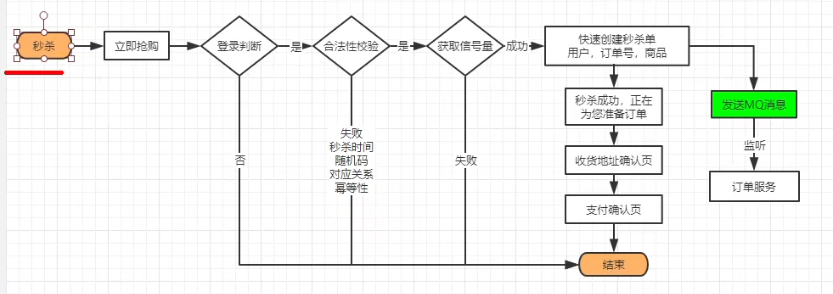

## CompletableFuture

supplyAsync用于有返回值的任务，

runAsync则用于没有返回值的任务

#### 计算完成后续-complete

#### 计算完成后续-handle

### 应用

直接用的话也可以，通过supplyAsync等方法提交任务就行，但这里可以和Spring自带的注解@Async结合。用@Async注释的方法spring会识别为异步方法。这个如果不配置的话默认会由spring创建线程池，默认核心线程8，最大线程数是MAX_VALUE，那我们肯定不能用默认的，可以通过配置文件去设置。然后我还了解可以通过某种方式

~~~java
spring:
  task:
    execution:
      pool:
        max-size: 6
        core-size: 3
        keep-alive: 3s
        queue-capacity: 1000
      thread-name-prefix: name
~~~

## 分布式锁

### 抢单

司机抢单的时候需要用的分布式锁，保证每一个orderId只能被一个司机去处理。原本采用的是lockRedis.setIfAbsent() ,本质就是通过setNx命令

redis.setnx

单例模式（构造方法私有、static创建对象、提供public静态方法提供实例

抢单时，`lockRedis.setIfAbsent()`。原本是判断加锁是否成功，若成功`lockRedis.expire(15L, TimeUnit.SECONDS)`设置过期时间，修改订单状态，最后删除锁。

这个问题在于，setNx和expire的操作不是原子的，如果这两步间出现问题，过期时间设置失败，会导致死锁。虽然这个概率非常非常低，但是只要是我们能够预料到的就应该解决它。这里我看了一下，老版本的redisTemplate，如果你已经调用了`boundValueOps()`绑定了key，再调用`setIfAbsent()`是没有提供那个加锁设置过期时间的API的，只能通过`opsForValue().setIfAbsent()`才能对应的API。

这个情况还是有些问题的，因为我设置的锁过期时间是15秒，如果业务代码超过了15秒，另一个司机来抢单就会拿到锁执行代码，最后会显示两个司机都抢到了订单，出现异常。不过我个人觉得针对我们这个业务场景，设置到这一步也没有什么问题了。但是本着百分百优化了解到了redisson，它的解决方案挺不错的，通过看门狗的方式。使用起来也十分简单。

默认看门狗的时间是30s，我这边改成了15秒，这样每过1/3的时间，看门狗发现业务还没有执行完就会延长到15秒。其它请求的线程进来，就会等待未完成的线程。

（一直没有执行完怎么办）

### Redisson

Redisson采用了基于NIO的Netty框架

Rlcok 分布式可重入锁

~~~java
        RLock rLock = redissonClient.getLock("orderId");
        rLock.lock();
~~~

看门狗默认续期30s

### 分布式ID

原本项目是采用了CAS的方式去保证创建出的id是不同的，首先生成当前时间戳，如果生成的时间戳和当前存储的时间戳不一致，就把sequence重置为0，否则就得加上一个修正，因为这说明有两个生成id的请求同时打进来了。然后就通过AtomicInteger的incrementAndGet()方法把序号+1，拼接到时间戳后面，中间还会加个当前服务器的标识。

其实我一开始是没有察觉到这里是有问题的，然后我去看了其它的分布式Id实现方案，推特的实现方式其实也类似，也是用雪花算法。但是它保证单节点序号不同的方式是在方法上加synchronized，直观来感觉的话肯定是CAS的操作支持的并发量更高，为什么推特没用这种方式，这肯定有他们的考量，那我肯定是更相信推特的程序员，然后我就分析CAS会有什么问题。
服务器标识可以保证每个微服务的id是区别开的，但是这个流程本身并不能够保证同一个服务器生成的id是唯一的。假如两个线程同时走到了incrementAndGet方法前，必然有一个线程先把序号加成1，在没有其它线程插入的时候，第二个线程会继续把这个值变成2，但是如果一个新的时间戳的线程进来先执行，它判断当前时间不一致，会把序列号重新置为0，第二个线程把它加为1，于是就会得到两个相同的id。

## 秒杀

数据尽量少，页面简单

秒杀的场次时间，和秒杀的产品在后台配置
开启定时任务，每天凌晨3点查找后三天的秒杀信息放置到缓存

### 定时任务缓存进redis

类上@EnableScheduling

1. 方法上 @Scheduled(cron = "* * * * * ?")
2. spring默认的线程池里核心线程只有1个，没完成默认是阻塞的。可以选择自己放入线程池执行。
3.  开启异步任务，在方法上@EnableAsync

* 每晚3点上架最近三天需要秒杀的商品
  * LocalTime.Min
  * LocalDateTime.of() 组合日期和时间
  * 开始时间_结束时间的long值为key，value为sessionId_skuId
    redisTemplate.opsForList().leftPushAll(k,v)
  * 再存一组活动id为key，保险内容json为value
    用Hash来存

* 设置随机码，防止脚本抢，在活动开始的时候才暴露这个随机码

* 设置秒杀商品的分布式信号量
  通过

  ~~~java
  RSemaphore semaphore = redissonClient.getSemaphore("seckill:stock"+"随机码")
  semaphore.trySetPermits("库存数")
  ~~~

* 处理秒杀上架的

* 

### 上架幂等性处理

给定时任务加分布式锁

* RLock.lock

后面再存redis的时候先redisTemplate.hasKey()查看是否有

### 遇到的问题

设置信号量一开始存在redis key是场次时间，value是商品id。再以商品id为key存相关信息，这就导致如果两个活动都有同一个商品的话，后面就只有一条数据。所以把存的value改成场次+商品id，这样就不会重复了。

### 返回当前时间的秒杀商品List

需要判断当前时间属于哪个秒杀场次，先取出所有的

~~~java
Set<String> keys = redisTemplate.keys(SESSIONS_CACHE_PREFIX + "*")
for(String key : keys) {
    String replace = key.replace("SESSIONS_CACHE_PREFIX", "")
    String[] s = replace.split("_")    
    long start = Long.parseLong(s[0])
    long end = Long.parseLong(s[1])    
    if(time > start && time < end) {
        // 用了redis的list指令range拿到存入的商品
        List<String> range = redisTemplate.opsForList().range(key, -100, 100);
        //绑定hash
        //取出商品详情list,用 multiGet
        List<Object> list = hashOps.multiGet(range)
        if(list != null) {
            
        }
        break
    }          
}       
~~~

### 返回指定商品的秒杀详情

通过redis的hash操作来获得

用正则筛选Key

### 秒杀

点击购买要先登录

优点就是就算击垮也只是秒杀服务，不会影响订单服务

### 高并发系统问题

#### 独立部署

#### 秒杀加密

每个随机码

#### 快速扣减

 

#### 动静分离

 

#### 流量错峰

可以在下单时加上验证码，不但可以拦截恶意请求，还可以起到流量错峰的作用

#### 限流、熔断、降级

#### 队列削峰

## Eureka生产优化

### 自动装配

starter包下都有个spring.factories，标记自动装配的类
EurekaServerAutoConfiguration
上面有@ConditionalOnBean({Marker.class})需要这个类，
然后启动类上加@EnableEurekaServer就只是注入了一个空Marker类

### 启动流程

加入了剔除任务，server端定期将没有心跳的服务剔除
设置进剔除任务的时间间隔毫秒数（默认60s，改成1秒）

* 从其它peer拉取注册表，那么拉取操作后的一段时间，再有新的节点是暂时没有同步的。

  需要通过后面的“集群同步” 再更新

添加事件(服务注册、服务开始、服务下线)到context

### 自我保护

服务少不开自我保护，因为挂了大概率是真挂了

服务多开自我保护，因为网络抖动的概率比较大

默认的剔除阈值为 0.85

### 快速下线

从源码进去看到它剔除不可用服务是通过Timer.schedule()来剔除的，这其实有个问题的，多线程并行处理任务时，Timer运行多个TimeTask，只要其中一个没有捕获抛出的异常，其它任务便会自动终止运行，换成ScheduleExecutorService比较好（可执行延迟任务，循环任务）

,设置进了2个参数，其中剔除的时间默认是60s，那么这段时间内就可能拉取到不可用的复位

监控下线事件，并发邮件通知。

### 优化多级缓存

register、readWriteCacheMap、readOnlyCacheMap

use-read-only-response-cache 设置为false

都说eureka实现了AP, 没有实现C

服务注册进入eurekaServer的addInstance方法。
更新register注册表（ConcurrentHashMap）
Map<服务名，map<实例id, 实例信息>>

新注册会让缓存readWriteCacheMap失效，但readWrite和readOnly之间的数据是30s同步一次的，一致性比较低，因此我选择舍弃一层缓存，换取强一些的一致性。

当取注册表信息的时候，才去从register读取。

### 服务注册

addInstance
通过http的方式交互，其实eureka这里代码写得也不是太好
一堆的if else进行空值校验，通过validate注解方式可读性更高

相互注册的服务同步之后，不会向目标服务的peer同步。所以eureka官方也是推荐你配置的时候把所以的服务集群都写进去

### **设计点**

收到服务实例信息之后，有各种事件配置，心跳时间、同步时间、续约时间、剔除时间。

eureka抽象成租约Lease，里面放置各种时间属性，和持有的服务实例Holder。

这样设计其实和eureka的业务有关系，因为它后面频繁的续约会更改租约中的时间属性值，这样不会影响其中的instance实例

日均几十W次，一秒可承受至少1000的并发，用的concurentHashMap put 

## java基础

~~~java
        String url = configService.mapServiceUrl() + "/distance?";
        Map<String, Object> map = new HashMap<>();
        map.put("originLongitude", distanceRequest.getOriginLongitude());
        map.put("originLatitude", distanceRequest.getOriginLatitude());
        map.put("destinationLongitude", distanceRequest.getDestinationLongitude());
        map.put("destinationLatitude", distanceRequest.getDestinationLatitude());
        String param = String.join("&", map.keySet().stream().map(k -> k + "={" + k + "}").collect(Collectors.toList()));
        url = url + param;
~~~

## 集合框架

### HashMap长度为什么是2的幂次方

为了让hashmap存储高效，我们是把key通过hash函数映射地均匀松散，取值范围在-2^32 — 2^32 - 1，但是我们的数组长度不可能这么大。让我来设计的话，我肯定第一时间想到的是对数组长度取余的方式。重点其实就在这里，取余(%)操作中如果除数是2的幂次则等价于与其除数减一的与(&)操作，效率是比%高的。因此hashmap就采取了这种方式，

### HashSet 如何检查重复

当你把对象加入HashSet的时候，HashSet会先去计算对象的HashCode,与其它已加入元素的hashCode作比较，如果没有相同，自然是没有重复的。否则会再调用equals()检查是否真的相同。相同就不会加入这个元素

这里其实可以引申出一个点，就是为什么我们重写equals方法后就必须重写hashCode。

两个对象相等的话，hashCode也一定相同，调用equals返回的也是true, 因此你如果重写了equals方法而没重写hashCode，那么hashCode默认是对堆上的对象产生的独特值，不重写的话，该class对象的两个对象无论如何都不会相等

### HashMap 多线程操作导致死循环问题

hashmap扩容的时候，需要调用rehash()，并发的情况下，这个rehash()就可能会出现问题，可能会导致元素之间形成循环列表，导致后面的get无效

具体不是太了解了，因为并发场景下我们基本是使用ConcurrentHashMap（转移话题吹）

## Spring

### Bean生命周期

* 像我们一开始通过配置文件去配置bean,到后面通过注解等方式，实际都是通过不同的途径转为beanDefinition，实际也是面向对象的思想方式，抽象出这个beanDefinition接口，方便扩展。

* 接着通过反射创建bean实例，通过set()设置一下属性值。

* 如果实现了`BeanNameAware`，调用 `setBeanName()`方法，传入 Bean 的name
  如果实现了`BeanClassLoaderAware`，调用调用 `setBeanClassLoader()`方法，传入 Bean 的名字
  如果 Bean 实现了 `BeanFactoryAware` 接口，调用 `setBeanFactory()`方法，传入 `BeanFactory`对象的实例

- 与上面的类似，如果实现了其他 `*.Aware`接口，就调用相应的方法。
- 如果有和加载这个 Bean 的 Spring 容器相关的 `BeanPostProcessor` 对象，执行`postProcessBeforeInitialization()` 方法
- 如果 Bean 实现了`InitializingBean`接口，执行`afterPropertiesSet()`方法。
- 如果 Bean 在配置文件中的定义包含 init-method 属性，执行指定的方法。
- 如果有和加载这个 Bean 的 Spring 容器相关的 `BeanPostProcessor` 对象，执行`postProcessAfterInitialization()` 方法
- 当要销毁 Bean 的时候，如果 Bean 实现了 `DisposableBean` 接口，执行 `destroy()` 方法。
- 当要销毁 Bean 的时候，如果 Bean 在配置文件中的定义包含 destroy-method 属性，执行指定的方法。

### AOP动态代理

Spring提供了两种方法来生成代理对象，JDKProxy和Cglib，具体使用哪一种的话是由AopProxyFactory 根据 AdvisedSupport 对象的配置来决定。一般我们也不会改这个配置，所以默认的策略就是如果目标类实现了接口就会通过JDK动态代理，否则的话使用Cglib来生成代理。

**JDK** **动态接口代理**

JDK 动态代理的关键在于java.lang.reflect包下的两个类，Proxy 和 InvocationHandler。

其中Proxy中使用频率最高的方法是`newProxyInstance()` ，主要是用来生成一个代理对象，接口入参有3个ClassLoader类加载器、被代理类实现的接口、实现了InvocationHandle的对象。

~~~java
// 
// 被代理类实现的接口
// 实现了InvocationHandle
public static Object newProxyInstance(ClassLoader loader,
                                          Class<?>[] interfaces,
                                          InvocationHandler h)
        throws IllegalArgumentException
    {
        ......
    }
~~~

前两个显然是被代理类相关的信息，需要额外关注的是这个`InvocationHandle`，它是用来自定义我们的处理逻辑，当我们的动态代理对象调用一个方法时，实际会被转发到`InvocationHandler`接口类的invoke()方法来调用，所以我们可以在invoke方法中自定义处理逻辑，比如在方法执行前后做一些操作什么的。

~~~java
public interface InvocationHandler {
    // 当你使用代理对象调用方法的时候实际会调用到这个方法
    public Object invoke(Object proxy, Method method, Object[] args)
        throws Throwable;
}
~~~

**CGLIB动态代理**

JDK动态代理的一个缺陷就是只能代理实现了接口的类，那么这个时候就需要通过CGLIB来实现动态代理。它的原理是通过生成目标类的子类来代理对象。

在 CGLIB 动态代理机制中 `MethodInterceptor` 接口和 `Enhancer` 类是核心。 `MethodInterceptor`就类似于`InvocationHandler`,我们需要自定义 `MethodInterceptor` 并重写 `intercept` 方法，`intercept` 用于拦截增强被代理类的方法。

通过 `Enhancer`类来动态获取被代理类，当代理类调用方法的时候，实际调用的是 `MethodInterceptor` 中的 `intercept` 方法。

**总结**

1. 就二者的效率来说，大部分情况都是 JDK 动态代理更优秀，随着 JDK 版本的升级，这个优势更加明显。
2. **JDK 动态代理只能代理实现了接口的类或者直接代理接口，而 CGLIB 可以代理未实现任何接口的类。** 另外， CGLIB 动态代理是通过生成一个被代理类的子类来拦截被代理类的方法调用，因此不能代理声明为 final 类型的类和方法

#### Dao 接口的工作原理是什么？

Dao 接口，就是人们常说的 `Mapper` 接口，接口的全限名，就是映射文件中的 namespace 的值，接口的方法名，就是映射文件中 `MappedStatement` 的 id 值，接口方法内的参数，就是传递给 sql 的参数。 `Mapper` 接口是没有实现类的，当调用接口方法时，接口全限名+方法名拼接字符串作为 key 值，可唯一定位一个 `MappedStatement` ，举例： `com.mybatis3.mappers. StudentDao.findStudentById` ，可以唯一找到 namespace 为 `com.mybatis3.mappers. StudentDao` 下面 `id = findStudentById` 的 `MappedStatement` 。在 MyBatis 中，每一个 `<select>` 、 `<insert>` 、 `<update>` 、 `<delete>` 标签，都会被解析为一个 `MappedStatement` 对象。

Dao 接口的工作原理是 JDK 动态代理，MyBatis 运行时会使用 JDK 动态代理为 Dao 接口生成代理 proxy 对象，代理对象 proxy 会拦截接口方法，转而执行 `MappedStatement` 所代表的 sql，然后将 sql 执行结果返回。

## 多线程

### 说下自己的理解

在多线程编程之前，我觉得首先应该清楚几个基本的概念。这就涉及到并发编程的3大特性，可见性，有序性，原子性。

1.可见性

这个首先得提一下JMM，jvm虚拟机是一种抽象化的计算机，所以它有着自己的一套完善的架构，JMM模型定义是内存分为工作内存和主内存，工作内存是从主存拷贝的副本，属于线程私有。当线程启动时，从主存中拷贝副本到工作内存，执行相关指令操作最后写回主存。

因此我们多线程去操作同一个变量的时候，一个线程对变量的修改，其它线程是不可见的。这个就可以牵扯出volatile关键字，它其中的一个作用保证可见性。被volatile修饰的变量，就被认为是不稳定的，线程在操作的时候都会从主存去读取。（顺便说volatile的其它作用）

2.有序性

线程的运行顺序是不可预知的，同时单线程内的指令也不一定就是按照顺序执行的，存在乱序的可能性。不过这个乱序有一个前提，那就是 as-if-serial，意思就是不影响单线程的最终一致性，那比如两条语句，i=1,i=i+1。这两条语句有依赖关系，肯定是不能乱序的。但是当涉及到多线程的时候，我们就需要关注这个问题。

3.原子性

无论什么语言最终都是转化为汇编语言，并且汇编语言的每一条指令也是可能被其他语言所打断的。我记得有8大原子操作。
lock,unlock肯定是原子性的，还有读取内存什么的操作

### synchronized原理

这个需要去看字节码，究竟在jvm层面的指令是如何。通过反编译可以看到执行了monitorenter 和monitorexit。

每一个对象在同一时间只能和一个monitor关联，而一个monitor在同一时间又只能被一个线程获得，所以当一个对象试图获得与它关联的monitor锁的所有权的时候，这个monitorenter会出现几种情况。0，不是0再判断持有的线程是不是当前线程，这个涉及可重入的概念。之所以设计成可重入主要是防止出现死锁的问题。

### AQS

AQS 就是一个抽象类，主要用来构建锁和同步器。

它的核心思想就是，如果请求的共享资源是空闲的，就将当前请求的线程设置为有效工作线程，并且将共享资源设置为锁定状态。当请求的资源是锁定的时候，AQS实现了一套线程阻塞等待以及被唤醒时的锁分配机制。具体的话我看了下AQS的实现。我总结下来的话可以分为5层
API层、锁获取方法层、队列方法层、排队方法层、数据提供层
我们自己去做自定义同步器的时候只需要去重写第一层的API方法即可，就会进入到第二层获取锁的方法层，如果获取失败就会进入第三第四对于等待队列的处理方法，这些需要依赖于第五层的数据提供层。

AQS是通过队列锁来实现的，它会将暂时没有获取到锁的线程放到队列中，这个队列是一个虚拟的双向Node队列

从上面的分析可以看出最关键的就是那个共享资源，AQS中的一个用volatile修饰的int类型的state，用来表示同步状态。队列中的节点会通过CAS去操作这个state修改它的值，实现状态的原子变更。因此也有人把AQS叫做 volatile+CAS.

从后面方法名里其实能看出来AQS定义了两种资源共享方式，比如有tryAcquire()，也有tryAcquireShared()

**资源共享方式**
AQS 定义两种资源共享方式

**1)Exclusive**（独占）

以`ReentrantLock`为例，它就是一个独占锁，即只要一个线程能够执行。同时它还可以设置公平和非公平锁。公平锁下，线程会按照在队列中的排队顺序去获取锁，非公平下队列中的所有线程会去抢锁，没抢到再重新加入队列等待唤醒。

我是看了`ReentrantLock`的源码，`FairSync` 和`NonfairSyncs`对于lock方法的实现看它是怎么具体的实现公平与非公平的。

* 非公平锁在调用lock方法的时候，这里的源码jdk8和11有些不同。1.8首先就会调用一次cas去抢锁,11则是把这里去除了。这里不得不提一下他们的代码质量，因为非公平锁去掉了先cas的逻辑，所以这个lock方法里就只剩下了acquire()方法，就不需要Fair和Nonfaire锁去重写了，干脆在11把子类的lock方法给删掉，直接由`ReentrantLock`去调用AQS的tryAcquire()方法。
  接在去看下status是否为0，是的话cas，不是的话得判断一下持锁的线程是否为当前线程，这里可以看出它是可重复锁，因为相同的话会把status+1。
* 公平锁会额外查看一下当前队列前是否有别的Node，没有的话才会去CAS，其它基本是一样的

相对来说非公平的性能肯定更好，但会让获取锁的时间变得更不确定，线程饥饿的概率大一些

**2)Share**（共享）

顾名思义多个线程可同时执行，像 `Semaphore/CountDownLatch`。`Semaphore`、`CountDownLatch`、 `CyclicBarrier`、`ReadWriteLock` 

自定义同步器在实现时只需要实现共享资源 state 的获取与释放方式即可，至于具体线程等待队列的维护（如获取资源失败入队/唤醒出队等），AQS 已经在底层已经帮我们实现好了。

看AQS的 Acquire(1)方法，获取锁失败后会调用addWaiter 
具体细节记不清了，大体上就是把对应线程以Node的结构加入到等待队列中。acquireQueued 会把放入队列中的线程不断去获取锁，直到获取成功或者不再需要获取（中断）。

**模板方法**
这里得提一下模板方法，这些同步器都是通过继承AQS并重写指定的方法实现对共享资源status的获取和释放，我这里就不赘述模板方法了。

用`CountDownLatch`来举例，任务会分成N个子线程去执行，那么就要把status也初始化为N（默认是0）。调用await()方法的时候会判断当前status的数值，如果不为0 await()方法就会一直阻塞。直到`CountDownLatch`自旋CAS判断当前的state==0，就会释放所有等待的线程

从它的这个await机制其实就可以构想到它的应用场景，比较常见的一个场景就是，一个线程等待多个线程的返回结果再继续执行。主线程调用await()阻塞住，每当一个线程执行完毕就`countDown()`把status -1,直接所有的线程执行完，status变为0，主线程才会解除阻塞继续执行。

顺便掰扯ReentrantLock和Synchronized

提下线程池中的worker

## JVM

### 对象创建流程

虚拟机遇到一条new指令的时候，首先会去检查能否在常量池中定位到这个类的符号引用，并检查是否该引用代表的类是否被加载解析初始化过。如果没有就得先走一个类加载过程。

类加载分为3个阶段，loading、linking、initialing
loading就是由我们的classLoader把解析class加载到内存中
linking阶段也大概分为3部，首先是verification，校验class文件是否规范，还有对字节码的语义分析，比如你继承了一个final修饰的类都会在这个阶段被检查出来。再就是对字节码进行验证，这个流程比较复杂，因为检查的是你代码中的语义是否合法、符合逻辑的。接着是Preparation，给类变量分配内存并设置初始值，这些内存是在方法区中分配的。此时初始化是不包括实例变量的，实例变量需要在对象实例化的时候再一同分配到堆中。然后是Resolution，是将常量池中的符号引用替换成直接引用，也就是得到类、字段、方法在内存中的指针或偏移量，那在需要调用的时候就可以直接通过指针或偏移量来访问到。

最后Initializing，开始为新生的对象分配内存，需要分配的大小在类加载后是可以确定的。分配内存自然需要在堆中划分出一块区域。这个分配方式其实牵扯到垃圾回收的算法，还需要考虑分配内存时的并发问题。这里先不详细说。

对象内存分配完成后，需要将分配到的内存空间都初始化为0值（不包括对象头）这一步就保证对象的实例字段可以在代码中没赋值的情况下也可以直接使用。

接着就是设置对象头中的信息，比如这个对象是哪个类的实例，对象的哈希码，GC分代年龄之类的信息。还有锁的状态之类（对象头的前两位就保存着锁的状态）

从虚拟机来看的话，这个时候对象就算是创建完成了。从Java程序来看则才刚刚开始，因为init方法还没执行，所有字段还都是null

### 双亲委派是怎么一回事

主要是为了两件事，一个是防止重复加载同一个class，一个是防止核心class被篡改。加载流程的话我去看了classLoader的源码，首先最下层的CustomerClassLoader会调用findInCache()来看自己的自定义缓存中是否有这个class，没有的话在去调用它parent的loadClass()，这里的parent并不是说类加载器间有继承关系，是逻辑上的一个关系。这样同理这个parent也会调用自己的findInCache()查看，这样一路向上就会调用到bootstrapClassloader。它的缓存中也没有的话就会调用findClass()方法来加载这个类，它没加载到才会去调用下一个classLoader去加载，这样就保证了核心的class不会被篡改。

其实知道这个流程之后，我们就知道怎么去打破双亲委派了。只需要继承classLoader后去重写它的loadClass

## MySQL

Undo Log 如何保障事务的原⼦性呢？

在操作任何数据之前，首先会将数据备份到一个地方（Undo Log）,如果出现错误或用户执行了rollback，系统就可以通过Undo Log恢复数据

Redo Log如何保障事务的持久性呢？

Redo Log 记录的是新数据的备份（和 Undo Log 相反）。 在事务提交前，只要将 Redo Log 持久化即可，不需要将数据持久化。当 系统崩溃时，虽然数据没有持久化，但是 Redo Log 已经持久化。系统可 以根据 Redo Log 的内容，将所有数据恢复到崩溃之前的状态。

## 消息队列

### 为什么用消息队列

**异步**：随着业务的发展，业务之间的调用链路是越来越长，相对的响应时间也会变长。而有些业务其实相对来说对于及时的要求没那么高。比如我们项目中购买保单后投保人相关的信息需要同步到下游系统，用于售后的一些功能处理。这个要求就不需要那么及时，所以完成可以在订单结束之后就返回响应，后续的操作到消息队列中消费处理

**解耦：**如果后续的各种服务都需要依赖于这个下单，没有消息中间件从中解耦的话，你每次都需要去修改这个订单服务。

**流量削峰：**大流量打过来，如果全部打到后端服务上，可能会抗不住。那么就可以把请求先放到消息队列中，后端服务按照自己的能力来消费。

但引入一个新的系统，整体稳定性必然会下降一层，是个取舍的过程，技术方案没有银弹。

### 消息不丢

生产者通过重试的方式，或者采用添加回调函数的方式

kafka自身的话通过副本的机制来保证，因为我们消息最终是存储在partition中的，在生产上我们会给kafka做集群，那么有一个replication的配置，我们配置成3，代表每个partition有3个副本，这样虽然会导致一些数据的冗余，但是可以提高安全性。然后还有个配置是min什么配置成2，意思就是消息至少要被同步到两个副本才被认为是发送成功。

消费者则确保自己真正执行完成业务逻辑之后再给broker发送ack的消息，当然也会出现消费完成发送ACK的时候挂掉的问题，就是下面处理重复消息的解决办法

### 重复消息

首先想的是到底能不能避免消息的重复。先从producer来看，如果producer只负责发不管broker的回复，那肯定是不会出现重复消息，但这消息的可靠性就不存在了。所以还是要等broker的响应，那自然会出现broker写入之后，响应通知producer没收到的情况，producer又会重新发送，这边是避免不了的。

同理consumer那边也是类似的情况，我这边拿到消息，业务逻辑走完，事务也commit了。结果消息队列挂掉了，没有更新consumer offset，就会重复消费。

这就可以看出来正常业务消息重复是不可避免的，关键的解决思路就是 **幂等**

### 消息有序性

全局有序就不提，这显然就违背了初衷，我们之所以做了发布订阅的模型就是为了解决队列模型并发的弱点，做到全局有序就只能用一个queue，所以可以采用部分有序的方式，发送消息的时候通过特定的策略，比如同一类业务用相同标识，这样可以让一类消息发送到一个queue上面。这样一个topic也支持多线程去消费。

### 消息堆积

首先得确认是哪里的问题，究竟是bug，还是消费者能力弱。比如合并db操作增加消费的效率。如果这样优化之后还不行就考虑给broker扩容。

### 自己如何实现消息队列

从几个重要的角色入手。生产者、消费者、Broker、注册 中心。

为了考虑扩容和整体的性能，采用分布式的思想，像 Kafka 一样采取分区理念，一个 Topic 分 为多个 partition，并且为保证数据可靠性，采取多副本存储，即 Leader 和 follower，根据性能 和数据可靠的权衡提供异步和同步的刷盘存储。 并且利用选举算法保证 Leader 挂了之后 follower 可以顶上，保证消息队列的高可用。

### 消费模式

push和pull

push模式下，因为broker是不清楚consumer的消费能力的，如果由broker来推，那么推送速率它难以控制，推得慢了消费者嫌慢，推快了消费者说我消费不过来了。

pull的话由consumer主动向broker请求拉取消息。这样它就可以根据自身情况来发起拉取请求。当然也有缺点，就是它不知道消息什么时候到了，自然需要隔一段时间去请求一次。但这个请求的频率也需要控制，请求太频繁就好像在攻击broker一样。

就看怎么取舍了，rocketMq和kafka都选择了pull的模式。从功能上考虑其实我也倾向于拉的模式，这样消息队列比较纯粹，它的作用就是接受保存好消息，等待消费者来消费。

为了处理pull的缺点，rocketMq和kafka是采用的长轮询的机制，具体细节我还没有了解，大概了解是拉取请求不满足条件的时候会hold住，等到满足条件之后，broker再提醒返回，从而避免consumer频繁的拉取动作

### 事务消息

producer首先发送一个半消息

## GIT

保存的是快照流

分布式

谈论分布式的时候是避不开CAP，我们做分布式系统的时候最终其实都是在CAP中去取舍。通常大家提到CAP可能会说3者中我们只能实现其中两者，这样说其实是不准确的。因为我们分布式系统本身就是必须满足P的（分区容错性），所以最终我们是在AP和CP中取舍。就延伸出了BASE理论，是Basically Availbale（基本可用）、Soft state（软状态）和Eventually consistent（最终一致性）三个短语的缩写。
基本可用就是说，系统出现故障的时候，我们允许损失部分功能而换取核心功能的可用，由于不要求强一致性，所以BASE系统允许系统存在中间状态，也就是软状态，不影响系统可用性。比如”支付中“，”数据同步中“这些状态。
最终一致性就是说，虽然中间过程数据没有达成一致，但是最终我们可以保证数据可达成一致。

#### 分布式事务

分布式事务的解决方案非常多，不同的场景我们会选择不同的解决方案。

刚性事务，满足CP
2PC，3PC都是应用。

柔性事务，也就是BASE理论下的事务
实现方式大概有补偿型、异步确保型、最大努力通知型。
TCC、本地事务消息、RocketMQ的事务消息

XA协议是需要提一下的，它也是一个规范，这个模型主要有3个角色TM、RM、AP，主要定义了TM和RM之间的接口。当需要事务的时候，AP向TM请求发起事务，TM负责整个事务的提交、回滚。

之所以要引入这个TM，是因为在分布式系统中，从理论上来说，两台机器是无法达成一致性的（这个可以参考相关的论文，像Fischer的）总之就是需要引入一个单点来协调。

它的实现就有2PC/3PC Seata

#### 柔性事务

补偿型，像TCC，事后补偿，但会和业务代码耦合，数据库操作不多的时候可以考虑

异步确保型，引入消息中间件，将事务参与者解耦，这个主要是用于内部系统。

最大努力通知，这个主要是用于外部系统，如果调用过支付相关的接口的话比较熟悉，它会每隔一段时间就给你发送支付结果的信息，只能尽量的确保你能够收到。

#### 事务消息

由Producer先发送半消息，这个半消息不是说消息是不完整的，而是说这个消息暂时是对Consumer是不可见的，实际上RocktMQ就是把它的topic名字更改掉。Broker存储半消息成功返回。Producer就执行本地事务，然后把执行结果通知到broker,来决定后续操作。如果成功，mq就会把消息状态改为提交，把半消息复制到原本的topic的queue中。但是由于Producer可能出现故障导致它没有主动通知自己的事务执行状态，mq会启动定时任务去反查状态。

**实现原理**
半消息发送的时候，会传入一个回调类TransactionListener，使⽤时必须实现其中的两个⽅法，executeLocalTransaction ⽅法会在broker返回半消息存储成功后执⾏，我们会在其中执⾏本地事务；checkLocalTransaction⽅法会在broker向producer发起反查时执⾏，我们会在其中查询库表状态。两个⽅法的返回值都是消息状态，就是告诉broker应该提交或者回滚半消息

## 复习

2.3.21.3. 执⾏ execute()⽅法和 submit()⽅法的区别是什么呢？

谈谈AQS

2.4.9. 如何判断⼀个类是⽆⽤的类?

 Cookie的作⽤是什么?和Session有什么区别？

MyISAM和InnoDB区别

一条SQL语句在MySQL中如何执行的

11. Redis是如何判断数据是否过期的呢？

缓存穿透解决方案

这个 Dao 接⼝的⼯作原理是什么？Dao 接⼝⾥的

session cookie

token

## 一致性哈希、哈希槽