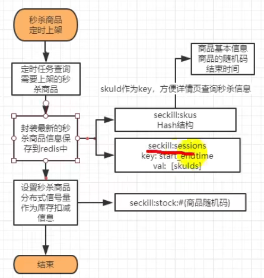

## CompletableFuture

supplyAsync用于有返回值的任务，

runAsync则用于没有返回值的任务

#### 计算完成后续-complete

#### 计算完成后续-handle

### 应用

使用@Async注解修饰方法

默认会由spring创建线程池
默认核心线程8，最大线程数是MAX_VALUE，可能会无限制创建线程
通过自定义配置

~~~java
spring:
  task:
    execution:
      pool:
        max-size: 6
        core-size: 3
        keep-alive: 3s
        queue-capacity: 1000
      thread-name-prefix: name
~~~

## 分布式锁

### 抢单

redis.setnx

单例模式（构造方法私有、static创建对象、提供public静态方法提供实例

抢单时，lockRedis.setIfAbsent()
锁住之后修改订单状态，最后删除锁。

如果业务代码超过了15秒的过期时间，另一个司机就会拿到锁执行代码，最后会显示两个司机都抢到了订单，出现异常。

### Redisson

Redisson采用了基于NIO的Netty框架

Rlcok 分布式可重入锁

~~~java
        RLock rLock = redissonClient.getLock("orderId");
        rLock.lock();
~~~

看门狗默认续期30s

### 分布式ID

推特采用synchronized 锁住nextId()方法。

因为我们并发量并没有这么大，所以采用CAS的方式，方法本身没有加锁。在时间戳和最后时间戳不同时，将sequence设置为0，然后在时间戳后加上

## 秒杀

数据尽量少，页面简单

### 定时任务

类上@EnableScheduling

1. 方法上 @Scheduled(cron = "* * * * * ?")
2. spring默认的线程池里核心线程只有1个，没完成默认是阻塞的。可以选择自己放入线程池执行。
3.  开启异步任务，在方法上@EnableAsync

* 每晚3点上架最近三天需要秒杀的商品
  * LocalTime.Min
  * LocalDateTime.of() 组合日期和时间

### 缓存进redis

## java基础

~~~java
        String url = configService.mapServiceUrl() + "/distance?";
        Map<String, Object> map = new HashMap<>();
        map.put("originLongitude", distanceRequest.getOriginLongitude());
        map.put("originLatitude", distanceRequest.getOriginLatitude());
        map.put("destinationLongitude", distanceRequest.getDestinationLongitude());
        map.put("destinationLatitude", distanceRequest.getDestinationLatitude());
        String param = String.join("&", map.keySet().stream().map(k -> k + "={" + k + "}").collect(Collectors.toList()));
        url = url + param;
~~~

## 复习

2.3.21.3. 执⾏ execute()⽅法和 submit()⽅法的区别是什么呢？

谈谈AQS

2.4.9. 如何判断⼀个类是⽆⽤的类?

 Cookie的作⽤是什么?和Session有什么区别？

MyISAM和InnoDB区别

一条SQL语句在MySQL中如何执行的

11. Redis是如何判断数据是否过期的呢？

缓存穿透解决方案

这个 Dao 接⼝的⼯作原理是什么？Dao 接⼝⾥的

session cookie

token

一致性哈希、哈希槽