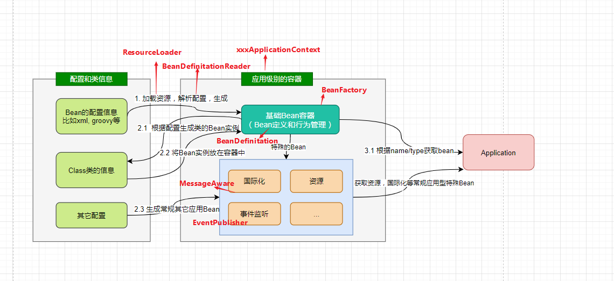

 先自我介绍一下，我是邓子鹏，20年毕业于青岛理工大学之后就到了杭州凯捷技术咨询工作，在职期间的话主要是负责了metlife人寿保险的项目后端开发，项目期间一些稍微突出的贡献简历上有写，在技术上处理的比较难的就是设计的秒杀免险的需求，还有rabbitmq做的退保犹豫期。然后在职期间还有


## 待办

1. jvm调优
2. docker部署
3. rabbitmq ttl 延迟队列
4. 线程池隔离
5. XXJOB
6. LCN
7. redis变慢


1. ELK + Kafka分布式日志
2. alibaba 
3. LVS

docker


## ELK

用户通过java应用程序的Slf4j写入日志，SpringBoot默认使用的是logback。我们通过实现自定义的Appender将日志写入kafka，同时logstash通过input插件操作kafka订阅其对应的主题。当有日志输出后被kafka的客户端logstash所收集，经过相关过滤操作后将日志写入Elasticsearch，此时用户可以通过kibana获取elasticsearch中的日志信息

### 配置kafka

\- 在input当中我们指定日志来源为kafka，具体含义可以参考官网：[kafka-input-plugin](https://www.elastic.co/guide/en/logstash/current/plugins-inputs-kafka.html) 

- 在filter中我们配置grok插件，该插件可以利用正则分析日志内容，其中patterns_dir属性用于指定自定义的分析规则，我们可以在该文件下建立文件配置验证的正则规则。举例子说明：55.3.244.1 GET /index.html 15824 0.043的 日志内容经过如下配置解析：


## LCN

本质上是 由LCN代理的数据库连接。事务发起方会调用tx-manager创建事务组对象，拿到groupId。在进行后面调用的时候会把这个groupId传递过去，再通知到TM，这样TM就知道有哪些服务是同一个事务组，才能做到统一管理。

在发起方执行完业务代码后，将执行结果状态通知给TM.

事务参与方提交实际是提交给了TXClient模块，TXClient模块下有一个框架定义的连接池。这个连接池其实就是在没有通知事务结果之前一直占有着这次事务的链接资源，没有释放

TM根据状态通知TxClient，然后TxClient会去执行相应的提交或回滚。提交之后再去关闭连接，这个就是LCN的事务协调机制。说白了就是代理了DataSource，拦截了连接池，从而控制连接池的事务提交。

### 使用

启动类中**添加@EnableDistributedTransaction注解**
需要事务处理的方法上加上@LcnTransaction


## XXL-JOB

### 概述

需要一个调度中心，

### 部署

运行调度数据库初始化sql，在数据库建表

配置报警邮箱、数据库等信息

调度中心及部署完毕

部署执行器（接受调度中心的调度并执行）

### 执行器配置

路由策略：当执行器集群部署时，提供丰富的路由策略
选择了轮询


### 执行开发

GLUE模式(Java)”的执行代码托管到调度中心在线维护，相比“Bean模式任务”需要在执行器项目开发部署上线，更加简便轻量

继承了IJoBHandler的类来执行

1. ` - 运行模式：`
2. `        BEAN模式：任务以JobHandler方式维护在执行器端；需要结合 "JobHandler" 属性匹配执行器中任务；`
3. `        GLUE模式(Java)：任务以源码方式维护在调度中心；该模式的任务实际上是一段继承自IJobHandler的Java类代码并 "groovy" 源码方式维护，它在执行器项目中运行，可使用@Resource/@Autowire注入执行器里中的其他服务；`

~~~java
/**
 * @author fueen
 * 编写自己的定时任务Handler，老版本是JobHandler，新版是XXLJob
 * 继承IJobHandler
 *
 */
@JobHandler(value = "MyJobHandler")
@Component
public class MyJobHandler extends IJobHandler {
    /**
     * 重写execute方法，里面执行相应的功能
     */
    @Override
    public ReturnT<String> execute(String param) throws Exception {
        System.out.println("我们不能失去信仰");
        return SUCCESS;
    }
}
~~~

再到调度中心添加任务

### 

## CompletableFuture

而`CompletableFuture`是对`Future`的扩展和增强。`CompletableFuture`实现了`Future`接口，并在此基础上进行了丰富的扩展，完美弥补了`Future`的局限性，**同时`CompletableFuture`实现了对任务编排的能力**。而在以往，虽然通过`CountDownLatch`等工具类也可以实现任务的编排，但需要复杂的逻辑处理，不仅耗费精力且难以维护。

**依赖关系**

- `thenApply()`：把前面任务的执行结果，交给后面的`Function`
- `thenCompose()`：用来连接两个有依赖关系的任务，结果由第二个任务返回

**and集合关系**

- `thenCombine()`：合并任务，有返回值
- `thenAccepetBoth()`：两个任务执行完成后，将结果交给`thenAccepetBoth`处理，无返回值
- `runAfterBoth()`：两个任务都执行完成后，执行下一步操作(`Runnable`类型任务)

##### or聚合关系

- `applyToEither()`：两个任务哪个执行的快，就使用哪一个结果，有返回值
- `acceptEither()`：两个任务哪个执行的快，就消费哪一个结果，无返回值
- `runAfterEither()`：任意一个任务执行完成，进行下一步操作(`Runnable`类型任务)

supplyAsync用于有返回值的任务，

runAsync则用于没有返回值的任务

#### 计算完成后续-complete


#### 计算完成后续-handle


### 应用

直接用的话也可以，通过supplyAsync等方法提交任务就行，但这里可以和Spring自带的注解@Async结合。用@Async注释的方法spring会识别为异步方法。这个如果不配置的话默认会由spring创建线程池，默认核心线程8，最大线程数是MAX_VALUE，那我们肯定不能用默认的，可以通过配置文件去设置。然后我还了解可以通过某种方式

~~~java
spring:
  task:
    execution:
      pool:
        max-size: 6
        core-size: 3
        keep-alive: 3s
        queue-capacity: 1000
      thread-name-prefix: name
~~~


## 分布式锁

### 抢单

司机抢单的时候需要用的分布式锁，保证每一个orderId只能被一个司机去处理。原本采用的是lockRedis.setIfAbsent() ,本质就是通过setNx命令


redis.setnx

单例模式（构造方法私有、static创建对象、提供public静态方法提供实例

抢单时，`lockRedis.setIfAbsent()`。原本是判断加锁是否成功，若成功`lockRedis.expire(15L, TimeUnit.SECONDS)`设置过期时间，修改订单状态，最后删除锁。

这个问题在于，setNx和expire的操作不是原子的，如果这两步间出现问题，过期时间设置失败，会导致死锁。虽然这个概率非常非常低，但是只要是我们能够预料到的就应该解决它。这里我看了一下，老版本的redisTemplate，如果你已经调用了`boundValueOps()`绑定了key，再调用`setIfAbsent()`是没有提供那个加锁设置过期时间的API的，只能通过`opsForValue().setIfAbsent()`才能对应的API。

这个情况还是有些问题的，因为我设置的锁过期时间是15秒，如果业务代码超过了15秒，另一个司机来抢单就会拿到锁执行代码，最后会显示两个司机都抢到了订单，出现异常。不过我个人觉得针对我们这个业务场景，设置到这一步也没有什么问题了。但是本着百分百优化了解到了redisson，它的解决方案挺不错的，通过看门狗的方式。使用起来也十分简单。

默认看门狗的时间是30s，我这边改成了15秒，这样每过1/3的时间，看门狗发现业务还没有执行完就会延长到15秒。其它请求的线程进来，就会等待未完成的线程。

（一直没有执行完怎么办）

### Redisson

Redisson采用了基于NIO的Netty框架

Rlcok 分布式可重入锁

~~~java
        RLock rLock = redissonClient.getLock("orderId");
        rLock.lock();
~~~

看门狗默认续期30s

### 分布式ID

原本项目是采用了CAS的方式去保证创建出的id是不同的，首先生成当前时间戳，如果生成的时间戳和当前存储的时间戳不一致，就把sequence重置为0，否则就得加上一个修正，因为这说明有两个生成id的请求同时打进来了。然后就通过AtomicInteger的incrementAndGet()方法把序号+1，拼接到时间戳后面，中间还会加个当前服务器的标识。

其实我一开始是没有察觉到这里是有问题的，然后我去看了其它的分布式Id实现方案，推特的实现方式其实也类似，也是用雪花算法。但是它保证单节点序号不同的方式是在方法上加synchronized，直观来感觉的话肯定是CAS的操作支持的并发量更高，为什么推特没用这种方式，这肯定有他们的考量，那我肯定是更相信推特的程序员，然后我就分析CAS会有什么问题。
服务器标识可以保证每个微服务的id是区别开的，但是这个流程本身并不能够保证同一个服务器生成的id是唯一的。假如两个线程同时走到了incrementAndGet方法前，必然有一个线程先把序号加成1，在没有其它线程插入的时候，第二个线程会继续把这个值变成2，但是如果一个新的时间戳的线程进来先执行，它判断当前时间不一致，会把序列号重新置为0，第二个线程把它加为1，于是就会得到两个相同的id。


## 秒杀

本来PM给的需求是要做个送免费险的活动，

有看那个淘宝前架构师的高并发专栏，怎么去构建一个高性能系统。

数据尽量少，页面简单

秒杀的场次时间，和秒杀的产品在后台配置。考虑什么时候把秒杀数据放到缓存中。不确定那一天开始活动，所以就开一个定时任务，一开始不会用那个xxjob，加Async注解+schedule注解，到方法里限制。每天凌晨3点查找后三天的秒杀信息放置到缓存，并且需要设置随机码，防止预先抢。


开启定时任务，每天凌晨3点查找后三天的秒杀信息放置到缓存


### 定时任务缓存进redis

类上@EnableScheduling

> 我们都知道启动spring定时任务需要加上这个注解，我有去看这个注解到底做了什么事情。通过@Import导入了SchedulingConfiguration的配置类，这个配置类实际上就是通过@Bean的方式向spring容器注入了一个ScheduledAnnotationBeanPostProcesser，根据对生命周期的了解，它会在这里遍历Bean的每一个方法，

1. 方法上 @Scheduled(cron = "* * * * * ?")

2. spring默认的线程池里核心线程只有1个，没完成默认是阻塞的。可以选择自己放入线程池执行。
3.  开启异步任务，在方法上@EnableAsync

* 每晚3点上架最近三天需要秒杀的商品
  * LocalTime.Min
  * LocalDateTime.of() 组合日期和时间
  * 开始时间_结束时间的long值为key，value为sessionId_skuId
    redisTemplate.opsForList().leftPushAll(k,v)
  * 再存一组活动id为key，保险内容json为value
    用Hash来存

* 设置随机码，防止脚本抢，在活动开始的时候才暴露这个随机码

* 设置秒杀商品的分布式信号量
  通过

  ~~~java
  RSemaphore semaphore = redissonClient.getSemaphore("seckill:stock"+"随机码")
  semaphore.trySetPermits("库存数")
  ~~~

* 处理秒杀上架的

* 

### 上架幂等性处理

给定时任务加分布式锁

* RLock.lock

后面再存redis的时候先redisTemplate.hasKey()查看是否有


### 遇到的问题

设置信号量一开始存在redis key是场次时间，value是商品id。再以商品id为key存相关信息，这就导致如果两个活动都有同一个商品的话，后面就只有一条数据。所以把存的value改成场次+商品id，这样就不会重复了。

### 返回当前时间的秒杀商品List

需要判断当前时间属于哪个秒杀场次，先取出所有的

> 用list存场次key，用map存商品key.
> range()取出所有场次key
> multiGet()取出所有商品详情

~~~java
Set<String> keys = redisTemplate.keys(SESSIONS_CACHE_PREFIX + "*")
for(String key : keys) {
    String replace = key.replace("SESSIONS_CACHE_PREFIX", "")
    String[] s = replace.split("_")    
    long start = Long.parseLong(s[0])
    long end = Long.parseLong(s[1])    
    if(time > start && time < end) {
        // 用了redis的list指令range拿到存入的商品
        List<String> range = redisTemplate.opsForList().range(key, -100, 100);
        //绑定hash
        //取出商品详情list,用 multiGet
        List<Object> list = hashOps.multiGet(range)
        if(list != null) {
            
        }
        break
    }          
}       
~~~


### 返回指定商品的秒杀详情

通过redis的hash操作来获得

用正则筛选Key


### 秒杀（redis占位幂等）

点击购买要先登录

请求kill接口需要killId(场次+商品)和key(随机码)

快速生成用户信息，订单号，商品信息，发给mq。成功后直接给前端返回订单号


优点就是就算击垮也只是秒杀服务，不会影响订单服务

~~~java
public R kill(String killId, String key) {
    // 校验时间
    // 校验随机码和商品Id要匹配
    // 防用户重复领取，将userId_sessionId_skuId,过期时间就设置活动时间
    redisTemplate.setIfAbsent(redisKy,time);
    // 用100ms快速试一下减信号量
    RSemaphore semaphore = redissonClient.getSemaphore(key);
    //秒杀成功快速下单（看tryAcquire原理）
  	boolean b =semaphore.tryAcquire(1);
    //测试了下20ms以内，那么一个线程，一秒就能接受50的并发，tomcat500个线程就是1w并发
    //发mq,包括userId,orderId,sessionId,skuId
    rabbitTemplate.convertAndSent("交换机名","routingKey",orderTo)
}

~~~


添加配置信息

~~~java
//订单服务需要创建队列和绑定关系
public Queue
    
@Bean
public Binding orderSeckillOrderQueue() { 
    return new Binding ("order.seckill.order.queue",  inding.DestinationType.QUEUE, "order-event-exchange", "order.seckill.order", null)
}

~~~

添加Listener

~~~java
@Component
@RabbitListener(queues = "order.seckill.order.queue")
public class OrderSeckillListener {
    
    @Autowired
    OrderSerice orderService;
    
    @RabbitHandler
    public void listener(SeckillOrderTo seckillOrder,Channel channel, Message message) {
        //根据seckillOrder创建秒杀单，设置状态为未完成
        
        
    }
    
}


~~~


### 放消息队列


绑定交换机，


### 高并发系统问题

因为之前的业务场景是几乎没有这种高并发的需求的，所以做这个的时候我也是和领导都沟通过，自己出解决方案。所

#### 独立部署

保险起见是新开了一个独立的服务，这样即使扛不住压力也不会影响其他的系统，在硬件层面做隔离


#### 秒杀加密

给每个秒杀商品都给加上随机码，知道活动开始的时候再把这个随机码暴露出去，这样避免提前的秒杀。


#### 库存预热

通过redis的信号量控制来做。


#### 快速扣减

 

#### 动静分离

 

#### 流量错峰

可以在下单时加上验证码，不但可以拦截恶意请求，还可以起到流量错峰的作用

#### 限流、熔断、降级

给这里秒杀服务做了降级，请求失败


#### 队列削峰

首先构想怎么去处理这个请求，其实第一反应就是redis，一开始我不知道redis有那个信号量的功能，本来想的是用分布式锁，请求过来我先加锁，查redis中的库存，并把redis中的库存减一，再走创建订单的流程。然后又去查了一下还有什么好办法。就我比较喜欢先自己想方案，再去找别人的方案，看我的差在哪里。

第二次优化就是引入队列，因为这个处理秒杀其实细节很多，就是到底是下订单的时候去减库存还是最后支付的时候再减库存。下订单减库存做起来更直观一点，缺点就是当有人取消订单的时候需要再把库存加上去。而支付减库存的话就没办法控制下订单的人数，别人输入信息之后确认告诉你没有了，我觉得这个是非常有损用户体验的，所以还是选择下单后就减库存，虽然有的人会放弃，但是肯定也有不是整点来的用户是能够领到别人取消的订单的。

接着就是考虑创建订单的流程，因为瞬时间的流量会很大，如果每一个请求都直接去创建订单的话是有风险的，所以就想到用中间件去处理，我把成功拿到创建订单资格的请求信息发送到mq里，这边订单服务监听队列按照自己的能力去消费就好。


### 页面流程


点击邀请链接后点击秒杀需要先判断是否登录


## RabbitMQ ttl + 死信队列

直接来想的话，就是我想定个时间来做个事情，比如我定闹铃来提醒自己做什么事情，自然就是做个定时任务，定时任务可以用jdk自带的timer,还有ScheduledExecutorService，或者spring的 springTask，但是用这些办法给每个退保请求都单独起一个线程，就很不合适。那如果单起一个线程的话，整一个全局的定时任务来做，但是一细想的话问题还是很多，不能做到精准的控制时间，那比如我刚跑完一个定时任务就来了一个退保请求，一个定时任务就会判定它在犹豫期内，要60min分钟才能扫描到。这个就必然不在考虑范围内了。

然后就偶然间想到那段时间看RocketMQ消息设计，这样话等待的时间也不会占用系统资源

队列和消息都能设置TTL（Time To Live）。这些死信可以关联到一个Exchange，

有两种实现方式，给消息设置过期时间，给队列设置过期时间

。后来去了解了一下，这个rabbitMQ给消息设置的过期时间是惰性检查的方式。因为这个队列是有顺序的，加入你先扔了个5分钟过期的消息再扔个1分钟的，rabbitMQ是先检查这个5分钟的，没过期它过一段时间再来检查，发现你过期了给扔到死信队列。那等检查到后面那个1s的实际都过很长时间了。


## Eureka生产优化

### 自动装配

starter包下都有个spring.factories，标记自动装配的类
EurekaServerAutoConfiguration
上面有@ConditionalOnBean({Marker.class})需要这个类，
然后启动类上加@EnableEurekaServer就只是注入了一个空Marker类

### 启动流程

加入了剔除任务，server端定期将没有心跳的服务剔除
设置进剔除任务的时间间隔毫秒数（默认60s，改成1秒）

* 从其它peer拉取注册表，那么拉取操作后的一段时间，再有新的节点是暂时没有同步的。

  需要通过后面的“集群同步” 再更新

添加事件(服务注册、服务开始、服务下线)到context

### 自我保护

服务少不开自我保护，因为挂了大概率是真挂了

服务多开自我保护，因为网络抖动的概率比较大

默认的剔除阈值为 0.85

### 快速下线

从源码进去看到它剔除不可用服务是通过Timer.schedule()来剔除的，这其实有个问题的，多线程并行处理任务时，Timer运行多个TimeTask，只要其中一个没有捕获抛出的异常，其它任务便会自动终止运行，换成ScheduleExecutorService比较好（可执行延迟任务，循环任务）

,设置进了2个参数，其中剔除的时间默认是60s，那么这段时间内就可能拉取到不可用的复位

监控下线事件，并发邮件通知。

### 优化多级缓存

register、readWriteCacheMap、readOnlyCacheMap

use-read-only-response-cache 设置为false

都说eureka实现了AP, 没有实现C

服务注册进入eurekaServer的addInstance方法。
更新register注册表（ConcurrentHashMap）
Map<服务名，map<实例id, 实例信息>>

新注册会让缓存readWriteCacheMap失效，但readWrite和readOnly之间的数据是30s同步一次的，一致性比较低，因此我选择舍弃一层缓存，换取强一些的一致性。

当取注册表信息的时候，才去从register读取。

### 服务注册

addInstance
通过http的方式交互，其实eureka这里代码写得也不是太好
一堆的if else进行空值校验，通过validate注解方式可读性更高

相互注册的服务同步之后，不会向目标服务的peer同步。所以eureka官方也是推荐你配置的时候把所以的服务集群都写进去

### **设计点**

收到服务实例信息之后，有各种事件配置，心跳时间、同步时间、续约时间、剔除时间。

eureka抽象成租约Lease，里面放置各种时间属性，和持有的服务实例Holder。

这样设计其实和eureka的业务有关系，因为它后面频繁的续约会更改租约中的时间属性值，这样不会影响其中的instance实例

日均几十W次，一秒可承受至少1000的并发，用的concurentHashMap put 

## java基础

~~~java
        String url = configService.mapServiceUrl() + "/distance?";
        Map<String, Object> map = new HashMap<>();
        map.put("originLongitude", distanceRequest.getOriginLongitude());
        map.put("originLatitude", distanceRequest.getOriginLatitude());
        map.put("destinationLongitude", distanceRequest.getDestinationLongitude());
        map.put("destinationLatitude", distanceRequest.getDestinationLatitude());
        String param = String.join("&", map.keySet().stream().map(k -> k + "={" + k + "}").collect(Collectors.toList()));
        url = url + param;
~~~

## 集合框架

### HashMap长度为什么是2的幂次方

为了让hashmap存储高效，我们是把key通过hash函数映射地均匀松散，取值范围在-2^32 — 2^32 - 1，但是我们的数组长度不可能这么大。让我来设计的话，我肯定第一时间想到的是对数组长度取余的方式。重点其实就在这里，取余(%)操作中如果除数是2的幂次则等价于与其除数减一的与(&)操作，效率是比%高的。因此hashmap就采取了这种方式，

### HashSet 如何检查重复

当你把对象加入HashSet的时候，HashSet会先去计算对象的HashCode,与其它已加入元素的hashCode作比较，如果没有相同，自然是没有重复的。否则会再调用equals()检查是否真的相同。相同就不会加入这个元素

这里其实可以引申出一个点，就是为什么我们重写equals方法后就必须重写hashCode。

两个对象相等的话，hashCode也一定相同，调用equals返回的也是true, 因此你如果重写了equals方法而没重写hashCode，那么hashCode默认是对堆上的对象产生的独特值，不重写的话，该class对象的两个对象无论如何都不会相等


### HashMap 多线程操作导致死循环问题

hashmap扩容的时候，需要调用rehash()，并发的情况下，这个rehash()就可能会出现问题，可能会导致元素之间形成循环列表，导致后面的get无效

具体不是太了解了，因为并发场景下我们基本是使用ConcurrentHashMap（转移话题吹）


## Spring

### IOC

以往我们类中的方法如果需要调用其它类的方法，那我们需要先手动把对象new出来通过set方法或者构造方法注入，也就是说你用一个对象前要把清楚它所引用的所有对象。但是引入spring之后，这些Bean的创建工作就全部交给了spring框架，需要的时候我们再从spring容器中获取即可。

* 因为从用户管理bean转变成了spring管理，所以称之为控制反转。
* 创建出来的bean放在哪里，这就是IOC Container
* 为了更好的配置bean，就需要提供各种方式，xml,java配置，注解配置等等
* spring接管bean之后就需要管理它的生命周期。
* 那我们应用程序从IOC Container中获取依赖的bean的过程就叫做依赖注入。
* 那依赖注入的方式

你创建了service，IOC容器会检查该service是否有对象需要注入。

### IOC配置方式

xml,不说了，几乎没人用了，配置繁琐不易维护，扩展性差

java配置，就创建个配置类，然后再方法上加上bean注解，方法返回值就是你要创建的bean。

注解配置，这个用的最多了。也最方便，但是对于一些第三方的资源没办法添加，还是得采用java配置的方式，比如用各种template。

### 容器设计

- 加载Bean的配置（比如xml配置）
  - 比如不同类型资源的加载，解析成生成统一Bean的定义
- 根据Bean的定义加载生成Bean的实例，并放置在Bean容器中
- 除了基础的bean，还需要设计一些针对企业级业务的特殊bean
- 对容器中的Bean提供统一的管理和调用
  - 容器里的bean是给人用的，所以自然需要提供获取的方法。
    比如用工厂模式管理，提供方法根据名字/类的类型等从容器中获取Bean

Spring Bean的创建是典型的工厂模式
BeanFactory作为最顶层的接口类，它定义了IOC容器的基本功能，比如getBean方法。
此外还有很多层次的接口，主要是为了**区分在 Spring 内部在操作过程中对象的传递和转化过程中，对对象的数据访问所做的限制**。

有**ListableBeanFactory**、**HierarchicalBeanFactory**、**ConfigurableBeanFactory**（这个比较重要，增强了IOC容器的可定制性，它定义了设置类装载器，容器初始化后置处理器方法等。）

---

**如何将Bean注册到BeanFactory**

spring配置文件中每一个Bean节点元素都是通过BeanDefinition对象标识。BeanDefinitionRegistry 接口就提供了向容器手工注册BeanDefinition对象的方法。

---

**通过BeanDefinitionReader解析Bean。**

---

**ApplicationContext**

作为IOC容器的接口类，它必须要继承BeanFactory对bean的规范，context有上下文的意思，因此还得包括对不同配置方式bean的加载，以及对各种事件的处理

1. 从ApplicationContext的类结构设计看的话，它围绕是否需要refresh容器衍生出两个抽象，一个是带refresh，就是初始化的时候就创建容器，以后每次refresh不会更改。



ioc容器对bean的载入是从refresh()函数开始的，它是一个模板方法。

经过解析变为BeanDefinition，由BeanDefinitionHolder持有。

再由BeanDefinitionReader将它真正解析到IoC容器中。

那其实IoC容器本质就是一个beanDefinitionMap，注册听起来还挺神秘的，实际就是将BeanDefinition put到ConcurrentHashMap，中


### 实例化Bean

beanDefinition接口中包含了类的Class信息以及是否是单例等。保存在了ConcurrentHashMap中，那么在依赖注入的时候就需要实例化bean.

这样就有了实例化bean的初步思路，在BeanFactory中的getBean(String name)方法。

* 从map中根据beanName拿到BeanDefinition
* 从BeanDefinition中获取beanClassName
* 通过反射初始化bean实例instance
  * 构造函数和属性值都可以从BeanDefinition中获得。
* 还有细节就是因为有单例的信息，那对于无参构造函数的实例，如果是单例还可以放到缓存中，下次获取的时候先从缓存去取。

#### getBean

getBean()方法有很多重载，但最后都是在doGetBean方法中实现的。所以这个地方就比较关键

* 解析bean真正的name，因为bean是工厂类的话有前缀&。
* 无参单例先尝试从缓存中取
* 若bean还在创建，抛异常
* 若bean definition在父类的bean工厂，则委派获取
* 标记beanName的实例正在创建
* 确保依赖也被初始化
* 真正创建
  * 单例 
  * 原型
  * 根据scope

### 循环依赖

spring对于单例bean准备了三级缓存，

singletonObjects、earlySingletonObjects、singletonFactories

前两个好理解，一个是成熟bean，early就是实例化但还未赋值的bean，还有单例工厂缓存。

看getSingleton()方法源码，Spring首先从一级缓存中获取。若是获取不到，而且对象正在建立中，就再从二级缓存中获取。若是仍是获取不到且容许singletonFactories经过getObject()获取，就从三级缓存singletonFactory.getObject()(三级缓存)获取，若是获取到了则从三级缓存移动到了二级缓存。

关键就在于第三极缓存，A首先完成初始化第一步，并且将自身提前曝光到三级缓存中，然后进行初始化的第二步，发现自身依赖B，那就需要走B的create流程，B初始化发现依赖A，就去getA，一级二级缓存都没有，然后在三级缓存中找到半成品的A，但就足够它完成后续的初始化流程了，这样B彻底初始化以后把自己放入一级缓存中。再回到A这里，这个时候就能拿到B的对象

三级缓存是在调用构造方法之后，所以没办法解决构造方法循环依赖

### Bean生命周期

spring只是帮我们管理单例Bean的生命周期，对于prototype的spring只负责创建。了解bean生命周期的意义在于可以利用bean的其存活期间的指定时刻完成一些相关操作。当然这种时刻有很多，但通常会在Bean被初始化和销毁前执行。


* 像我们一开始通过配置文件去配置bean,到后面通过注解等方式，实际都是通过不同的途径转为beanDefinition，实际也是面向对象的思想方式，抽象出这个beanDefinition接口，方便扩展。
* 接着通过反射创建bean实例，通过set()设置一下属性值。
* 如果实现了`BeanNameAware`，调用 `setBeanName()`方法，传入 Bean 的name
  如果实现了`BeanClassLoaderAware`，调用调用 `setBeanClassLoader()`方法，传入 Bean 的名字
  如果 Bean 实现了 `BeanFactoryAware` 接口，调用 `setBeanFactory()`方法，传入 `BeanFactory`对象的实例

- 与上面的类似，如果实现了其他 `*.Aware`接口，就调用相应的方法。
- 如果有和加载这个 Bean 的 Spring 容器相关的 `BeanPostProcessor` 对象，执行`postProcessBeforeInitialization()` 方法
- 如果 Bean 实现了`InitializingBean`接口，执行`afterPropertiesSet()`方法。
- 如果 Bean 在配置文件中的定义包含 init-method 属性，执行指定的方法。
- 如果有和加载这个 Bean 的 Spring 容器相关的 `BeanPostProcessor` 对象，执行`postProcessAfterInitialization()` 方法
- 当要销毁 Bean 的时候，如果 Bean 实现了 `DisposableBean` 接口，执行 `destroy()` 方法。
- 当要销毁 Bean 的时候，如果 Bean 在配置文件中的定义包含 destroy-method 属性，执行指定的方法。

### AOP动态代理

AspectJ是静态织入，是在编译期织入，而动态织入像JDK动态代理和Cglib是在运行时动态将需要增强的代码织入目标类中。SpringAOP更容易使用，面向企业级应用的常见织入方案。aspectJ功能更加强大，但也比较复杂。

找到AOP的解析类，然后可以看到AOP的创建工作是交给AnnotationAwareAspectJAutoProxyCreator，从类结构可以它实现了两类接口：

- BeanFactoryAware属于**Bean级生命周期接口方法**
- InstantiationAwareBeanPostProcessor 和 BeanPostProcessor 这两个接口实现，一般称它们的实现类为“后处理器”，是**容器级生命周期接口方法**；

后续用双检锁的方式，拿到切面类里的切面方法，将其转换成advisor（并放入缓存中）

主要是处理使用了@Aspect注解的切面类，然后将切面类的所有切面方法根据使用的注解生成对应Advice，并将Advice连同切入点匹配器和切面类等信息一并封装到Advisor的过程

#### 创建代理

创建代理的方法是postProcessAfterInitialization，如果能够获取到advisor才会创建。

因为有advisor代表改类是刷需要增强的。

通过ProxyFactory创建代理类


#### 两种动态代理

Spring提供了两种方法来生成代理对象，JDKProxy和Cglib，具体使用哪一种的话是由AopProxyFactory 根据 AdvisedSupport 对象的配置来决定。一般我们也不会改这个配置，所以默认的策略就是如果目标类实现了接口就会通过JDK动态代理，否则的话使用Cglib来生成代理。

**JDK** **动态接口代理**

JDK 动态代理的关键在于java.lang.reflect包下的两个类，Proxy 和 InvocationHandler。

其中Proxy中使用频率最高的方法是`newProxyInstance()` ，主要是用来生成一个代理对象，接口入参有3个ClassLoader类加载器、被代理类实现的接口、实现了InvocationHandle的对象。

~~~java
// 
// 被代理类实现的接口
// 实现了InvocationHandle
public static Object newProxyInstance(ClassLoader loader,
                                          Class<?>[] interfaces,
                                          InvocationHandler h)
        throws IllegalArgumentException
    {
        ......
    }
~~~

前两个显然是被代理类相关的信息，需要额外关注的是这个`InvocationHandle`，它是用来自定义我们的处理逻辑，当我们的动态代理对象调用一个方法时，实际会被转发到`InvocationHandler`接口类的invoke()方法来调用，所以我们可以在invoke方法中自定义处理逻辑，比如在方法执行前后做一些操作什么的。

~~~java
public interface InvocationHandler {
    // 当你使用代理对象调用方法的时候实际会调用到这个方法
    public Object invoke(Object proxy, Method method, Object[] args)
        throws Throwable;
}
~~~

**CGLIB动态代理**

JDK动态代理的一个缺陷就是只能代理实现了接口的类，那么这个时候就需要通过CGLIB来实现动态代理。它的原理是通过生成目标类的子类来代理对象。

在 CGLIB 动态代理机制中 `MethodInterceptor` 接口和 `Enhancer` 类是核心。 `MethodInterceptor`就类似于`InvocationHandler`,我们需要自定义 `MethodInterceptor` 并重写 `intercept` 方法，`intercept` 用于拦截增强被代理类的方法。

通过 `Enhancer`类来动态获取被代理类，当代理类调用方法的时候，实际调用的是 `MethodInterceptor` 中的 `intercept` 方法。

**总结**

1. 就二者的效率来说，大部分情况都是 JDK 动态代理更优秀，随着 JDK 版本的升级，这个优势更加明显。
2. **JDK 动态代理只能代理实现了接口的类或者直接代理接口，而 CGLIB 可以代理未实现任何接口的类。** 另外， CGLIB 动态代理是通过生成一个被代理类的子类来拦截被代理类的方法调用，因此不能代理声明为 final 类型的类和方法


#### Dao 接口的工作原理是什么？

Dao 接口，就是人们常说的 `Mapper` 接口，接口的全限名，就是映射文件中的 namespace 的值，接口的方法名，就是映射文件中 `MappedStatement` 的 id 值，接口方法内的参数，就是传递给 sql 的参数。 `Mapper` 接口是没有实现类的，当调用接口方法时，接口全限名+方法名拼接字符串作为 key 值，可唯一定位一个 `MappedStatement` ，举例： `com.mybatis3.mappers. StudentDao.findStudentById` ，可以唯一找到 namespace 为 `com.mybatis3.mappers. StudentDao` 下面 `id = findStudentById` 的 `MappedStatement` 。在 MyBatis 中，每一个 `<select>` 、 `<insert>` 、 `<update>` 、 `<delete>` 标签，都会被解析为一个 `MappedStatement` 对象。

Dao 接口的工作原理是 JDK 动态代理，MyBatis 运行时会使用 JDK 动态代理为 Dao 接口生成代理 proxy 对象，代理对象 proxy 会拦截接口方法，转而执行 `MappedStatement` 所代表的 sql，然后将 sql 执行结果返回。


## 多线程


### 说下自己的理解

在多线程编程之前，我觉得首先应该弄清楚基本的概念。就是为什么需要多线程

那我们都知道，CPU、内存、I/O设备的速度是有极大差异的，为了更合理利用CPU的资源，平衡他们之间的速度差异，在各方面都做出了调整。

* CPU增加了缓存，来平衡CPU和内存间的速度差异，这导致了可见性问题
* 操作系统增加了进程和线程，达到分时复用CPU的目的，进而平衡CPU与I/O的速度差异，这导致了原子性的问题。
* 编译程序优化指令执行次序，使得缓存能更合理得被应用，这导致了有序性的问题。

这就分别涉及到并发编程的3大特性，可见性，有序性，原子性。

1.可见性 （CPU缓存引起）

我们多线程去操作同一个变量的时候，CPU是先把值先加载到自己的高速缓存中，却并没有立刻写入到主存中，也就是说当前线程对于变量的修改对于另一个线程是不可见的。这个就可以牵扯出volatile关键字，它其中的一个作用保证可见性。被volatile修饰的变量，就被认为是不稳定的，线程在操作的时候都会从主存去读取。（顺便说volatile的其它作用）

2.有序性 （重排序引起）

对多线程不怎么了解的程序员往往会觉得程序就是按照我们代码书写的顺序执行的，但实际上这是种错觉。从java源代码到最终执行，实际上会经历编译器重排序和处理器重排序。JMM的编译器有相应的规则来禁止某些重排。那对于处理器重排，JMM是通过在java编译器生成指令序列时插入特定类型的内存屏障来实现的，从而达到控制处理器重排序的目的。
程的运行顺序是不可预知的，同时单线程内的指令也不一定就是按照顺序执行的，存在乱序的可能性。不过这个乱序有一个前提，那就是 as-if-serial，意思就是不影响单线程的最终一致性，那比如两条语句，i=1,i=i+1。这两条语句有依赖关系，肯定是不能乱序的。但是当涉及到多线程的时候，我们就需要关注这个问题。

3.原子性


无论什么语言最终都是转化为汇编语言，并且汇编语言的每一条指令也是可能被其他语言所打断的。我记得有8大原子操作。
lock,unlock肯定是原子性的，还有读取内存什么的操作

### 线程安全实现方式

#### 互斥同步

比如synchronized 和 ReentrantLock （适合写多读少，直接）

#### **非阻塞同步**

CAS和AtomicInteger（适合读多写少，不放弃CPU时间片，自旋减少CPU切换，减低消耗）
**ABA问题**大部分时候不会影响并发的正确性，如果真的需要解决，JUC包也提供了个带有标记的原子引用类AtomicStampedReference来解决，它的思路就是加上版本号来判断执行的次序，不过如果真的需要解决，还是从用互斥同步更高效一点。

#### 无同步方案

1. 栈封闭，多线程访问局部变量的时候就没有线程安全问题，因为局部变量储存在虚拟机栈中，线程私有。

2. 线程本地存储，如ThreadLoacal，每个线程都有一个 ThreadLocal.ThreadLocalMap对象，当调用ThreadLocal的set方法的时候，实际上会拿到当前线程的ThreadLocalMap并调用它的set方法，将threadLocal和value的键值对存入map中。


### synchronized原理

这个需要去看字节码，先javac编译成class文件，再用javap反编译查看class文件的信息。可以看到执行了monitorenter 和monitorexit。

每一个对象在同一时间只能和一个monitor关联，而一个monitor在同一时间又只能被一个线程获得，所以当一个对象试图获得与它关联的monitor锁的所有权的时候，执行monitorenter会出现几种情况。0，不是0再判断持有的线程是不是当前线程，这个涉及可重入的概念。之所以设计成可重入主要是防止出现死锁的问题。monitorexit会释放对于monitor的所有权，释放过程也很简单，就是将计数器减1。如果减完是0，就释放掉锁。


### LockSupport


### AQS

AQS 就是一个抽象类，主要用来构建锁和同步器。它的实现主要借助于两个类，UnSafe类和LockSupport

它的核心思想就是，如果请求的共享资源是空闲的，就将当前请求的线程设置为有效工作线程，并且将共享资源设置为锁定状态。当请求的资源是锁定的时候，AQS实现了一套线程阻塞等待以及被唤醒时的锁分配机制。具体的话我看了下AQS的实现。我总结下来的话可以分为5层
API层、锁获取方法层、队列方法层、排队方法层、数据提供层
我们自己去做自定义同步器的时候只需要去重写第一层的API方法即可，就会进入到第二层获取锁的方法层，如果获取失败就会进入第三第四对于等待队列的处理方法，这些需要依赖于第五层的数据提供层。

AQS是通过队列锁来实现的，它会将暂时没有获取到锁的线程放到队列中，这个队列是一个虚拟的双向Node队列

从上面的分析可以看出最关键的就是那个共享资源，AQS中的一个用volatile修饰的int类型的state，用来表示同步状态。队列中的节点会通过CAS去操作这个state修改它的值，实现状态的原子变更。因此也有人把AQS叫做 volatile+CAS.

从后面方法名里其实能看出来AQS定义了两种资源共享方式，比如有tryAcquire()，也有tryAcquireShared()

**资源共享方式**
AQS 定义两种资源共享方式

**1)Exclusive**（独占）

以`ReentrantLock`为例，它就是一个独占锁，即只要一个线程能够执行。同时它还可以设置公平和非公平锁。公平锁下，线程会按照在队列中的排队顺序去获取锁，非公平下队列中的所有线程会去抢锁，没抢到再重新加入队列等待唤醒。

我是看了`ReentrantLock`的源码，`FairSync` 和`NonfairSyncs`对于lock方法的实现看它是怎么具体的实现公平与非公平的。

* 非公平锁在调用lock方法的时候，这里的源码jdk8和11有些不同。1.8首先就会调用一次cas去抢锁,11则是把这里去除了。这里不得不提一下他们的代码质量，因为非公平锁去掉了先cas的逻辑，所以这个lock方法里就只剩下了acquire()方法，就不需要Fair和Nonfaire锁去重写了，干脆在11把子类的lock方法给删掉，直接由`ReentrantLock`去调用AQS的tryAcquire()方法。
  接在去看下status是否为0，是的话cas，不是的话得判断一下持锁的线程是否为当前线程，这里可以看出它是可重复锁，因为相同的话会把status+1。
* 公平锁会额外查看一下当前队列前是否有别的Node，没有的话才会去CAS，其它基本是一样的

相对来说非公平的性能肯定更好，但会让获取锁的时间变得更不确定，线程饥饿的概率大一些

**2)Share**（共享）

顾名思义多个线程可同时执行，像 `Semaphore/CountDownLatch`。`Semaphore`、`CountDownLatch`、 `CyclicBarrier`、`ReadWriteLock` 

自定义同步器在实现时只需要实现共享资源 state 的获取与释放方式即可，至于具体线程等待队列的维护（如获取资源失败入队/唤醒出队等），AQS 已经在底层已经帮我们实现好了。

看AQS的 Acquire(1)方法，获取锁失败后会调用addWaiter 
具体细节记不清了，大体上就是把对应线程以Node的结构加入到等待队列中。acquireQueued 会把放入队列中的线程不断去获取锁，直到获取成功或者不再需要获取（中断）。

**模板方法**
这里得提一下模板方法，这些同步器都是通过继承AQS并重写指定的方法实现对共享资源status的获取和释放，我这里就不赘述模板方法了。

用`CountDownLatch`来举例，任务会分成N个子线程去执行，那么就要把status也初始化为N（默认是0）。调用await()方法的时候会判断当前status的数值，如果不为0 await()方法就会一直阻塞。直到`CountDownLatch`自旋CAS判断当前的state==0，就会释放所有等待的线程

从它的这个await机制其实就可以构想到它的应用场景，比较常见的一个场景就是，一个线程等待多个线程的返回结果再继续执行。主线程调用await()阻塞住，每当一个线程执行完毕就`countDown()`把status -1,直接所有的线程执行完，status变为0，主线程才会解除阻塞继续执行。


顺便掰扯ReentrantLock和Synchronized

提下线程池中的worker


### 自定义线程池

用spring封装的ThreadPoolTaskExecutor，因为原生的是不支持通过注解的方式注入的。

老版本的话是不识别yml的配置的，所以需要重写一下DefaultPropertySourceFactory 的 createPropertySource方法，


### 线程池参数

cpu密集型的，基本使用CPU核数+1

IO密集型的大概可以使用CPU*2

基于时间，超时时间1s，单个请求平均处理时间10ms，那队列100合适


## JVM

### 对象创建流程

虚拟机遇到一条new指令的时候，首先会去检查能否在常量池中定位到这个类的符号引用，并检查是否该引用代表的类是否被加载解析初始化过。如果没有就得先走一个类加载过程。

类加载分为3个阶段，loading、linking、initialing
loading就是由我们的classLoader把解析class加载到内存中
linking阶段也大概分为3部，首先是verification，校验class文件是否规范，还有对字节码的语义分析，比如你继承了一个final修饰的类都会在这个阶段被检查出来。再就是对字节码进行验证，这个流程比较复杂，因为检查的是你代码中的语义是否合法、符合逻辑的。接着是Preparation，给类变量分配内存并设置初始值，这些内存是在方法区中分配的。此时初始化是不包括实例变量的，实例变量需要在对象实例化的时候再一同分配到堆中。然后是Resolution，是将常量池中的符号引用替换成直接引用，也就是得到类、字段、方法在内存中的指针或偏移量，那在需要调用的时候就可以直接通过指针或偏移量来访问到。

最后Initializing，开始为新生的对象分配内存，需要分配的大小在类加载后是可以确定的。分配内存自然需要在堆中划分出一块区域。这个分配方式其实牵扯到垃圾回收的算法，还需要考虑分配内存时的并发问题。这里先不详细说。

对象内存分配完成后，需要将分配到的内存空间都初始化为0值（不包括对象头）这一步就保证对象的实例字段可以在代码中没赋值的情况下也可以直接使用。

接着就是设置对象头中的信息，比如这个对象是哪个类的实例，对象的哈希码，GC分代年龄之类的信息。还有锁的状态之类（对象头的前两位就保存着锁的状态）

从虚拟机来看的话，这个时候对象就算是创建完成了。从Java程序来看则才刚刚开始，因为init方法还没执行，所有字段还都是null


### 双亲委派是怎么一回事

主要是为了两件事，一个是防止重复加载同一个class，一个是防止核心class被篡改。加载流程的话我去看了classLoader的源码，首先最下层的CustomerClassLoader会调用findInCache()来看自己的自定义缓存中是否有这个class，没有的话在去调用它parent的loadClass()，这里的parent并不是说类加载器间有继承关系，是逻辑上的一个关系。这样同理这个parent也会调用自己的findInCache()查看，这样一路向上就会调用到bootstrapClassloader。它的缓存中也没有的话就会调用findClass()方法来加载这个类，它没加载到才会去调用下一个classLoader去加载，这样就保证了核心的class不会被篡改。

其实知道这个流程之后，我们就知道怎么去打破双亲委派了。只需要继承classLoader后去重写它的loadClass


## Redis

### 变慢原因


## MySQL

### 执行过程

大体分为server层和存储引擎层。插件式。
连接器从权限表中查出你拥有的权限，之后这个连接里的权限判断都依赖于这个权限，即使中间被更改了权限，也不会影响当前连接。

**查询缓存**
查询缓存失效非常频繁，只要有对一个表的更新，这个表上所有的查询缓存都会被清空。除非你有个静态表，，很长时间才会更新一次。比如，一个系统配置表，那这张表上的查询才适合使用查询缓存。

不过8.0之后就删除了查询缓存

**分析器**
先词法分析再语法分析

MySQL需要知道你要做什么，因此需要对SQL语句做解析。

**优化器**
优化器是在表里面有多个索引的时候，决定使用哪个索引；或者在一个语句有多表关联（join）的时候，决定各个表的连接顺序。

比如我们join AB表分别查a.c=10 and b.c=20。
我们可以选择先查表1中的数据，再根据id关联到表2查c=20。

逻辑结果是一致的，但执行效率上会有差别，优化器的作用就是决定选择哪一个方案。

**执行器**

调用存储引擎的接口。

数据库慢查询日志中有一个rows_examined字段表示语句执行过程中扫描了多少行。这个值就是在执行器每次调用引擎获取数据行的时候累加的。

### update流程

也是先走查询流程，但会涉及两个重要的日志模块，redo

### Redo log

粉板和账本 （InnoDB特有）

redo log大小固定，可以配置为一组4个文件，每个1G。并且**循环写**，写完了就会刷新到磁盘。如果每笔操作都记录到磁盘，还要到磁盘中找到数据对应的位置

### binlog

是sever层的日志

因为是两个系统的日志，所以需要两阶段提交


### Undo log


### log

sync_binlog这个参数设置成1的时候，表示每次事务的binlog都持久化到磁盘。这个参数我也建议你设置成1，这样可以保证MySQL异常重启之后binlog不丢失。

Undo Log 如何保障事务的原⼦性呢？

在操作任何数据之前，首先会将数据备份到一个地方（Undo Log）,如果出现错误或用户执行了rollback，系统就可以通过Undo Log恢复数据

Redo Log如何保障事务的持久性呢？

Redo Log 记录的是新数据的备份（和 Undo Log 相反）。 在事务提交前，只要将 Redo Log 持久化即可，不需要将数据持久化。当 系统崩溃时，虽然数据没有持久化，但是 Redo Log 已经持久化。系统可 以根据 Redo Log 的内容，将所有数据恢复到崩溃之前的状态。


### 调优

#### 数据类型优化

1. 越小越好
   在不影响存储的情况下选择最小的数据类型
2. 使用简单的数据类型
   整型比字符操作代价更低、使用自建类型而不是字符串来存日期时间
   用整型存IP地址
3. 避免出现可能为null的列，对于可为null的列会占用更多的存储空间，并且作为索引的时候需要额外的空间。
4. 有时可以使用枚举类代替常用的字符串类型，mysql存储枚举类型会非常紧凑


## 消息队列


### 为什么用消息队列

**异步**：随着业务的发展，业务之间的调用链路是越来越长，相对的响应时间也会变长。而有些业务其实相对来说对于及时的要求没那么高。比如我们项目中购买保单后投保人相关的信息需要同步到下游系统，用于售后的一些功能处理。这个要求就不需要那么及时，所以完成可以在订单结束之后就返回响应，后续的操作到消息队列中消费处理

**解耦：**如果后续的各种服务都需要依赖于这个下单，没有消息中间件从中解耦的话，你每次都需要去修改这个订单服务。

**流量削峰：**大流量打过来，如果全部打到后端服务上，可能会抗不住。那么就可以把请求先放到消息队列中，后端服务按照自己的能力来消费。

但引入一个新的系统，整体稳定性必然会下降一层，是个取舍的过程，技术方案没有银弹。


### 消息不丢

**消息发出去，由于网络问题没抵达服务器**

发mq要保证100%成功，所以要捕捉异常，本来想写个消息重发，但是考虑到短时间内不一定能够恢复正常。还是要创建个mq的消息表（记录它的交换机，路由键，消息内容，消息格式，消息状态），记录发送失败的消息。开启定时任务扫描，发送状态失败的消息。

**消息抵达broker，但borker持久化失败**

写个初始化方法（加@PostConstruct)
给rabbitMQ写确认回调方法，消息抵达broker的回调，消息抵达队列的回调，失败的话更改消息的状态。

**消费者收到消息自动ACK，但自己没消费成功**

开启手动ACK,确保我们消费成功了才返回ACK让broker去删除消息


**kafka的办法**

kafka自身的话通过副本的机制来保证，因为我们消息最终是存储在partition中的，在生产上我们会给kafka做集群，那么有一个replication的配置，我们配置成3，代表每个partition有3个副本，这样虽然会导致一些数据的冗余，但是可以提高安全性。然后还有个配置是min什么配置成2，意思就是消息至少要被同步到两个副本才被认为是发送成功。

消费者则确保自己真正执行完成业务逻辑之后再给broker发送ack的消息，当然也会出现消费完成发送ACK的时候挂掉的问题，就是下面处理重复消息的解决办法

### 重复消息


首先想的是到底能不能避免消息的重复。先从producer来看，如果producer只负责发不管broker的回复，那肯定是不会出现重复消息，但这消息的可靠性就不存在了。所以还是要等broker的响应，那自然会出现broker写入之后，响应通知producer没收到的情况，producer又会重新发送，这边是避免不了的。

同理consumer那边也是类似的情况，我这边拿到消息，业务逻辑走完，事务也commit了。结果消息队列挂掉了，没有更新consumer offset，就会重复消费。

这就可以看出来正常业务消息重复是不可避免的，关键的解决思路就是 **幂等**。

看订单状态，或者通过主键约束。

### 消息堆积

首先得确认是哪里的问题，究竟是bug，还是消费者能力弱。比如合并db操作增加消费的效率。如果这样优化之后还不行就考虑给broker扩容。


### 消息有序性

全局有序就不提，这显然就违背了初衷，我们之所以做了发布订阅的模型就是为了解决队列模型并发的弱点，做到全局有序就只能用一个queue，所以可以采用部分有序的方式，发送消息的时候通过特定的策略，比如同一类业务用相同标识，这样可以让一类消息发送到一个queue上面。这样一个topic也支持多线程去消费。


### 自己如何实现消息队列

从几个重要的角色入手。生产者、消费者、Broker、注册 中心。

为了考虑扩容和整体的性能，采用分布式的思想，像 Kafka 一样采取分区理念，一个 Topic 分 为多个 partition，并且为保证数据可靠性，采取多副本存储，即 Leader 和 follower，根据性能 和数据可靠的权衡提供异步和同步的刷盘存储。 并且利用选举算法保证 Leader 挂了之后 follower 可以顶上，保证消息队列的高可用。


### 消费模式

push和pull

push模式下，因为broker是不清楚consumer的消费能力的，如果由broker来推，那么推送速率它难以控制，推得慢了消费者嫌慢，推快了消费者说我消费不过来了。

pull的话由consumer主动向broker请求拉取消息。这样它就可以根据自身情况来发起拉取请求。当然也有缺点，就是它不知道消息什么时候到了，自然需要隔一段时间去请求一次。但这个请求的频率也需要控制，请求太频繁就好像在攻击broker一样。

就看怎么取舍了，rocketMq和kafka都选择了pull的模式。从功能上考虑其实我也倾向于拉的模式，这样消息队列比较纯粹，它的作用就是接受保存好消息，等待消费者来消费。

为了处理pull的缺点，rocketMq和kafka是采用的长轮询的机制，具体细节我还没有了解，大概了解是拉取请求不满足条件的时候会hold住，等到满足条件之后，broker再提醒返回，从而避免consumer频繁的拉取动作

### 事务消息

producer首先发送一个半消息


## GIT

保存的是快照流


## 分布式

谈论分布式的时候是避不开CAP，我们做分布式系统的时候最终其实都是在CAP中去取舍。通常大家提到CAP可能会说3者中我们只能实现其中两者，这样说其实是不准确的。因为我们分布式系统本身就是必须满足P的（分区容错性），所以最终我们是在AP和CP中取舍。就延伸出了BASE理论，是Basically Availbale（基本可用）、Soft state（软状态）和Eventually consistent（最终一致性）三个短语的缩写。
基本可用就是说，系统出现故障的时候，我们允许损失部分功能而换取核心功能的可用，由于不要求强一致性，所以BASE系统允许系统存在中间状态，也就是软状态，不影响系统可用性。比如”支付中“，”数据同步中“这些状态。
最终一致性就是说，虽然中间过程数据没有达成一致，但是最终我们可以保证数据可达成一致。

#### 分布式事务


分布式事务的解决方案非常多，不同的场景我们会选择不同的解决方案。

刚性事务，满足CP
2PC，3PC都是应用。

柔性事务，也就是BASE理论下的事务
实现方式大概有补偿型、异步确保型、最大努力通知型。
TCC、本地事务消息、RocketMQ的事务消息

XA协议是需要提一下的，它也是一个规范，这个模型主要有3个角色TM、RM、AP，主要定义了TM和RM之间的接口。当需要事务的时候，AP向TM请求发起事务，TM负责整个事务的提交、回滚。

之所以要引入这个TM，是因为在分布式系统中，从理论上来说，两台机器是无法达成一致性的（这个可以参考相关的论文，像Fischer的）总之就是需要引入一个单点来协调。

它的实现就有2PC/3PC Seata

#### 柔性事务

**补偿型**，像TCC，事后补偿，但会和业务代码耦合，数据库操作不多的时候可以考虑

**异步确保型**，引入消息中间件，将事务参与者解耦，这个主要是用于内部系统。

**最大努力通知**，这个主要是用于外部系统，如果调用过支付相关的接口的话比较熟悉，它会每隔一段时间就给你发送支付结果的信息，只能尽量的确保你能够收到。


#### 事务消息

由Producer先发送半消息，这个半消息不是说消息是不完整的，而是说这个消息暂时是对Consumer是不可见的，实际上RocktMQ就是把它的topic名字更改掉。Broker存储半消息成功返回。Producer就执行本地事务，然后把执行结果通知到broker,来决定后续操作。如果成功，mq就会把消息状态改为提交，把半消息复制到原本的topic的queue中。但是由于Producer可能出现故障导致它没有主动通知自己的事务执行状态，mq会启动定时任务去反查状态。

**实现原理**
半消息发送的时候，会传入一个回调类TransactionListener，使⽤时必须实现其中的两个⽅法，executeLocalTransaction ⽅法会在broker返回半消息存储成功后执⾏，我们会在其中执⾏本地事务；checkLocalTransaction⽅法会在broker向producer发起反查时执⾏，我们会在其中查询库表状态。两个⽅法的返回值都是消息状态，就是告诉broker应该提交或者回滚半消息


## 日志

分清日志框架本身和日志门面

日志框架选用的是Log4j2，日志门面为slf4j


## 线上排查

### CPU飙升

获取ThreadDump，间隔10-20s抓一次，至少三次的dump的信息来判断故障点

```bash
ps –ef | grep java
kill -3 <pid>
```

jvm自带工具，获取线程堆栈

```bash
jps 或 ps –ef | grep java （获取PID）
jstack [-l ] <pid> | tee -a jstack.log（获取ThreadDump）
```

1. 使用命令：top -H -p pid（pid为被测系统的进程号），找到导致CPU高的线程ID，对应thread dump信息中线程的nid，只不过一个是十进制，一个是十六进制；
2. 在thread dump中，根据top命令查找的线程id，查找对应的线程堆栈信息；


## 项目优化

#### 整合对外接口

给其它系统提供的链接，有文章链接，有有的是返回指定店铺链接，有的是产品链接。有的要返回小程序链接(pagepath)，或者h5链接。处理的内容是相似的，最后把他们整合

#### 接口安全


#### 线程池隔离

定义线程池参数的抽象类，因为需要在配置文件中配置拒绝策略，所以给策略自定义枚举，

因为用yml格式配置，自定义个加载yaml配置的工厂，重写它的createPropertySource方法。

每个不同的线程池就去继承线程池的抽象类，然后通过
@PropertySource()标识配置文件位置和解析资源所用的工厂类


## 复习

2.3.21.3. 执⾏ execute()⽅法和 submit()⽅法的区别是什么呢？

谈谈AQS

2.4.9. 如何判断⼀个类是⽆⽤的类?

 Cookie的作⽤是什么?和Session有什么区别？

MyISAM和InnoDB区别

一条SQL语句在MySQL中如何执行的

11. Redis是如何判断数据是否过期的呢？

缓存穿透解决方案

这个 Dao 接⼝的⼯作原理是什么？Dao 接⼝⾥的

session cookie

token


## 一致性哈希、哈希槽